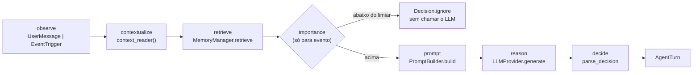

# Agent Runtime

> **Documentação de implementação**: descreve o Agent Runtime que existe em
> `src/jarvis/agent/` desde a **Fase 4**. O contrato normativo está em
> [`architecture-contracts.md §3.4`](architecture-contracts.md#34-agent-runtime),
> [ADR-0002](adr/0002-llm-provider-abstraction.md),
> [ADR-0003](adr/0003-policy-engine-safety-authority.md),
> [ADR-0011](adr/0011-gemini-rest-llm-adapter.md) e
> [ADR-0012](adr/0012-core-owned-structured-decisions.md) — este documento não
> os repete: explica o que foi construído, como funciona e o que ainda não faz.
>
> O plano que guiou a fase, com as alternativas descartadas, está em
> [`phase-4-plan.md`](phase-4-plan.md).

## O que existe

```text
src/jarvis/agent/
├── errors.py        # taxonomia: InvalidDecisionError, LLM*Error, PromptTooLargeError
├── messages.py      # Role, Message, LLMRequest, LLMResponse, StopReason, TokenUsage
├── ports.py         # LLMProvider (Protocol)
├── decision.py      # DecisionType, MemoryProposal, ActionProposal, Decision, parse_decision
├── conversation.py  # ConversationTurn, Conversation
├── input.py         # UserMessage, EventTrigger, EventSummary, AgentInput
├── importance.py    # ImportanceWeights, ImportanceAssessment, assess, should_reason
├── prompt.py        # SYSTEM_INSTRUCTION, Capability, PromptBudget, ReasoningEnvelope, PromptBuilder
├── runtime.py       # AgentRuntime, AgentTurn, LLMRetryPolicy, GenerationDefaults
└── adapters/
    └── gemini.py    # GeminiLLMProvider (REST, stdlib)
```

O Agent Runtime é o único componente que conhece Context, Memory e
`LLMProvider` ao mesmo tempo — é para isso que ele existe. Ele **não** conhece
Skill, Tool Router, MCP, Policy, banco, arquivo nem `Settings`.

## O loop implementado



`AgentRuntime.handle(agent_input, conversation=…, recent_events=…, capabilities=…)`
devolve um `AgentTurn` com a decisão, a avaliação de importância (quando
houve), os ids das memórias consultadas, o uso de tokens e a latência.

**O que o loop não faz, por decisão e não por omissão:** não grava memória, não
emite evento, não captura snapshot, não escreve em disco. O único efeito
externo de um turno é a chamada HTTP feita pelo adapter.

## Duas entradas, dois tratamentos

| | `UserMessage` | `EventTrigger` |
|---|---|---|
| origem | CLI (`agent ask`/`chat`), futura Voice Interface | evento já registrado no Event Store |
| triagem | **nunca** — falar com o agente é, por definição, relevante | sempre, antes de qualquer chamada ao modelo |
| `correlation_id` | o `conversation_id` | o `correlation_id` do evento |
| `causation_id` | ausente | o `event_id` do gatilho |
| payload no prompt | o texto da mensagem | o payload do evento, inteiro |

## `Decision`: seis variantes, validadas por forma

`ignore` · `remember` · `notify` · `ask` · `act` · `act_and_notify`

Cada variante declara o que exige e o que não admite, numa tabela que os testes
percorrem (`_REQUIRED`/`_FORBIDDEN` em `decision.py`) — uma variante nova sem
regra de forma quebra o teste.

**Uma resposta de conversa é `notify` com `message`.** O que distingue um
alerta proativo de uma réplica ao usuário é o gatilho, não o tipo da decisão;
não existe um sétimo tipo `respond`.

`Decision` é **dado inerte**: sem `execute()`, sem callback, sem referência a
Skill. `test_a_decision_carries_no_executable_behaviour` verifica isso por
introspecção, e `test_agent_architecture.py` verifica que nenhum módulo do
pacote alcança `jarvis.skills`, `jarvis.tools`, `jarvis.mcp` ou `jarvis.policy`
— nomes reservados que ainda não existem, justamente para que o dia em que
existirem o teste já esteja de guarda.

## `LLMProvider`: o que um adapter precisa garantir

```python
class LLMProvider(Protocol):
    @property
    def model(self) -> LLMModel: ...
    def generate(self, request: LLMRequest) -> LLMResponse: ...
```

- não busca contexto, memória, eventos, capacidades nem configuração;
- não monta prompt e não interpreta a resposta como decisão;
- não guarda estado entre chamadas;
- traduz **toda** exceção nativa para a taxonomia de `agent/errors.py`;
- respeita `request.timeout_seconds`.

O port não tem superfície de tool-calling nem de JSON Schema — ver
[ADR-0012](adr/0012-core-owned-structured-decisions.md).

## O adapter Gemini

| Aspecto | Como é |
|---|---|
| Endpoint | `POST https://generativelanguage.googleapis.com/v1beta/models/{modelo}:generateContent` |
| Transporte | `urllib.request` da stdlib; **nenhum SDK de vendor** ([ADR-0011](adr/0011-gemini-rest-llm-adapter.md)) |
| Autenticação | header `x-goog-api-key` — nunca na query string, que vaza em log de exceção e proxy |
| Structured output | `generationConfig.responseMimeType = "application/json"`; a validação autoritativa é do Core |
| Modelo | `JARVIS_GEMINI_MODEL`, default `gemini-2.0-flash` (tier gratuito) |
| Testabilidade | o transporte é injetável (`opener`), então corpo, parsing e erros são testados sem rede |

Tradução de erro (nenhuma exceção nativa chega ao Core):

| Origem | Erro interno | Retryable |
|---|---|---|
| timeout de socket / `URLError(TimeoutError)` | `LLMTimeoutError` | sim |
| HTTP 429 (lê `Retry-After`) | `LLMRateLimitError` | sim |
| HTTP 401/403 | `LLMAuthenticationError` | não |
| HTTP 4xx restante | `LLMRequestRejectedError` | não |
| HTTP 5xx, conexão recusada | `LLMProviderError` | sim |
| corpo não-JSON, sem candidatos, texto vazio com `STOP` | `LLMInvalidResponseError` | não |

`LLMProviderError` deriva de `ProviderError`, categoria compartilhada
introduzida nesta fase em `jarvis/errors.py` — `EmbeddingProviderError` e
`ContextProviderError` passaram a derivar dela também (contracts §13).

## Importance Engine

Filtro determinístico e explicável, **sem nenhuma chamada de LLM** — um filtro
que chama o modelo não filtra chamadas ao modelo.

| Grandeza | Cálculo |
|---|---|
| `urgency` | o maior entre proximidade do próximo compromisso (≤15 min → 1.0; ≤60 min → 0.7; conhecido → 0.3) e recência do evento (meia-vida de 30 min) |
| `personal_relevance` | melhor `RelevanceScore.total` do retrieval; 0.0 sem memória |
| `temporal_relevance` | fração dos campos de contexto observados que estão `fresh`; 0.5 quando não há nenhum |
| `interruption_cost` | `busy`/`do_not_disturb` → 0.9; atividade exigente → 0.7; `free` → 0.1; desconhecido → 0.3 |

`total = 0.30·urgency + 0.30·personal_relevance + 0.15·temporal_relevance − 0.25·interruption_cost`,
limitado a `[0,1]`. Abaixo de `JARVIS_AGENT_IMPORTANCE_THRESHOLD` (default
`0.45`) o turno termina em `Decision.ignore` com
`reason="below_importance_threshold"` — sem custo, sem token, sem ruído.

`reasons` carrega rótulos fechados (`user_busy`, `schedule_imminent`,
`no_relevant_memory`…), nunca conteúdo: eles vão para o log.

## Prompt assembly e orçamento

O envelope tem oito seções: `now`, `trigger`, `current_context`,
`relevant_memories`, `recent_events`, `conversation`, `available_capabilities`,
`constraints`. Campo de contexto ausente fica fora; campo vencido entra
**marcado** `stale` (contracts §6: quem decide se aceita é o consumidor).

O orçamento é medido em caracteres (~4 por token), não em tokens — um
tokenizador seria dependência nova para uma estimativa que só precisa ser
conservadora. Ordem de corte, sempre a mesma:

1. turnos de conversa mais antigos;
2. eventos recentes mais antigos;
3. memórias de menor score;
4. truncagem por item (`max_chars_per_item`).

O gatilho, a instrução de sistema e as `constraints` **nunca** são cortados; se
ainda assim não couber, `PromptTooLargeError` — falhar é melhor que enviar um
prompt mutilado em silêncio. O que foi omitido é informado ao modelo em
`constraints.omitted` e logado em contagem.

## Erros, timeout, retry

- **Timeout**: um único mecanismo, `LLMRequest.timeout_seconds`, aplicado pelo adapter.
- **Retry de transporte** (`LLMRetryPolicy`, no Core): só quando o erro se declara `retryable`; `max_attempts=2` por default para não queimar quota gratuita; respeita o `Retry-After` do provider quando existe; `sleep` é injetável, então nenhum teste dorme.
- **Reparo de conteúdo**: uma tentativa, reenviando o envelope com um pedido curto de correção de formato. Falhando a segunda, `InvalidDecisionError` sobe.
- **Sem limitador de taxa client-side**: o que existe é 429 mapeado, retries limitados, uma chamada por turno e a triagem cortando o caminho proativo. Gatilho para acrescentar: 429 recorrente em uso normal.

## Observabilidade

Logs estruturados, um por passo relevante, sempre com `correlation_id`:
`agent.turn_started`, `agent.triage_skipped`, `agent.prompt_trimmed`,
`agent.llm_called`, `agent.llm_failed`, `agent.decision_invalid`,
`agent.decided`.

**Nenhum deles contém** prompt, resposta do modelo, conteúdo de memória,
payload de evento, `message` da decisão ou credencial —
`tests/test_agent_privacy.py` verifica isso em todos os caminhos, inclusive nos
de erro.

Cadeia reconstruível: `Event.correlation_id` → `Decision.correlation_id` →
(Fase 5) `PolicyVerdict` → Skill → Tool.

## Configuração e secrets

| Variável | Default | Categoria |
|---|---|---|
| `JARVIS_LLM_PROVIDER` | `gemini` | configuração |
| `JARVIS_GEMINI_API_KEY` | — | **secret** (`SecretStr`) |
| `JARVIS_GEMINI_MODEL` | `gemini-2.0-flash` | configuração |
| `JARVIS_LLM_TIMEOUT_SECONDS` | `30` | configuração |
| `JARVIS_LLM_MAX_OUTPUT_TOKENS` | `1024` | configuração |
| `JARVIS_LLM_TEMPERATURE` | `0.2` | configuração |
| `JARVIS_LLM_MAX_ATTEMPTS` | `2` | configuração |
| `JARVIS_AGENT_IMPORTANCE_THRESHOLD` | `0.45` | configuração |

`build_llm_provider` em `cli.py` é o **único** lugar que lê a credencial. O
`AgentRuntime` recebe valores já resolvidos (`GenerationDefaults`), nunca
`Settings` — é o que torna estruturalmente impossível um secret chegar ao
prompt, e não apenas improvável.

## Comandos de CLI

```bash
jarvis agent ask "o que aconteceu enquanto eu estava fora?"
jarvis agent ask "oi" --conversation-id conv-42
printf 'oi\ne depois?\n' | jarvis agent chat        # multi-turno, uma mensagem por linha
jarvis agent react --event-id <id de um evento registrado>
```

Sem `JARVIS_GEMINI_API_KEY` os três falham com mensagem explícita e código de
saída 1; todo o resto do Jarvis continua funcionando offline.

Para `act`/`act_and_notify` a saída imprime, literalmente,
`proposta não executada: requer Policy Engine (Fase 5)`.

## Limitações conhecidas

- **Nada é executado.** `act` volta como proposta; `remember` não grava; `notify`/`ask` não entregam nada. Faltam Policy Engine (Fase 5) e Notification System (7.3).
- **O agente não emite eventos.** Registrar decisões de forma consultável é a subfase 7.4.
- **Não há subscrição no bus.** O caminho proativo é explícito (`agent react`); inscrever o agente é o Trigger Engine (7.1). Sem isso, todo `jarvis events emit` viraria uma chamada paga.
- **Sem tool-calling e sem streaming** — ver ADR-0012 e `phase-4-plan.md §20`.
- **Conversa não é persistida.** Sessões são escopo de 6.4.
- **`available_capabilities` chega vazio** e o modelo é instruído a não propor ação. Só a Fase 5 muda isso.
- **`EmbeddingProvider` continua local** (`HashingEmbeddingProvider`): é port separado de `LLMProvider` (ADR-0002), e trocá-lo exigiria reindexar tudo e tornaria `memory add` dependente de rede.

## Como trocar de provider

1. Escrever `src/jarvis/agent/adapters/<vendor>.py` implementando `LLMProvider`, traduzindo os erros para a taxonomia de `agent/errors.py`.
2. Acrescentar o nome a `LLMProviderName` em `config.py` e escolher em `build_llm_provider`.

Nada muda em `runtime.py`, `prompt.py`, `decision.py`, `importance.py` nem nos
testes de comportamento do agente. É a promessa do ADR-0002, e os testes de
arquitetura são o que a mantêm verdadeira.

## Testes

```bash
uv run pytest                  # suíte padrão: sem API key, sem rede, sem quota
uv run pytest -m external      # smoke test contra a API real (opcional, manual)
```

O único teste que toca a API real é `tests/test_agent_smoke_external.py`,
marcado `external` e excluído por `addopts`. Os demais usam `StubLLMProvider`,
`FailingLLMProvider` e `RecordingOpener` (`tests/agent_doubles.py`).

## Documentos relacionados

- Contrato normativo: [architecture-contracts.md §3.4](architecture-contracts.md#34-agent-runtime)
- Abstração de LLM: [ADR-0002](adr/0002-llm-provider-abstraction.md)
- Policy Engine como autoridade: [ADR-0003](adr/0003-policy-engine-safety-authority.md) e [security.md](security.md)
- Adapter Gemini: [ADR-0011](adr/0011-gemini-rest-llm-adapter.md)
- Decisão estruturada: [ADR-0012](adr/0012-core-owned-structured-decisions.md)
- Plano da fase: [phase-4-plan.md](phase-4-plan.md)
- Visão geral: [architecture.md](architecture.md)
