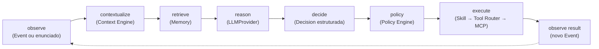

# Agent Runtime

> Documentação conceitual do Agent Runtime, previsto para a **Fase 4** do
> [roadmap](../ROADMAP.md). Criada na subfase **0.5** como explicação de um
> contrato já aprovado na 0.3 — **não implementa** o loop, o `PromptBuilder`
> nem a integração com um `LLMProvider` real. O contrato normativo completo
> está em
> [`architecture-contracts.md §3.4`](architecture-contracts.md#34-agent-runtime)
> e em [ADR-0002](adr/0002-llm-provider-abstraction.md)/
> [ADR-0003](adr/0003-policy-engine-safety-authority.md); este documento
> explica o *porquê* e o *como se relaciona*, sem repetir a tabela de
> dependências.

## Papel do Agent Runtime

O Agent Runtime é o núcleo de raciocínio do Jarvis: recebe um evento (ou um
enunciado de conversa, no caso de voz), monta um prompt a partir de
contexto + memória recuperada, chama o LLM via port, e interpreta a
resposta como uma `Decision` estruturada. É o único componente que conhece
tanto o `LLMProvider` quanto o Context Engine e a Memory System ao mesmo
tempo — mas mesmo ele **não executa ações**.

## O loop conceitual

- **Percepção (`observe`)** — o ponto de entrada: um `Event` chegando do
  Event Bus, ou um enunciado do usuário vindo da Voice Interface/CLI.
- **Contextualização (`contextualize`)** — consulta ao `CurrentContext`
  (leitura apenas) para saber "o que está acontecendo agora" ao redor
  desse evento/enunciado.
- **Retrieval (`retrieve`)** — busca de memórias relevantes na Memory
  System para esse evento/contexto específico — é aqui que `relevance`
  (ver [memory-system.md](memory-system.md)) é calculado, não antes.
- **Raciocínio (`reason`)** — o `PromptBuilder` monta o prompt a partir de
  contexto + memória + evento + capacidades disponíveis + conversa, e o
  `LLMProvider` port é chamado (ver §3 abaixo).
- **Decisão (`decide`)** — a resposta do LLM é interpretada, inteiramente
  dentro do Core, como uma `Decision` estruturada de um schema fixo — nunca
  como texto livre repassado adiante.
- **Policy** — a `Decision`, se for `act`/`act_and_notify`, é entregue ao
  Policy Engine como uma **proposta**, não uma ordem (ver §2 e
  [security.md](security.md)).
- **Execução (`execute`)** — só acontece depois de um `PolicyApproval`;
  quem executa é a Skill aprovada, via Tool Router → MCP — o Agent Runtime
  não participa dessa etapa além de ter emitido a `Decision` original.
- **Resultado (`observe result`)** — o resultado da execução vira um novo
  `Event`, reentrando no ciclo pelo topo — é assim que uma ação concreta
  atualiza contexto e memória subsequentes.

## `Decision`: os seis tipos

`ignore` | `remember` | `notify` | `ask` | `act` | `act_and_notify` — ver
[ROADMAP.md §4.3](../ROADMAP.md). `ignore` e `remember` não propõem
nenhuma ação no mundo (a segunda apenas grava memória); `notify` e `ask`
propõem comunicação com o usuário, roteada pelo Notification System;
`act`/`act_and_notify` propõem execução de uma Skill e por isso são as
únicas que passam pelo Policy Engine antes de qualquer efeito real.

## O LLM propõe; código determinístico autoriza e executa

Esta é a propriedade central do Agent Runtime, e vale sem exceção: **o
Agent Runtime nunca executa ações diretamente.** Uma `Decision.act` é uma
proposta estruturada — o Policy Engine, determinístico e sem chamada de
LLM na própria decisão de autorização, é quem decide se essa proposta vira
execução real (ver [ADR-0003](adr/0003-policy-engine-safety-authority.md)
e [security.md](security.md)).

Isso não é uma limitação técnica temporária — é a resposta arquitetural a
um risco concreto: um LLM pode alucinar, pode ser manipulado por conteúdo
malicioso embutido em um evento (prompt injection vindo de um email, por
exemplo), ou simplesmente errar a avaliação de risco de uma ação. Se o
mesmo componente que decide "fazer algo" também fosse a única autoridade
sobre se a ação *pode* acontecer, não existiria rede de segurança
independente entre "o modelo quis" e "o Jarvis fez". O Agent Runtime,
portanto, **não tem, e não deveria ter, autoridade final sobre segurança**
— essa responsabilidade é exclusivamente do Policy Engine.

## `LLMProvider`: raciocínio sem acoplamento de vendor

O Agent Runtime depende de um port `LLMProvider`, não de um SDK de vendor
específico (ver [ADR-0002](adr/0002-llm-provider-abstraction.md)):

- Prompt assembly, seleção de quais capacidades expor ao LLM, e
  interpretação da resposta em `Decision` acontecem inteiramente no Core,
  sobre uma representação genérica de mensagens/tools/resposta — nunca
  sobre o formato de wire de um vendor específico.
- A tradução para/do formato de um vendor concreto acontece só dentro do
  adapter correspondente em Infrastructure.
- Erros de provider chegam ao Core já mapeados para uma taxonomia própria
  (`LLMTimeoutError`, `LLMRateLimitError`, `LLMProviderError`,
  `LLMInvalidResponseError`) — o Core nunca captura uma exceção nativa de
  SDK de vendor diretamente.

Isso é o que permite trocar de provider de LLM escrevendo apenas um novo
adapter + selecionando-o via configuração, sem qualquer mudança em Agent
Runtime, `PromptBuilder`, `Decision` ou Skills.

## O que o Agent Runtime pode e não pode conhecer

Permitido: Context (leitura), Memory, `LLMProvider` port, Policy Engine
(apenas para entregar a `Decision`), Skill Registry (apenas para descoberta
de capacidades a expor ao LLM). Proibido: SDK concreto de vendor de LLM,
implementação interna de Skills, internals do Tool Router, internals de
infraestrutura — ver a tabela completa em
[`architecture-contracts.md §3.4`](architecture-contracts.md#34-agent-runtime).

## Documentos relacionados

- Contrato normativo completo: [architecture-contracts.md §3.4](architecture-contracts.md#34-agent-runtime)
- Abstração de LLM: [ADR-0002](adr/0002-llm-provider-abstraction.md)
- Policy Engine como autoridade de segurança: [ADR-0003](adr/0003-policy-engine-safety-authority.md) e [security.md](security.md)
- Visão geral: [architecture.md](architecture.md)
