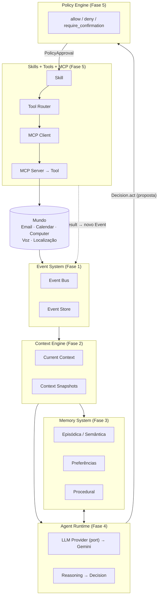
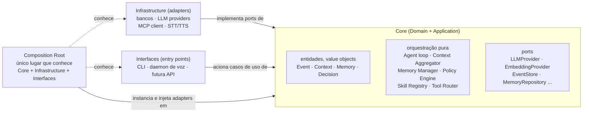
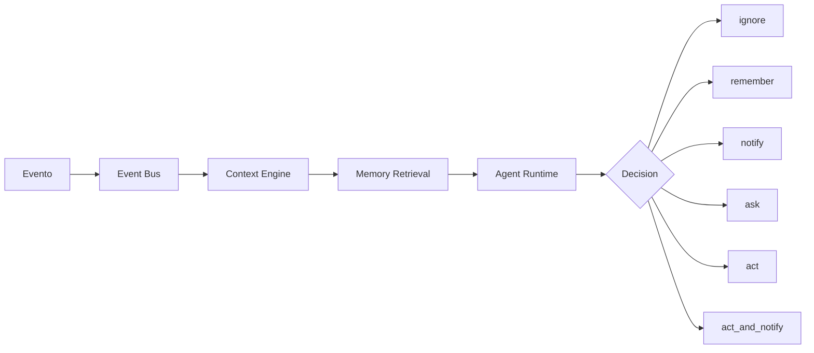
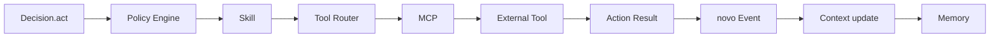
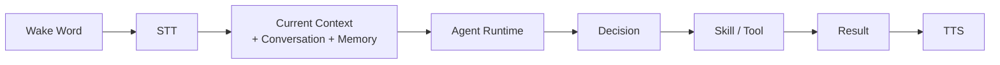

# Arquitetura do Jarvis

> Visão geral narrativa da arquitetura do Jarvis. Criado na subfase **0.5**
> do [roadmap](../ROADMAP.md).
>
> Este documento **explica e conecta** conceitos — não é normativo. A fonte
> normativa é [`architecture-contracts.md`](architecture-contracts.md) e os
> [ADRs](adr/). Onde este documento e os contratos parecerem divergir, os
> contratos prevalecem; trate a divergência como um bug de documentação, não
> como uma nova decisão.
>
> Hierarquia dos documentos deste repositório:
>
> ```text
> CLAUDE.md                     guia operacional rápido para o agente
> docs/architecture.md          você está aqui — visão geral narrativa
> docs/architecture-contracts.md  contratos normativos
> docs/adr/                     decisões e justificativas históricas
> docs/{event,context,memory,agent-runtime,skills,mcp,security}.md
>                                documentação conceitual por componente
> ```

---

## 1. Propósito do sistema

O Jarvis é um agente pessoal de IA construído incrementalmente ao longo de
oito fases (ver [ROADMAP.md](../ROADMAP.md)). O objetivo final — o "critério
final do Jarvis v0.1" do roadmap — é um sistema capaz de executar, de forma
confiável, o ciclo:

```text
mundo → evento → contexto → memória → raciocínio → decisão → policy →
skill → mcp/tool → ação → resultado → novo evento → memória → contexto atualizado
```

e, paralelamente, uma conversa por voz que percorre o mesmo núcleo de
raciocínio (`wake word → STT → agente → contexto+memória → decisão → ação →
TTS`).

**Estado atual (Fases 0 a 8 concluídas — v0.1):** a cadeia da
esquerda para a direita existe em código — Event System, Context Engine,
Memory System, Agent Runtime, Policy Engine, Skills, Tool Router e cliente
MCP. O ciclo `evento → contexto → memória → raciocínio → decisão → política
→ skill → ferramenta → resultado → evento` roda de ponta a ponta pelo CLI.
Desde a Fase 6 o segundo ciclo do critério de v0.1 também roda: `wake word →
STT → agente → contexto + memória → decisão → ação → TTS`, com um painel
local mostrando tudo isso acontecer. Desde a Fase 7, o Jarvis também **age
sozinho quando autorizado** (§6). A Fase 8 acrescenta observação e controle
do computador — ver [`computer.md`](computer.md), não repetido aqui.

Segue sendo um documento de arquitetura **alvo**, aprovado como contrato na
subfase 0.3. Cada seção abaixo indica em que fase o componente
correspondente passou a ter comportamento real.

---

## 2. Visão de alto nível



> Todo o diagrama existe em código desde a Fase 5 — o que falta (voz,
> proatividade, contexto do sistema operacional) não aparece aqui, e sim nas
> seções 6 e 7. O diagrama espelha a seção "ARQUITETURA-ALVO" do
> [ROADMAP.md](../ROADMAP.md), redesenhada para deixar explícito o ponto
> central do [ADR-0003](adr/0003-policy-engine-safety-authority.md): o Agent
> Runtime propõe (`Decision.act`), nunca executa — quem executa é
> Policy → Skill → Tool Router → MCP.

### Componentes e onde aprofundar

| Componente | Responsabilidade em uma frase | Fase | Documento |
|---|---|---|---|
| Event System | transforma acontecimentos em fatos estruturados e imutáveis | 1 | [event-system.md](event-system.md) |
| Context Engine | mantém uma projeção consultável do "estado atual" | 2 | [context-system.md](context-system.md) |
| Memory System | conhecimento durável e recuperável, com ciclo de vida | 3 | [memory-system.md](memory-system.md) |
| Agent Runtime | monta prompt, chama o LLM, interpreta a resposta como `Decision` | 4 | [agent-runtime.md](agent-runtime.md) |
| Policy Engine | única autoridade sobre `allow`/`deny`/`require_confirmation` | 5 | [security.md](security.md) |
| Skills | capacidades de alto nível com risco/permissão próprios | 5 | [skills.md](skills.md) |
| Tool Router + MCP | roteia chamadas de Skill até a ferramenta externa | 5 | [mcp.md](mcp.md) |
| Action Execution | percorre a cadeia `Decision → Policy → Skill → Tool`; único que conhece os três | 5 | [security.md](security.md) |
| Voice Interface | wake word → STT → Agent Runtime → TTS | 6 | [voice.md](voice.md) |
| Observability Interface | projeta o estado interno do sistema; somente leitura | 6 | [interface.md](interface.md) |
| Notification System | entrega mensagens ao usuário com prioridade | 5/7 | [security.md](security.md) (confirmação), §6 abaixo (proatividade) |

Cada componente tem seu contrato completo (entradas, saídas, o que pode/não
pode conhecer) em [`architecture-contracts.md §3`](architecture-contracts.md#3-limites-dos-componentes)
— não repetido aqui.

---

## 3. Ports & Adapters e a direção das dependências

O Jarvis segue Ports & Adapters (arquitetura hexagonal) em vez de uma pilha
linear de camadas — decisão registrada em
[ADR-0001](adr/0001-ports-and-adapters-dependency-rule.md).



Regra: tudo aponta para dentro, para o Core. Infrastructure nunca é
importada por Core nem por Interfaces diretamente — só o Composition Root
conhece as três zonas ao mesmo tempo e faz a ligação (injeção de
dependência manual, sem container de DI — ver
[CLAUDE.md §10](../CLAUDE.md)).

**Composition Root hoje:** `src/jarvis/cli.py` já cumpre esse papel na sua
forma mínima — é o único módulo que carrega `Settings` (Infrastructure de
configuração) e aciona o comportamento do CLI (Interface). Conforme
Core/Infrastructure/Interfaces ganharem componentes reais a partir da Fase
1, o Composition Root cresce junto, mas seu papel não muda: ele é sempre o
único lugar autorizado a conhecer as três zonas.

**Sobre a separação física em pastas:** `domain/`, `application/`,
`infrastructure/`, `interfaces/` **não existem** como diretórios ainda, de
propósito — a regra de dependência acima é conceitual até que o volume de
código justifique a separação física (ver "Alternativas consideradas" do
ADR-0001 e [CLAUDE.md §1](../CLAUDE.md)). Não a antecipe em nenhuma subfase
sem confirmação explícita contra o roadmap.

---

## 4. Fluxo principal

O fluxo abaixo é a versão narrativa da seção "FLUXO PRINCIPAL" do
[ROADMAP.md](../ROADMAP.md). Três variantes do mesmo núcleo de raciocínio:

### 4.1 Evento externo → decisão



`ignore` é uma decisão tão válida quanto qualquer outra — silêncio não é
ausência de processamento, é o resultado de uma avaliação (ver §6).

### 4.2 Decisão de ação → efeito no mundo



A `Decision.act` do Agent Runtime é uma **proposta**, não uma ordem — ver
[security.md](security.md) para o papel do Policy Engine nessa transição.

Desde a Fase 5 essa cadeia existe em código. Quem a percorre é o `ActionExecutor`
(`jarvis/execution/`), o único componente autorizado a conhecer Policy, Skills e
Tools ao mesmo tempo ([ADR-0016](adr/0016-action-execution-orchestrator.md)) — o
Agent Runtime entrega a `Decision` e para, e um teste arquitetural garante que
não exista caminho de import dele até a execução.

### 4.3 Conversação por voz



A Voice Interface (Fase 6) não acessa Skills, Tools, MCP, Memory ou Context
diretamente — todo esse acesso passa pelo Agent Runtime, que já é o
componente que sabe orquestrar contexto + memória + decisão (ver
[`architecture-contracts.md §3.9`](architecture-contracts.md#39-voice-interface)).

---

## 5. Fronteira de persistência (cross-cutting)

Persistência não é um componente com lógica de negócio própria — é uma
regra que atravessa todos os componentes com estado durável (Event Store,
Memory Repository, Context Snapshot Repository, Audit Log Repository). Cada
um desses é modelado como um **port** no Core, implementado por um
**adapter** em Infrastructure:

- Domain/Application nunca importam driver de banco, ORM ou biblioteca de
  acesso a dados — só o `Repository` port correspondente.
- Nenhum tipo específico de banco (linha de ORM, cursor) atravessa a
  fronteira do adapter de volta para o Core.
- **Nenhum banco de dados é escolhido nesta subfase.** A escolha concreta
  (SQLite, PostgreSQL, pgvector, outro) é decisão de cada fase de
  implementação (Event Store na Fase 1, Memory Storage na Fase 3) e deve
  permanecer trocável sem alterar Core — essa é justamente a garantia que a
  regra acima produz.

Detalhe completo: [`architecture-contracts.md §11`](architecture-contracts.md#11-persistence-boundary).

---

## 6. Proatividade (Fase 7)

O Jarvis recebe eventos, constrói contexto e decide, sozinho, se deve
interromper o usuário — atrás de três interruptores de opt-in, desligados
por padrão ([ADR-0029](adr/0029-proactivity-opt-in-layers.md)). O fluxo:

```text
Evento → Contexto → Memória relevante → Avaliação pelo agente →
Policy/regras → Notificar ou permanecer silencioso
```

Esse fluxo **não é um componente novo** — é o mesmo fluxo do §4.1, em que a
`Decision` resultante pode ser `notify`/`act_and_notify` (interromper) ou
`ignore`/`remember` (permanecer em silêncio). O que a Fase 7 adiciona é o
**Trigger Engine** (que decide quando reavaliar autonomamente, sem um
evento externo esperando resposta síncrona) e a **Interruption Policy**
(que pesa importância, atividade do usuário, foco, horário e notificações
recentes antes de decidir interromper — ver
[ROADMAP.md §7.2](../ROADMAP.md)).

**Silêncio é uma decisão válida.** Um agente que avalia um evento e decide
`ignore` não falhou em agir — cumpriu a avaliação corretamente.

---

## 7. Voz e painel (Fase 6)

```text
Microfone → Wake Word → STT → Agent Runtime → TTS → Alto-falante
                                    │
                                    └──► Painel (somente leitura)
```

A Voice Interface é uma **Interface** (no sentido de Ports & Adapters, §3):
aciona o Agent Runtime como qualquer outro ponto de entrada (ex. o CLI),
sem conhecer Skills, Tools, MCP ou os internals de Memory/Context — ver
[`architecture-contracts.md §3.9`](architecture-contracts.md#39-voice-interface).

Desde a Fase 6 isso existe em código, com uma fronteira ainda mais estrita do
que o contrato exige: `jarvis.voice` não importa nem `jarvis.agent`. O resto do
sistema chega por um port próprio (`ConversationalAgent`) implementado no
composition root, o que torna o loop inteiro testável sem LLM, sem banco e sem
hardware.

Os providers concretos: **Groq** para transcrição e **Google Cloud TTS** para
síntese, ambos por REST da biblioteca padrão
([ADR-0022](adr/0022-cloud-speech-over-stdlib-rest.md)); wake word **sem IA
local**, por push-to-talk ou por verificação em transcrição com orçamento
([ADR-0021](adr/0021-wake-word-without-local-ai.md)). Detalhe completo em
[voice.md](voice.md).

O **painel de observabilidade** (`jarvis.interface`) é a outra metade da fase: um
leitor de `PanelSnapshot`, servido em `127.0.0.1`, **sem nenhuma rota de
escrita** ([ADR-0024](adr/0024-observability-panel-as-snapshot-reader.md)). Ele
mostra eventos, contexto, memórias, decisões, ações, ferramentas e a conversa —
e não aciona nada. Detalhe completo em [interface.md](interface.md).

`jarvis run` sobe os dois no mesmo processo, com uma única thread tocando banco
([ADR-0023](adr/0023-single-resident-process.md)).

---

## 8. Observabilidade (cross-cutting)

Três princípios valem desde já como contrato, mesmo sem implementação:

- **`correlation_id`** propaga por todo um fluxo — de `Event` a `Decision`,
  a `PolicyVerdict`, à execução de Skill/Tool, ao `Event` de resultado — é
  a espinha dorsal que liga um fluxo inteiro nos logs.
- **`causation_id`** liga um passo ao seu evento/decisão pai direto, dentro
  do fluxo identificado pelo `correlation_id` acima.
- **Audit log** é uma categoria separada de log de debug, com retenção mais
  rígida, atrelada especificamente a vereditos do Policy Engine e execuções
  do Tool Router (ver [security.md](security.md)).

Métricas e tracing distribuído estão deliberadamente fora de escopo por
ora — um agente pessoal em processo único não justifica essa
infraestrutura ainda. Detalhe completo:
[`architecture-contracts.md §14`](architecture-contracts.md#14-observability-contract).

---

## 9. Relação entre os conceitos, em uma frase cada

- **Evento** é um fato que aconteceu; imutável, é o registro de "o que
  aconteceu e quando" (`occurred_at`/`recorded_at`).
- **Contexto** é uma projeção, derivada de eventos + providers, do "estado
  atual" — reconstruível, não é fonte de verdade.
- **Memória** é conhecimento durável que persiste além do contexto atual,
  com ciclo de vida próprio (reforço, decaimento, expiração).
- **Agente** lê contexto + memória, raciocina sobre um evento (ou
  enunciado de conversa) via `LLMProvider`, e emite uma `Decision`.
- **Policy** é o portão determinístico entre "o agente propôs" e "o mundo
  mudou" — nenhuma `Decision.act` vira ação sem passar por ele.
- **Skill** é a unidade que carrega risco/permissão/confirmação e sabe
  compor uma ou mais **Tools** para cumprir a ação aprovada pela Policy.

---

## 10. Documentos relacionados

- Contratos normativos: [architecture-contracts.md](architecture-contracts.md)
- Decisões históricas: [adr/](adr/)
- Guia operacional do agente de desenvolvimento: [CLAUDE.md](../CLAUDE.md)
- Planejamento por fases: [ROADMAP.md](../ROADMAP.md)
- Por componente: [event-system.md](event-system.md) ·
  [context-system.md](context-system.md) · [memory-system.md](memory-system.md) ·
  [agent-runtime.md](agent-runtime.md) · [skills.md](skills.md) ·
  [mcp.md](mcp.md) · [security.md](security.md) · [voice.md](voice.md) ·
  [interface.md](interface.md) · [proactivity.md](proactivity.md) ·
  [computer.md](computer.md)
- Problemas de setup conhecidos: [troubleshooting.md](troubleshooting.md)
