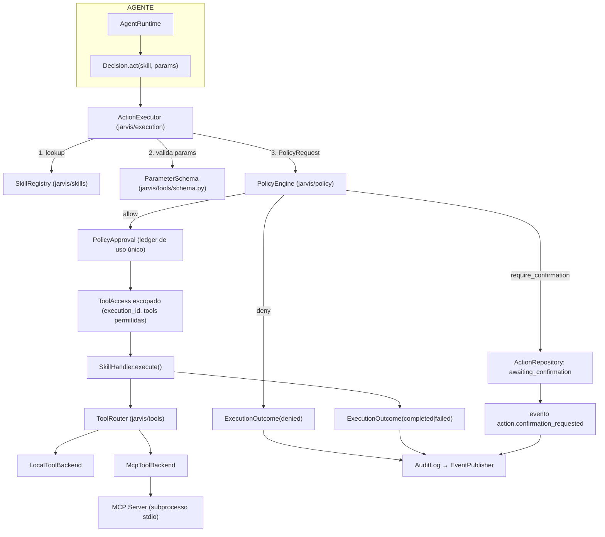
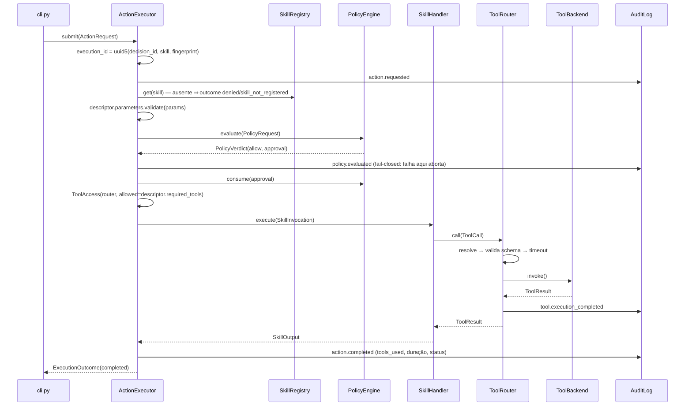

# Plano de implementação — Fase 5: Skills, Policy Engine, Tool Router e MCP

> Plano técnico aprovado antes da implementação da Fase 5, na metodologia do
> [`ROADMAP.md`](../ROADMAP.md) (explorar → planejar → revisar → aprovar →
> implementar → testar → commit). Segue o formato dos planos das Fases 1 a 4.
>
> Fonte do objetivo arquitetural: [`PHASE-5.md`](../PHASE-5.md). Fonte da
> verdade sobre o estado atual: o código em `src/` e o `ROADMAP.md`. Fonte da
> verdade sobre fronteiras: [`architecture-contracts.md`](architecture-contracts.md)
> e os ADRs em [`adr/`](adr/).
>
> **Uma única unidade de desenvolvimento.** As etapas E1–E12 da §27 existem para
> ordenar a implementação, não para pedir aprovação entre elas.

---

## 1. Objetivo

Transformar a `Decision.act` — hoje uma proposta inerte — em execução real,
autorizada e auditável, implementando a cadeia:

```text
Event / User Input → Context + Memory → Agent Runtime → LLM → Decision
  → Policy Engine → Skill → Tool Router → Tool/MCP → External System
  → Result → Agent Runtime → Events / Memory / Response
```

O princípio que a fase materializa, e que todo teste desta fase existe para
provar:

```text
LLM propõe.  Código valida.  Policy autoriza.  Skill executa.
Tool opera.  MCP conecta.    Event registra.
```

Ao final, o Jarvis consegue executar uma ação local de ponta a ponta
(`jarvis action run --skill file.write ...`), negar uma ação proibida, bloquear
uma ação de risco até confirmação explícita do usuário, falar com um MCP Server
externo, e responder depois "o que foi feito, por quê, com qual autorização e
com qual resultado" a partir do Event Store.

---

## 2. Estado atual encontrado

Fases 0–4 concluídas. `git log`: `61186a6 chore: complete agent runtime milestone`.

```text
src/jarvis/
├── __init__.py · __main__.py · cli.py · config.py · errors.py
├── events/    event.py bus.py ports.py publisher.py errors.py + adapters/
├── context/   observation.py model.py freshness.py projection.py aggregator.py
│              consumer.py engine.py snapshot.py ports.py errors.py + adapters/
├── memory/    memory.py embedding.py ranking.py retrieval.py consolidation.py
│              manager.py ports.py errors.py + adapters/
└── agent/     messages.py ports.py decision.py conversation.py input.py
               importance.py prompt.py runtime.py errors.py + adapters/gemini.py

tests/  57 módulos, estrutura plana, doubles em *_doubles.py e factories.py
docs/   README · architecture · architecture-contracts · phase-1..4-plan
        event-system · context-system · memory-system · agent-runtime
        skills · mcp · security (os três últimos, conceituais)
        adr/0001..0012
```

Fatos verificados no código que condicionam o plano:

| Fato | Onde | Consequência para a Fase 5 |
|---|---|---|
| `Decision` é dado inerte, sem `execute()`, sem referência a Skill/Tool | `agent/decision.py` | O executor lê a `Decision`; a `Decision` continua não conhecendo ninguém |
| `ActionProposal` valida **forma** (`skill` é slug, `parameters` é JSON congelado), não semântica | `agent/decision.py:176` | A validação contra o schema real da Skill é desta fase, e acontece **fora** do agente |
| `AgentRuntime.handle(..., capabilities: tuple[Capability, ...])` já existe e hoje recebe `()` | `agent/runtime.py:149`, `agent/prompt.py:88` | Integrar o Skill Registry ao agente **não** exige que o agente importe `jarvis.skills` — o composition root traduz |
| `_render_constraints` desliga `act` quando não há capacidades | `agent/prompt.py:333` | O mesmo código passa a ligar `act` quando houver Skills registradas; sem mudança de lógica |
| `tests/test_agent_architecture.py` já **proíbe** o agente de importar `jarvis.skills`, `jarvis.tools`, `jarvis.policy`, `jarvis.mcp`, `mcp` | `tests/test_agent_architecture.py:61` | Os nomes reservados viram pacotes reais; o teste passa a ter dentes. Falta acrescentar `jarvis.execution` ao conjunto |
| `EventBus` é síncrono, com filtro por `event_type`, retry e dead-letter | `events/bus.py` | Confirmação por evento reusa o mecanismo existente; nenhum broker novo |
| `EventStore.append` trata `event_id` repetido como no-op (`AppendResult.is_duplicate`) | `events/ports.py:28` | Idempotência de eventos de auditoria sai de graça com `deterministic_event_id` |
| `Event.payload`/`metadata` são congelados recursivamente (`MappingProxyType`/`tuple`) | `events/event.py:76` | Parâmetros de ação viajam como JSON sem risco de mutação |
| `jarvis/errors.py` declara que `PolicyDenied` e `UserFacingError` "serão adicionados pelas fases que os introduzirem" | `errors.py:8` | Esta fase introduz `PolicyDenied` |
| Três bancos SQLite separados, um por componente, `PRAGMA user_version` como migração | `*/adapters/sqlite_*.py` | Um quarto banco (`actions.db`) segue o padrão, sem ferramenta de migração |
| `cli.py` é o único módulo que conhece Core + Infrastructure + Interfaces e o único que lê a credencial | `cli.py:1` | Todo wiring novo (registries, backends, MCP) entra aqui e em nenhum outro lugar |
| `pyproject.toml`: só `pydantic` + `pydantic-settings` em runtime; `-m 'not external'` no `addopts` | `pyproject.toml` | Nenhuma dependência nova é aceitável sem necessidade concreta; a suíte padrão não pode exigir rede |
| Não existe `jarvis/policy/`, `jarvis/skills/`, `jarvis/tools/`, `jarvis/execution/`, nem qualquer código MCP | `src/` | Tudo abaixo é novo |

---

## 3. Arquitetura atual relevante

O que a Fase 5 consome do que já existe, e **como** consome:

- **Event System** — `Event`/`RecordedEvent`, `EventBus`, `EventPublisher`,
  `SqliteEventStore`, `deterministic_event_id`, `JsonValue`. A camada de ação
  publica eventos (auditoria) e consome eventos (respostas de confirmação). É a
  primeira vez que um componente do Jarvis usa o Event System nas duas direções
  — Memory (3.7) e Agent (4.2) são só de entrada.
- **Agent Runtime** — `Decision`, `ActionProposal`, `Capability`,
  `ReasoningEnvelope`, `AgentTurn`. A camada de ação **lê** a `Decision`; o
  agente continua sem qualquer caminho até a execução.
- **Context / Memory** — usados **apenas** onde há necessidade real (§17). O
  Policy Engine não lê contexto do Context Engine (contracts §3.5 proíbe); o
  que ele recebe é um `PolicyRequest` de dados simples montado pelo executor.
  Skills recebem dados por parâmetro, nunca buscam (contracts §3.6).
- **Configuração** — `Settings` (prefixo `JARVIS_`), lida uma vez em `cli.py`.
- **Erros** — `JarvisError → DomainError | InfrastructureError → ProviderError`,
  com `retryable` como atributo de classe.
- **Testes arquiteturais por AST** — padrão de `tests/test_*_architecture.py`:
  `ast.parse` + lista de imports proibidos por módulo. A Fase 5 replica e
  amplia.

---

## 4. Gap entre estado atual e objetivo

| # | Objetivo da Fase 5 | Hoje | Gap |
|---|---|---|---|
| 1 | Skill como modelo de domínio com risco/permissão/schema | inexistente | criar `jarvis/skills/` |
| 2 | Skills registráveis e descobríveis pelo agente | `capabilities=()` sempre | criar `SkillRegistry` + wiring |
| 3 | Validação de input em código, não pelo LLM | só validação de forma | criar `ParameterSchema` |
| 4 | Policy Engine determinístico com allow/deny/require_confirmation | inexistente | criar `jarvis/policy/` |
| 5 | `PolicyApproval` que uma Skill não consegue forjar | conceito em ADR-0003, sem mecanismo | ledger de uso único no engine (ADR-0013) |
| 6 | Fluxo de confirmação | inexistente | estado persistido + resposta como evento (ADR-0014) |
| 7 | `Tool`/`ToolResult`/`ToolError` e Tool Router | inexistente | criar `jarvis/tools/` |
| 8 | Backend de tools não-MCP (prova que o contrato não é MCP-shaped) | inexistente | `LocalToolBackend` |
| 9 | MCP client (conexão, discovery, invocação, timeout, reconexão) | inexistente | `McpToolBackend` sobre stdio/JSON-RPC (ADR-0015) |
| 10 | Identidade de execução correlacionável | `correlation_id` só até a `Decision` | `execution_id` + eventos (§16) |
| 11 | Idempotência de ação | só de evento | `execution_id` determinístico + `Idempotency` declarada (§20) |
| 12 | Auditoria consultável | logs estruturados apenas | eventos de auditoria (ADR-0017) |
| 13 | Resultado voltando ao agente | `_print_turn` diz "não executada" | `ActionResultSummary` no envelope (§17) |
| 14 | Provas estruturais de não-bypass | nomes reservados no teste do agente | `test_action_architecture.py` + `test_action_security.py` |

---

## 5. Arquitetura proposta

Quatro pacotes novos. A divisão existe para que cada regra de dependência seja
enunciável como uma lista de imports proibidos — não por estética.

```text
src/jarvis/
├── policy/        Core — autoridade de autorização. Não conhece ninguém.
├── skills/        Core — capacidades. Conhece policy.vocabulary e tools.
├── tools/         Core + adapters — contrato de Tool, roteamento, backends.
└── execution/     Core + adapters — o único lugar que conhece os três acima.
```



Direções de dependência (todas verificadas por teste em §22):

```text
policy      →  (nada de jarvis, exceto jarvis.errors)
skills      →  policy.vocabulary, tools (contrato + router port), events.event(JsonValue)
tools       →  events.event (JsonValue), jarvis.errors
execution   →  policy, skills, tools, events
agent       →  ─X→  policy, skills, tools, execution, mcp
cli         →  tudo (composition root)
```

Note a assimetria deliberada: `skills` conhece `tools` (contracts §3.6 permite o
Tool Router port) mas **não** conhece `policy.engine`; `policy` não conhece
`skills` nem `tools`; `tools` não conhece `policy` nem `skills`. Só
`execution` fecha o triângulo — é a razão de ele existir como pacote próprio
(ADR-0016).

---

## 6. Componentes a criar

### 6.1 `jarvis/policy/` — Core

| Módulo | Conteúdo |
|---|---|
| `vocabulary.py` | **Módulo folha, sem imports de `jarvis`.** `RiskLevel` (StrEnum ordenada: `none < low < medium < high < critical`), `ConfirmationRequirement` (`never \| conditional \| always`), `Effect` (`read \| write \| destructive \| physical \| external_communication \| spend`), `Capability` (slug `dominio:verbo`), `Idempotency` (`safe \| unsafe`) |
| `verdict.py` | `PolicyDecision` (`allow \| deny \| require_confirmation`), `PolicyRequest`, `PolicyVerdict`, `PolicyApproval`, `Confirmation` |
| `rules.py` | `PolicyRuleSet` (dados imutáveis) + as regras determinísticas, cada uma com `rule_id` |
| `engine.py` | `PolicyEngine`: `evaluate()`, `issue()`, `consume()`, ledger de approvals |
| `errors.py` | `PolicyError`, `ApprovalError`, `UnknownApprovalError`, `ApprovalExpiredError`, `ApprovalAlreadyUsedError`, `ApprovalMismatchError` |
| `ports.py` | `AuditLog` (Protocol) + `AuditEntry`/`AuditKind` |

### 6.2 `jarvis/skills/` — Core

| Módulo | Conteúdo |
|---|---|
| `skill.py` | `SkillDescriptor`, `SkillInvocation`, `SkillOutput`, `SkillHandler` (Protocol), `Skill` (descritor + handler) |
| `registry.py` | `SkillRegistry`: `register`, `get`, `list`, `capabilities()` (→ `agent.Capability`) |
| `errors.py` | `SkillError`, `SkillInputError`, `SkillExecutionError`, `SkillUnavailableError` |
| `builtin/__init__.py` | `register_builtin_skills(registry)` |
| `builtin/files.py` | `file.read`, `file.write`, `file.list` |
| `builtin/system.py` | `system.status` |

Skills embutidas são **Core puro**: compõem chamadas de Tool via `ToolAccess`.
Nenhuma delas importa `pathlib`, `os` ou `platform` — o I/O mora no
`LocalToolBackend` (§6.3). É essa separação que faz o teste arquitetural
"nenhuma Skill toca o sistema de arquivos" ser verdadeiro e não decorativo.

### 6.3 `jarvis/tools/` — Core + adapters

| Módulo | Camada | Conteúdo |
|---|---|---|
| `tool.py` | Core | `ToolId` (`backend:nome`), `ToolDescriptor`, `ToolCall`, `ToolResult` |
| `schema.py` | Core | `FieldType`, `FieldSpec`, `ParameterSchema.validate()`, `parameters_fingerprint()` |
| `errors.py` | Core | `ToolError`, `ToolNotFoundError`, `ToolInvalidInputError`, `ToolTimeoutError`, `ToolUnavailableError`, `ToolExecutionError`, `ToolProtocolError`, `ToolNotPermittedError` |
| `ports.py` | Core | `ToolBackend` (Protocol): `backend_id`, `discover()`, `invoke()`, `close()` |
| `registry.py` | Core | `ToolRegistry`: `register_backend`, `refresh`, `get`, `list` |
| `router.py` | Core | `ToolRouter.call()`: resolve → valida → timeout → normaliza → audita |
| `access.py` | Core | `ToolAccess` — router escopado a uma execução e a um conjunto de tools |
| `adapters/local_backend.py` | Infra | `fs.read_text`, `fs.write_text`, `fs.list_dir`, `system.info`, com raiz allowlistada |
| `adapters/mcp_protocol.py` | Infra | Envelopes JSON-RPC 2.0, handshake, tradução de JSON Schema → `ParameterSchema` |
| `adapters/mcp_stdio.py` | Infra | Transporte por subprocesso: escrita, thread leitora + `queue`, deadline, encerramento |
| `adapters/mcp_client.py` | Infra | `McpToolBackend`: lifecycle, discovery, `tools/call`, normalização de resultado/erro |
| `adapters/mcp_config.py` | Infra | Leitura de `mcp.json`, resolução de `env_keys` a partir do ambiente |

### 6.4 `jarvis/execution/` — Core + adapters

| Módulo | Camada | Conteúdo |
|---|---|---|
| `identity.py` | Core | `new_execution_id`, `deterministic_execution_id` |
| `model.py` | Core | `Actor` (`user \| event \| system`), `ActionRequest`, `ExecutionStatus`, `PendingAction`, `ExecutionOutcome` |
| `errors.py` | Core | `ExecutionError`, `UnknownSkillError`, `DuplicateExecutionError`, `ConfirmationExpiredError` |
| `ports.py` | Core | `ActionRepository` (Protocol) |
| `events.py` | Core | `ACTION_EVENT_TYPES` + construtores dos nove `Event` da §16 |
| `orchestrator.py` | Core | `ActionExecutor`: `submit()`, `resume()`, `pending()`, `expire()` |
| `consumer.py` | Core | `ActionEventConsumer` — projeta respostas de confirmação no estado |
| `adapters/sqlite_actions.py` | Infra | `SqliteActionRepository` (`data/actions.db`, `user_version = 1`) |
| `adapters/event_audit.py` | Infra | `EventAuditLog` — implementa `AuditLog` publicando eventos |

---

## 7. Componentes a modificar

| Arquivo | Mudança | Por quê |
|---|---|---|
| `src/jarvis/errors.py` | `+ class PolicyDenied(DomainError)` | O próprio docstring do módulo reserva o nome para a fase que o introduzir |
| `src/jarvis/agent/prompt.py` | `Capability` ganha `parameters: str \| None`; `PromptBudget` ganha `max_capabilities`; capacidades entram na escada de corte do `_trim` | Sem isso, um registry grande estoura `PromptTooLargeError` — hoje `available_capabilities` é a única seção nunca cortada |
| `src/jarvis/agent/input.py` | `+ ActionResultSummary` (dado simples: `skill`, `status`, `summary`, `execution_id`) | Fecha o laço "resultado → agente" sem o agente importar `jarvis.execution` |
| `src/jarvis/agent/prompt.py` | `ReasoningEnvelope` ganha `last_action_result: ActionResultSummary \| None`; `_render` ganha a seção | idem |
| `src/jarvis/config.py` | Campos da §15.3 | Configuração de sistema, injetada pelo composition root |
| `src/jarvis/cli.py` | `build_skill_registry`, `build_tool_registry`, `build_policy_engine`, `build_action_executor`; comandos `skills`, `tools`, `action`; flag `--execute` em `agent ask`; novos `except` no `main` | Único composition root |
| `.env.example` | Bloco "Fase 5" | Espelha `Settings` |
| `tests/test_agent_architecture.py` | `EXECUTION_PACKAGES` ganha `jarvis.execution` | Os nomes reservados passam a existir; o novo pacote precisa entrar na mesma proibição |
| `tests/test_agent_prompt.py` | Casos para `max_capabilities` e `last_action_result` | Mudança de comportamento no builder |
| `README.md`, `CLAUDE.md`, `docs/*` | §23 | Documentação junto da funcionalidade |
| `ROADMAP.md` | Checkboxes 5.1–5.10 + histórico + M5 | Só ao final, e só do que foi realmente feito |

**Não** se modifica: `agent/runtime.py`, `agent/decision.py`, `agent/ports.py`,
`agent/messages.py`, `agent/adapters/gemini.py`, nada em `events/`, `context/`
ou `memory/`. A integração do agente é por injeção de `capabilities` e leitura
da `Decision` — não por mudança no runtime.

---

## 8. Interfaces / contratos

Assinaturas conceituais; nomes de campo são reversíveis e não constam de ADR.

### 8.1 Vocabulário (`policy/vocabulary.py`)

```python
class RiskLevel(StrEnum):  # ordenada por _ORDER, comparável
    NONE = "none"
    LOW = "low"
    MEDIUM = "medium"
    HIGH = "high"
    CRITICAL = "critical"


class ConfirmationRequirement(StrEnum):
    NEVER = "never"
    CONDITIONAL = "conditional"
    ALWAYS = "always"


class Effect(StrEnum):  # a diferenciação pedida pela spec §32
    READ = "read"
    WRITE = "write"
    DESTRUCTIVE = "destructive"
    PHYSICAL = "physical"
    EXTERNAL_COMMUNICATION = "external_communication"
    SPEND = "spend"


class Idempotency(StrEnum):
    SAFE = "safe"
    UNSAFE = "unsafe"
```

`Capability` é um slug validado `dominio:verbo` (`file:read`, `system:read`,
`message:send`) — um `NewType[str]` com validador, não uma classe.

### 8.2 Skill (`skills/skill.py`)

```python
@dataclass(frozen=True, slots=True, kw_only=True)
class SkillDescriptor:
    name: str  # slug; mesmo padrão de ActionProposal.skill
    summary: str  # frase curta, vai para o envelope do LLM
    parameters: ParameterSchema
    capabilities: frozenset[str]  # exigidas, ex. {"file:write"}
    required_tools: tuple[ToolId, ...]  # menor privilégio: o teto do ToolAccess
    risk: RiskLevel
    effects: frozenset[Effect]
    confirmation_requirement: ConfirmationRequirement
    idempotency: Idempotency
    version: int = 1


@dataclass(frozen=True, slots=True, kw_only=True)
class SkillInvocation:
    execution_id: str
    correlation_id: str
    parameters: Mapping[str, JsonValue]  # já validados
    tools: ToolAccess  # escopado, só chega após approval
    now: datetime


@dataclass(frozen=True, slots=True, kw_only=True)
class SkillOutput:
    data: Mapping[str, JsonValue]
    summary: str  # texto seguro para o usuário


class SkillHandler(Protocol):
    def execute(self, invocation: SkillInvocation) -> SkillOutput: ...
```

`risk`/`effects`/`confirmation_requirement` são **autodeclarações** (contracts
§8.4). O `SkillHandler` não recebe o `PolicyEngine`, não recebe o `ToolRouter`
inteiro e não tem como obter um `PolicyApproval` — é a forma estrutural de
"Skill nunca autoriza a si mesma".

### 8.3 Policy (`policy/verdict.py`, `policy/engine.py`)

```python
@dataclass(frozen=True, slots=True, kw_only=True)
class PolicyRequest:
    execution_id: str
    correlation_id: str
    decision_id: str | None
    actor: str  # "user" | "event" | "system"
    skill: str
    risk: RiskLevel
    effects: frozenset[Effect]
    confirmation_requirement: ConfirmationRequirement
    capabilities: frozenset[str]
    parameters_fingerprint: str  # sha256 do JSON canônico — nunca os parâmetros
    confirmation: Confirmation | None = None
    requested_at: datetime


@dataclass(frozen=True, slots=True, kw_only=True)
class PolicyVerdict:
    decision: PolicyDecision
    reason: str  # slug estável: "capability_not_granted"
    detail: str  # frase humana, sem parâmetros
    rule_id: str
    policy_version: int
    evaluated_at: datetime
    execution_id: str
    approval: PolicyApproval | None = None


@dataclass(frozen=True, slots=True, kw_only=True)
class PolicyApproval:
    approval_id: str
    execution_id: str
    skill: str
    parameters_fingerprint: str
    policy_version: int
    issued_at: datetime
    expires_at: datetime


class PolicyEngine:
    def evaluate(self, request: PolicyRequest) -> PolicyVerdict: ...
    def consume(self, approval: PolicyApproval, *, moment: datetime) -> None: ...
```

`PolicyRequest` carrega **fingerprint**, nunca os parâmetros. O Policy Engine
nunca vê conteúdo — só identidade, risco e forma. Isso é o que permite logar e
auditar cada veredito sem risco de vazamento (§15.4).

### 8.4 Tool (`tools/`)

```python
type ToolId = str  # "backend:nome", validado por regex


@dataclass(frozen=True, slots=True, kw_only=True)
class ToolDescriptor:
    tool_id: ToolId
    backend_id: str
    name: str
    summary: str
    parameters: ParameterSchema
    supports_idempotency_key: bool = False


@dataclass(frozen=True, slots=True, kw_only=True)
class ToolCall:
    tool_id: ToolId
    parameters: Mapping[str, JsonValue]
    execution_id: str
    correlation_id: str
    idempotency_key: str | None = None
    timeout_seconds: float | None = None


@dataclass(frozen=True, slots=True, kw_only=True)
class ToolResult:
    tool_id: ToolId
    data: Mapping[str, JsonValue]
    message: str  # legível, truncado
    duration_ms: float
    backend_id: str
    execution_id: str


class ToolBackend(Protocol):
    @property
    def backend_id(self) -> str: ...
    def discover(self) -> Sequence[ToolDescriptor]: ...
    def invoke(self, call: ToolCall, *, timeout_seconds: float) -> ToolResult: ...
    def close(self) -> None: ...


class ToolRouter:
    def call(self, call: ToolCall) -> ToolResult: ...  # levanta ToolError em falha


class ToolAccess:  # construído apenas por jarvis/execution
    def call(
        self,
        tool_id: ToolId,
        parameters: Mapping[str, JsonValue],
        *,
        idempotency_key: str | None = None,
    ) -> ToolResult: ...
    @property
    def used(self) -> tuple[ToolId, ...]: ...
```

`ToolResult` só representa sucesso. Falha é exceção da taxonomia `ToolError`,
capturada pelo executor — evita o `if result.ok` esquecido, que é a forma mais
comum de "falha tratada como sucesso".

### 8.5 Schema (`tools/schema.py`)

```python
class FieldType(StrEnum):
    STRING = "string"
    INTEGER = "integer"
    NUMBER = "number"
    BOOLEAN = "boolean"
    OBJECT = "object"
    ARRAY = "array"


@dataclass(frozen=True, slots=True, kw_only=True)
class FieldSpec:
    type: FieldType
    required: bool = False
    description: str = ""
    enum: tuple[JsonValue, ...] | None = None
    minimum: float | None = None
    maximum: float | None = None
    max_length: int | None = None
    pattern: str | None = None
    default: JsonValue | None = None


@dataclass(frozen=True, slots=True, kw_only=True)
class ParameterSchema:
    fields: Mapping[str, FieldSpec]
    allow_unknown: bool = False  # spec §27: rejeitar campo desconhecido

    def validate(self, params: Mapping[str, JsonValue]) -> Mapping[str, JsonValue]: ...
    def describe(self) -> str: ...  # linha curta para o envelope do LLM


def parameters_fingerprint(params: Mapping[str, JsonValue]) -> str: ...  # sha256 canônico
def from_json_schema(schema: Mapping[str, object]) -> ParameterSchema: ...
```

Validador próprio, **sem dependência nova**. `pydantic` está disponível mas não
resolve o problema real: schemas de MCP chegam como JSON Schema arbitrário em
runtime, não como classes. `from_json_schema` traduz um subconjunto documentado
(`type`, `properties`, `required`, `enum`, `minimum`, `maximum`, `maxLength`,
`pattern`, `additionalProperties`) e **ignora o resto registrando quais
palavras-chave ignorou** — nunca finge ter validado o que não validou.

### 8.6 Execução (`execution/`)

```python
class ExecutionStatus(StrEnum):
    AWAITING_CONFIRMATION = "awaiting_confirmation"
    COMPLETED = "completed"
    FAILED = "failed"
    DENIED = "denied"
    REJECTED = "rejected"
    EXPIRED = "expired"
    DUPLICATE = "duplicate"


@dataclass(frozen=True, slots=True, kw_only=True)
class ActionRequest:
    skill: str
    parameters: Mapping[str, JsonValue]
    actor: str
    correlation_id: str
    decision_id: str | None = None
    causation_id: str | None = None


@dataclass(frozen=True, slots=True, kw_only=True)
class ExecutionOutcome:
    execution_id: str
    status: ExecutionStatus
    skill: str
    reason: str  # slug
    detail: str
    correlation_id: str
    data: Mapping[str, JsonValue] = ...
    summary: str = ""
    tools_used: tuple[ToolId, ...] = ()
    duration_ms: float | None = None
    verdict: PolicyVerdict | None = None


class ActionRepository(Protocol):
    def put(self, pending: PendingAction) -> None: ...
    def get(self, execution_id: str) -> PendingAction | None: ...
    def list_by_status(self, status: ExecutionStatus, *, limit: int) -> Sequence[PendingAction]: ...
    def mark(
        self, execution_id: str, *, status: ExecutionStatus, moment: datetime, reason: str = ""
    ) -> PendingAction: ...


class ActionExecutor:
    def submit(self, request: ActionRequest) -> ExecutionOutcome: ...
    def resume(self, execution_id: str) -> ExecutionOutcome: ...
    def pending(self, *, limit: int) -> Sequence[PendingAction]: ...
    def expire(self, *, moment: datetime) -> int: ...
```

`submit` **retorna** um `ExecutionOutcome` em vez de levantar exceção nos casos
de negação e de confirmação pendente: negar não é falha (contracts §13), e o
agente precisa poder relatar a negação. `PolicyDenied` existe para os caminhos
que **não podem** continuar (uso de `ToolAccess` sem approval válido) — guarda,
não fluxo de controle.

---

## 9. Fluxos de execução

### 9.1 Ação permitida, ponta a ponta



### 9.2 Negação

```text
submit → registry ok → schema ok → evaluate → deny
       → audit policy.evaluated(deny) + action.failed(reason=policy_denied)
       → ExecutionOutcome(status=denied)
       → NENHUMA approval é emitida, NENHUM ToolAccess é construído,
         NENHUM handler é chamado.
```

O teste `test_deny_never_reaches_a_tool` usa um backend que registra toda
invocação e assere lista vazia.

### 9.3 Confirmação (dois processos, porque o CLI é o canal)

```text
Processo 1 — jarvis agent ask "apague o rascunho" --execute
  submit → evaluate → require_confirmation
        → ActionRepository.put(PendingAction(awaiting_confirmation,
              parameters, expires_at = now + JARVIS_CONFIRMATION_TTL_SECONDS))
        → audit action.confirmation_requested (SEM parâmetros)
        → ExecutionOutcome(awaiting_confirmation) — CLI imprime o execution_id

Processo 2 — jarvis action confirm <execution_id>
  EventPublisher.publish(action.confirmation_granted)      # contracts §10.2
        → EventBus → ActionEventConsumer.handle()
        → repository.mark(confirmed_at)                    # consumer só projeta
  CLI então chama executor.resume(execution_id)            # o CLI orquestra
        → carrega PendingAction, revalida schema
        → evaluate(PolicyRequest com confirmation preenchida)  ← Policy decide de novo
        → allow ⇒ approval ⇒ ToolAccess ⇒ handler ⇒ tools ⇒ action.completed
```

Três propriedades que os testes fixam:

1. `resume` sem `confirmation` registrada devolve `awaiting_confirmation` e não
   chama handler nem tool.
2. `resume` depois de `expires_at` devolve `expired`, marca no repositório e não
   executa. Confirmação velha não ressuscita execução.
3. Quem decide depois da confirmação é o **Policy Engine**, não o CLI e não a
   Skill: uma denylist adicionada entre o pedido e a confirmação ainda nega.

### 9.4 Falha de tool

```text
handler → ToolAccess.call → router → backend levanta ToolTimeoutError
  → router audita tool.execution_failed, decide retry (§20) e relança
  → handler não captura (ou captura e traduz para SkillExecutionError)
  → executor captura ToolError|SkillError
  → audit action.failed(reason="tool_timeout", tools_used=[...])
  → ExecutionOutcome(failed) — com `detail` seguro, sem parâmetros
  → CLI (ou o agente, §17.2) relata
```

### 9.5 Descoberta de tools

```text
cli.build_tool_registry(settings)
  ├─ LocalToolBackend(root=settings.file_skill_root)   → discover() estático
  └─ McpToolBackend(spec) para cada server habilitado em mcp.json
        └─ conecta (lazy) → initialize → tools/list → traduz JSON Schema
  ToolRegistry.refresh() → mapa ToolId → (backend, descriptor)
```

Backend indisponível na descoberta não derruba o processo: o registry registra o
backend como degradado, `jarvis tools list` mostra o estado, e uma Skill que
declare uma tool ausente é **negada** pelo Policy Engine
(`required_tool_unavailable`) em vez de falhar no meio da execução.

---

## 10. Policy Engine

### 10.1 Regras

`PolicyRuleSet` é dado imutável construído no composition root a partir de
`Settings`. Regras, cada uma com `rule_id` estável:

| `rule_id` | Condição | Veredito |
|---|---|---|
| `skill_not_registered` | skill ausente do registry (o executor monta um `PolicyRequest` sintético) | `deny` |
| `required_tool_unavailable` | alguma tool declarada não está no `ToolRegistry` | `deny` |
| `skill_denylisted` | `skill ∈ ruleset.denied_skills` | `deny` |
| `effect_denylisted` | `effects ∩ ruleset.denied_effects ≠ ∅` | `deny` |
| `risk_above_ceiling` | `risk ≥ ruleset.deny_risk_at_or_above` (default `critical`) | `deny` |
| `capability_not_granted` | `capabilities ⊄ ruleset.granted_capabilities` | `deny` |
| `risk_requires_confirmation` | `risk ≥ ruleset.confirm_risk_at_or_above` (default `high`) | `require_confirmation` |
| `effect_requires_confirmation` | `effects ∩ ruleset.confirm_effects ≠ ∅` (default `{destructive, physical, external_communication, spend}`) | `require_confirmation` |
| `skill_requires_confirmation` | `confirmation_requirement == always` | `require_confirmation` |
| `proactive_action_requires_confirmation` | `confirmation_requirement == conditional` **e** `actor == "event"` | `require_confirmation` |
| `confirmation_satisfied` | `require_confirmation` pendente **e** confirmação válida, não expirada, com fingerprint igual | rebaixa para `allow` |
| `default_allow` | nenhuma das acima | `allow` |

### 10.2 Composição: o mais forte vence

Todas as regras são avaliadas; o veredito final é
`max(deny, require_confirmation, allow)` nessa ordem de força. Não é
"primeira regra que casa" — assim **nenhuma regra pode rebaixar** a decisão de
outra. A única exceção é `confirmation_satisfied`, que só se aplica quando a
força máxima é exatamente `require_confirmation` e nunca sobre um `deny`. O
teste `test_confirmation_never_overrides_a_deny` fixa isso.

Denylist e teto de risco valem **independentemente** da autodeclaração da Skill
(contracts §10.4, "cinto e suspensório"): uma Skill que se declare `low` e
esteja na denylist é negada.

### 10.3 `PolicyApproval` e o ledger (ADR-0013)

- `evaluate()` com veredito `allow` chama `issue()`, que cria a `PolicyApproval`
  **e a registra num ledger interno do engine** (`dict[approval_id, _Issued]`).
- `consume(approval, moment)` valida contra o ledger: existe? não consumida?
  não expirada? `execution_id`, `skill` e `parameters_fingerprint` batem? Falhou
  qualquer item ⇒ `ApprovalError` (subclasse de `PolicyDenied`). Sucesso ⇒
  marca consumida.
- Uma `PolicyApproval` construída à mão fora do engine **não está no ledger** e
  é recusada. É essa a razão de o mecanismo não precisar de criptografia nem de
  JWT — a spec §8 pede explicitamente que não se introduza isso sem necessidade.
- O ledger é **em memória, por processo**. Consequência aceita e desejada:
  aprovações não sobrevivem ao processo. Uma confirmação respondida em outra
  invocação do CLI força uma reavaliação completa de política e uma aprovação
  nova — que é exatamente o comportamento seguro.
- TTL curto (`JARVIS_APPROVAL_TTL_SECONDS`, default 60s): a aprovação existe
  para atravessar uma execução, não para ser guardada.

---

## 11. Skills

### 11.1 Registro e descoberta

`SkillRegistry.register(skill)` — explícito, no composition root. **Sem
auto-descoberta por varredura de módulos ou entry points**: importar código
arbitrário para descobrir capacidades é uma superfície de ataque e uma fonte de
efeito colateral em import, ambas desnecessárias num projeto pessoal com quatro
Skills. Registro duplicado levanta erro; nome inválido (fora do padrão slug de
`ActionProposal.skill`) levanta erro no registro, não na execução.

`registry.capabilities()` devolve `tuple[agent.Capability, ...]` com
`name`, `summary` e `parameters=descriptor.parameters.describe()` — o que o
composition root injeta em `runtime.handle(..., capabilities=...)`. É assim que
"o LLM não pode inventar o nome de uma Skill e executá-la" (spec §26) fica
verdadeiro nas duas pontas: a lista limita o que ele vê, e o registry limita o
que o executor aceita.

### 11.2 Catálogo inicial

| Skill | Tools | `capabilities` | `risk` | `effects` | `confirmation` | `idempotency` |
|---|---|---|---|---|---|---|
| `system.status` | `local:system.info` | `system:read` | `none` | `{read}` | `never` | `safe` |
| `file.list` | `local:fs.list_dir` | `file:read` | `low` | `{read}` | `never` | `safe` |
| `file.read` | `local:fs.read_text` | `file:read` | `low` | `{read}` | `never` | `safe` |
| `file.write` | `local:fs.write_text` | `file:write` | `medium` | `{write}` | `conditional` | `unsafe` |

Quatro Skills locais, escolhidas por serem as únicas que dão execução real de
ponta a ponta **sem** integração externa. Elas cobrem os dois lados da política:
leitura permitida automaticamente e escrita que exige confirmação quando a ação
é proativa. Nenhuma Skill genérica do tipo `execute_anything` (spec §33).

### 11.3 Ciclo de vida de uma execução de Skill

```text
lookup → validação de schema → política → approval → ToolAccess escopado
       → handler.execute() → tools → SkillOutput → auditoria → outcome
```

Cada seta é uma barreira que o teste da §22 prova não ter atalho.

---

## 12. Tool Router

Responsabilidades, no ponto único de estrangulamento (contracts §9):

1. **Resolver** `tool_id` no `ToolRegistry` (ausente ⇒ `ToolNotFoundError`).
2. **Validar** parâmetros contra o `ParameterSchema` do descritor —
   imediatamente antes do dispatch, e independentemente da validação de negócio
   já feita pela Skill. Concerns diferentes, não redundância.
3. **Aplicar timeout** por chamada (`ToolCall.timeout_seconds` ou
   `settings.tool_timeout_seconds`).
4. **Executar** via `ToolBackend`.
5. **Normalizar** toda falha para a taxonomia `ToolError`. Nenhum erro de
   JSON-RPC, `subprocess` ou `OSError` cru chega à Skill.
6. **Registrar** a execução: log estruturado + `AuditLog` (`tool.execution_*`),
   com `tool_id`, `backend_id`, `execution_id`, `correlation_id`, duração e
   status. Skills não implementam log de execução próprio.
7. **Repetir** apenas quando `error.retryable` **e** a execução foi declarada
   `Idempotency.SAFE` (§20).

O router **não** decide autorização e não conhece `jarvis.policy` — o teste
arquitetural proíbe o import. Sua entrada é um `ToolCall` que só o
`ToolAccess`, construído após approval, sabe montar com `execution_id` válido.

### 12.1 Registry e descoberta

`ToolRegistry` mantém `ToolId → (ToolBackend, ToolDescriptor)`, construído por
`refresh()` sobre os backends registrados. Colisão de `tool_id` entre backends é
impossível por construção (o prefixo é o `backend_id`). O registry é **cache do
ambiente, não fonte de verdade do domínio** (spec §25): vive em memória, é
refeito a cada processo, com `jarvis tools list --refresh` para forçar. Nenhuma
persistência de catálogo nesta fase — ela só se justificaria com custo de
descoberta medido, que não existe com um backend local e servers stdio locais.

---

## 13. MCP

### 13.1 Escolha de transporte (ADR-0015)

Cliente MCP **próprio, síncrono, sobre stdio + JSON-RPC 2.0, usando apenas a
stdlib** (`subprocess`, `json`, `threading`, `queue`). Precedente direto:
ADR-0011 fala com o Gemini por `urllib` da stdlib em vez de SDK. Motivos:

- o SDK oficial é async-first, e o Jarvis é síncrono por decisão registrada
  (ADR-0008) — adotá-lo forçaria asyncio no bus, no CLI e nos testes;
- o subconjunto necessário do protocolo é pequeno e estável: `initialize`,
  `notifications/initialized`, `tools/list`, `tools/call`;
- zero dependência nova, requisito explícito da spec §38/§44.

### 13.2 Lifecycle

```text
McpToolBackend(spec)                # nada acontece na construção
  ├─ ensure_connected()             # lazy, na primeira discovery/invocação
  │    ├─ subprocess.Popen(cmd, stdin=PIPE, stdout=PIPE, stderr=PIPE,
  │    │                   text=True, encoding="utf-8", bufsize=1, env=…)
  │    ├─ thread leitora → queue.Queue (portátil; selectors não funciona
  │    │                                em pipes no Windows)
  │    ├─ initialize(protocolVersion, clientInfo) com deadline de startup
  │    └─ notifications/initialized
  ├─ discover()   → tools/list      → from_json_schema por tool
  ├─ invoke(call) → tools/call      → normalização (§13.4)
  └─ close()      → terminate → wait(timeout) → kill; drena a thread leitora
```

Reconexão: falha de transporte marca o backend como degradado e encerra o
processo. A **próxima** chamada tenta reconectar uma vez; falhando, devolve
`ToolUnavailableError` (retryable). Não há laço de reconexão em background —
não há daemon nesta fase para hospedá-lo.

### 13.3 Configuração e fronteira de secrets

Arquivo `mcp.json` (caminho em `JARVIS_MCP_CONFIG`; ausente ⇒ nenhum MCP
server, e todo o resto do sistema continua funcionando):

```json
{
  "servers": {
    "workspace": {
      "command": ["npx", "-y", "@modelcontextprotocol/server-filesystem", "./data/workspace"],
      "enabled": true,
      "timeout_seconds": 20,
      "startup_timeout_seconds": 10,
      "env_keys": ["JARVIS_WORKSPACE_TOKEN"]
    }
  }
}
```

**`env_keys` nomeia variáveis; nunca contém valores.** O composition root lê os
valores do ambiente e os injeta no `env` do subprocesso. O arquivo de
configuração é versionável sem risco, e um teste (`test_action_privacy.py`)
assere que nenhum valor de `env_keys` aparece em log, evento ou mensagem de
erro. O ambiente do filho é **explícito e mínimo** (`PATH`, `SYSTEMROOT` no
Windows, mais as chaves pedidas) — não `os.environ` inteiro: menor privilégio
aplicado à borda do processo.

### 13.4 Normalização de resultado

| Resposta MCP | Vira |
|---|---|
| `result.isError == true` | `ToolExecutionError(mensagem do bloco de texto)` |
| `result.structuredContent` presente | `ToolResult.data = structuredContent` |
| só `content: [{type:"text"}]` | `ToolResult.data = {"text": ...}`, `message` = texto truncado |
| bloco de conteúdo não textual | `{"type": "...", "omitted": true}` — binário não trafega nesta fase |
| `error` JSON-RPC (`-32601`, …) | `ToolNotFoundError` / `ToolInvalidInputError` / `ToolProtocolError` conforme o código |
| corpo não-JSON, `id` que não bate, EOF | `ToolProtocolError` |
| deadline estourado | `ToolTimeoutError` |

### 13.5 Testes sem serviço externo

`tests/mcp_fake_server.py` — servidor MCP mínimo e determinístico, executado
como `[sys.executable, "-m", "tests.mcp_fake_server"]`, com tools que cobrem
sucesso, erro declarado, lentidão (para timeout), resposta malformada e crash
sob demanda. Roda em Linux (CI) e Windows (dev), sem rede, sem credencial, sem
marcador `external`. Fixture com escopo de módulo para não pagar spawn por teste.

---

## 14. Confirmation

Modelo (ADR-0014): **estado operacional persistido + resposta do usuário como
evento**.

- O que é **estado**: a ação pendente (parâmetros incluídos, porque para
  executá-la depois é preciso tê-los). Vive em `data/actions.db`, é mutável e
  apagável — categoria "estado operacional" de contracts §12, que pertence ao
  componente dono. Deliberadamente **não** no Event Store: um evento é imutável
  e para sempre, e enterrar parâmetros de ação (caminhos, textos, destinatários)
  num log perpétuo é um custo de privacidade que não precisamos pagar.
- O que é **evento**: o pedido de confirmação e a resposta do usuário —
  `action.confirmation_requested`, `action.confirmation_granted`,
  `action.confirmation_denied`. Cumpre literalmente contracts §10.2 ("a resposta
  do usuário chega como evento") e reusa bus + store + dedup existentes.
- Quem projeta o evento no estado é o `ActionEventConsumer`, exatamente como
  `ContextEventConsumer` e `MemoryEventConsumer` — consumers projetam, nunca
  executam.
- Quem retoma é o composition root (`jarvis action confirm` → `resume`), não o
  consumer. Um consumer que dispara execução seria um caminho lateral até a
  Tool, e é justamente o que a fase existe para impedir.

Canal de apresentação: **o CLI**, não um Notification System — esse é 7.3 e
implementá-lo aqui seria adiantar fase. Comandos: `jarvis action pending`,
`jarvis action show <id>`, `jarvis action confirm <id>`,
`jarvis action reject <id> --reason "..."`.

Expiração: `expires_at = requested_at + JARVIS_CONFIRMATION_TTL_SECONDS`
(default 900). `resume` depois disso ⇒ `expired`. `jarvis action pending`
mostra o tempo restante e marca as expiradas ao listar.

Vínculo: a confirmação é ligada a `execution_id` **e** ao
`parameters_fingerprint`. Confirmar "apagar A" nunca autoriza "apagar B", e uma
edição dos parâmetros entre pedido e confirmação invalida a confirmação.

---

## 15. Security

### 15.1 As cinco impossibilidades (spec §36), e como cada uma é garantida

| Propriedade | Garantia estrutural | Teste |
|---|---|---|
| `LLM → Tool` impossível | `jarvis.agent` não importa `jarvis.{policy,skills,tools,execution,mcp}`; `Decision` não tem `execute()`; o adapter de LLM só devolve texto | `test_agent_architecture.py` (ampliado) + `test_action_security.py::test_no_import_path_from_agent_to_tools` |
| `Skill → self-authorize` impossível | `SkillHandler` recebe `SkillInvocation`, que não contém `PolicyEngine`, `ToolRouter` nem meio de emitir approval; `jarvis.skills` não importa `jarvis.policy.engine` | `test_action_architecture.py` + `test_action_security.py::test_a_skill_cannot_forge_an_approval` |
| `Tool → bypass Policy` impossível | `ToolAccess` só é construído em `jarvis/execution` e só depois de `consume(approval)` bem-sucedido; `ToolAccess` recusa tool fora de `required_tools` | `test_action_security.py::test_tool_access_is_only_built_after_approval` |
| `require_confirmation → execute` impossível | `submit` devolve `awaiting_confirmation` sem construir `ToolAccess`; `resume` reavalia política e exige confirmação válida e não expirada | `test_action_security.py::test_confirmation_required_never_reaches_a_tool` |
| `deny → execute` impossível | nenhuma approval emitida ⇒ nenhum `ToolAccess` ⇒ handler nunca chamado | `test_action_security.py::test_denied_action_never_reaches_a_tool` |

### 15.2 Menor privilégio, em três camadas independentes

1. **Política** — `granted_capabilities` limita quais Skills podem sequer ser
   autorizadas.
2. **Execução** — `ToolAccess` limita cada execução às tools declaradas naquela
   Skill.
3. **Infraestrutura** — `LocalToolBackend` resolve caminhos e recusa qualquer
   coisa fora da raiz allowlistada; o subprocesso MCP recebe ambiente mínimo.

Uma camada comprometida não derruba as outras. Nenhuma delas é a única.

### 15.3 Configuração nova (`Settings`, prefixo `JARVIS_`)

| Campo | Default | Papel |
|---|---|---|
| `policy_granted_capabilities` | `"system:read,file:read,file:write"` | allowlist de capacidades |
| `policy_denied_skills` | `""` | denylist estática por nome |
| `policy_denied_effects` | `""` | denylist estática por efeito |
| `policy_confirm_risk` | `"high"` | risco a partir do qual exige confirmação |
| `policy_deny_risk` | `"critical"` | risco a partir do qual nega |
| `policy_confirm_effects` | `"destructive,physical,external_communication,spend"` | efeitos que exigem confirmação |
| `confirmation_ttl_seconds` | `900` | validade de uma confirmação pendente |
| `approval_ttl_seconds` | `60` | validade de uma `PolicyApproval` |
| `file_skill_root` | `Path("data/workspace")` | raiz allowlistada do backend local |
| `tool_timeout_seconds` | `20.0` | orçamento por chamada de tool |
| `tool_max_attempts` | `2` | tentativas, só para execução `safe` |
| `mcp_config_path` | `None` | caminho do `mcp.json`; `None` = sem MCP |
| `mcp_startup_timeout_seconds` | `10.0` | handshake |

Listas chegam como string separada por vírgula e são convertidas em
`frozenset` por validador do próprio `Settings`, falhando alto em valor
inválido — configuração de segurança silenciosamente ignorada é pior que
ausente. Nada disso é preferência do usuário (ADR-0006): preferências vivem em
Memory, não aqui.

### 15.4 Secrets e conteúdo sensível

- Nenhum `PolicyRequest`, `PolicyVerdict`, `PolicyApproval`, evento de auditoria
  ou log carrega parâmetros de ação — só `parameters_fingerprint`.
- A única estrutura que guarda parâmetros é a `PendingAction` no `actions.db`,
  local, apagável, nunca logada.
- Mensagens de erro nomeiam campo e categoria, nunca valor (mesmo padrão de
  `agent/errors.py` e `memory/errors.py`).
- `mcp.json` nomeia variáveis de ambiente; valores só existem em memória, no
  `env` do subprocesso.
- `system.status` devolve OS, versão de Python, hostname e uso de disco da raiz
  allowlistada — **não** variáveis de ambiente, não `os.environ`, não caminhos
  fora da raiz.

### 15.5 Prompt injection

A defesa não muda e não é um filtro de conteúdo (security.md): uma `Decision.act`
manipulada por conteúdo de evento continua sendo apenas uma proposta. Nesta fase
ela ganha três barreiras a mais: o nome precisa existir no registry, os
parâmetros precisam passar no schema, e o Policy Engine precisa autorizar. O
teste `test_action_security.py::test_injected_skill_name_is_denied` submete uma
`ActionProposal` com nome inventado e assere `denied/skill_not_registered`.

---

## 16. Events / auditing

Nove tipos, cada um com propósito operacional ou de auditoria (spec §22).
`source = "jarvis-execution"` para os emitidos pela camada de ação;
`source = "jarvis-cli"` para as respostas de confirmação.

| `event_type` | Quando | Payload (nunca parâmetros) |
|---|---|---|
| `action.requested` | toda submissão | `execution_id`, `skill`, `actor`, `decision_id`, `parameters_fingerprint` |
| `policy.evaluated` | todo veredito | `execution_id`, `skill`, `decision`, `reason`, `rule_id`, `policy_version`, `risk`, `effects` |
| `action.confirmation_requested` | veredito `require_confirmation` | `execution_id`, `skill`, `risk`, `expires_at`, `summary` |
| `action.confirmation_granted` | usuário confirma (emitido pela interface) | `execution_id`, `parameters_fingerprint` |
| `action.confirmation_denied` | usuário recusa | `execution_id`, `reason` |
| `tool.execution_completed` | cada tool bem-sucedida | `execution_id`, `tool_id`, `backend_id`, `duration_ms` |
| `tool.execution_failed` | cada tool falha | idem + `error_type`, `retryable` |
| `action.completed` | execução concluída | `execution_id`, `skill`, `tools_used`, `duration_ms` |
| `action.failed` | negada, recusada, expirada ou falha | `execution_id`, `skill`, `status`, `reason`, `tools_used` |

**Não** existe `action.started` (redundante com `requested`+`completed`) nem
`tool.execution_started` (nenhum consumidor operacional; a duração já está no
evento de término).

`event_id` determinístico:
`deterministic_event_id(source="jarvis-execution", natural_key=f"{execution_id}:{marco}")`,
onde `marco` inclui um ordinal para eventos de tool. Republicar é no-op, por
contrato do Event Store — a idempotência de auditoria sai de graça.

Correlação: `correlation_id` é o da `Decision`, que é o do evento/conversa que a
originou. `causation_id` aponta o passo anterior (`action.requested` →
`policy.evaluated` → … → `action.completed`), e o `execution_id` aparece em
todos os payloads. Uma cadeia inteira sai com
`jarvis events list --correlation-id <id>`.

Auditoria = essa cadeia (ADR-0017). Nenhum banco de auditoria paralelo. As
perguntas da spec §23 são todas respondíveis:

| Pergunta | Onde |
|---|---|
| quem solicitou? | `action.requested.actor` + `decision_id` |
| qual a intenção? | `decision_id` → `Decision` no rastro do turno; `skill` no evento |
| qual Skill? | `skill` |
| qual política, qual veredito? | `policy.evaluated.rule_id`/`decision`/`policy_version` |
| houve confirmação? | par `confirmation_requested` / `granted\|denied` |
| qual Tool, qual MCP server? | `tool.execution_*.tool_id`/`backend_id` |
| qual resultado, quando? | `action.completed\|failed` + `occurred_at`/`recorded_at` |
| qual evento causou? | `causation_id` / `correlation_id` |

**Política de falha da auditoria:** falha ao publicar `policy.evaluated`
**aborta a execução** (fail-closed — sem trilha, sem ação). Falha ao publicar os
eventos posteriores é logada como erro mas não desfaz o efeito já produzido: não
existe compensação honesta para "o arquivo já foi escrito".

---

## 17. Agent Runtime integration

### 17.1 Ida — capacidades reais no envelope

`cli.py` passa `capabilities=registry.capabilities()` para
`runtime.handle(...)`. Nada muda no `AgentRuntime`. O `PromptBuilder` já
alterna a nota de restrição quando a lista deixa de ser vazia; a única mudança
é `Capability.parameters` (a linha de schema) e o corte por
`PromptBudget.max_capabilities` na escada de `_trim`.

### 17.2 Volta — resultado ao agente

`Decision.act` / `act_and_notify` com `--execute` ⇒ `executor.submit(...)`.
Depois:

- **sucesso em `act_and_notify`**: a `message` já produzida pelo agente é a
  resposta; **nenhuma segunda chamada ao LLM** — pagar por um turno extra para
  reformular o que já foi dito é desperdício de quota;
- **falha, negação ou confirmação pendente**: aí sim vale um segundo turno. O
  CLI monta `ActionResultSummary(skill, status, summary, execution_id)` e chama
  `runtime.handle(UserMessage(...), last_action_result=...)`, e o agente explica
  em linguagem natural o que houve. É o "observe result" do loop 4.6, fechado
  onde ele custa menos e informa mais.

`ActionResultSummary` vive em `agent/input.py` e é dado puro — o agente
continua sem importar `jarvis.execution`.

### 17.3 O que **não** muda

`runtime.py` não ganha nenhum parâmetro novo além do repasse de
`last_action_result` ao envelope. O agente não chama política, não valida nome
de skill e não conhece `execution_id` senão como texto. A regra do CLAUDE.md
§10 ("não fazer o Agent Runtime aplicar as decisões que produz") permanece
literalmente verdadeira: quem aplica é `jarvis/execution`, acionado pelo
composition root.

---

## 18. Persistence

Um banco novo: `data/actions.db`, `PRAGMA user_version = 1`, mesmo padrão dos
outros três (contexto de gerenciamento `open()`, `Row` factory, sem ORM, sem
ferramenta de migração — não há histórico de schema a migrar).

```sql
CREATE TABLE actions (
    execution_id            TEXT PRIMARY KEY,
    skill                   TEXT NOT NULL,
    parameters              TEXT NOT NULL,      -- JSON
    parameters_fingerprint  TEXT NOT NULL,
    actor                   TEXT NOT NULL,
    decision_id             TEXT,
    correlation_id          TEXT NOT NULL,
    causation_id            TEXT,
    status                  TEXT NOT NULL,
    reason                  TEXT NOT NULL DEFAULT '',
    requested_at            TEXT NOT NULL,
    expires_at              TEXT,
    updated_at              TEXT NOT NULL,
    confirmed_at            TEXT
);
CREATE INDEX actions_status_idx ON actions(status, requested_at);
```

Serve a dois propósitos, ambos concretos: guardar a ação pendente entre dois
processos, e dar a garantia de idempotência de execução (§20). Não guarda
resultado — resultado é evento.

Nenhuma outra persistência. Sem cache de catálogo de tools, sem store de
approvals, sem banco de auditoria.

---

## 19. Error handling

Taxonomia nova, toda pendurada na hierarquia existente de `jarvis/errors.py`:

```text
JarvisError
├── DomainError (retryable = False)
│   ├── PolicyDenied                      ← novo em jarvis/errors.py
│   │   ├── ApprovalError
│   │   │   ├── UnknownApprovalError
│   │   │   ├── ApprovalExpiredError
│   │   │   ├── ApprovalAlreadyUsedError
│   │   │   └── ApprovalMismatchError
│   │   └── ToolNotPermittedError
│   ├── SkillError
│   │   ├── SkillInputError
│   │   └── SkillExecutionError
│   ├── ToolInvalidInputError
│   ├── ToolNotFoundError
│   ├── UnknownSkillError
│   ├── DuplicateExecutionError
│   └── ConfirmationExpiredError
└── InfrastructureError (retryable = True)
    ├── ActionRepositoryError
    └── ProviderError
        ├── ToolExecutionError            (retryable = False)
        ├── ToolTimeoutError              (retryable = True)
        ├── ToolUnavailableError          (retryable = True)
        └── ToolProtocolError             (retryable = False)
```

Regras:

- `retryable` continua sendo atributo de **classe** — nenhum `except` precisa
  inspecionar instância.
- Toda exceção nativa (`subprocess`, `OSError`, `json.JSONDecodeError`,
  `sqlite3.Error`) é traduzida **no adapter**. Nada cru atravessa a fronteira.
- Nenhuma mensagem contém parâmetros, conteúdo de arquivo, resposta de tool ou
  valor de variável de ambiente.
- `main()` no CLI ganha os novos tipos nos dois blocos existentes:
  `EXIT_INVALID_INPUT` para `DomainError`, `EXIT_INFRASTRUCTURE_ERROR` para
  `InfrastructureError`. Nenhum código de saída novo — negação de política não é
  crash, é um `ExecutionOutcome` impresso com `EXIT_OK`.

---

## 20. Idempotency / retry

Três níveis, cada um resolvendo um problema distinto:

1. **Identidade de execução.**
   `execution_id = uuid5(NAMESPACE, f"{decision_id}\x1f{skill}\x1f{fingerprint}")`
   — mesma técnica de `deterministic_event_id`. Resubmeter a mesma `Decision`
   produz o mesmo `execution_id`; se já houver um registro em estado terminal,
   `submit` devolve `ExecutionOutcome(status=duplicate)` **sem executar nada**.
   É o que impede "evento duplicado ⇒ mensagem enviada duas vezes" (spec §19).
   Sem `decision_id` (ação direta pelo CLI), o id é aleatório: uma ação pedida
   duas vezes à mão é intencional.

2. **Retry de tool.** O router repete apenas se `error.retryable` **e** a Skill
   declarou `Idempotency.SAFE`. Um timeout numa operação `unsafe` **nunca** é
   repetido: o timeout não prova que a operação não aconteceu do outro lado.
   Backoff exponencial simples, `tool_max_attempts` default 2, mesma filosofia
   de `LLMRetryPolicy`.

3. **Chave de idempotência de tool.**
   `idempotency_key = f"{execution_id}:{ordinal}"`, repassada a backends que
   declarem `supports_idempotency_key`. O `LocalToolBackend` não precisa; MCP
   servers que ignorem simplesmente ignoram — por isso o nível 1 é a garantia,
   e este é reforço.

Eventos de auditoria são idempotentes por construção (`event_id` determinístico
+ no-op no store).

---

## 21. Test strategy

Doubles em `tests/action_doubles.py`: `FakeToolBackend` (registra invocações,
programável para sucesso/erro/lentidão), `RecordingAuditLog`,
`InMemoryActionRepository`, `make_skill(...)`, `make_descriptor(...)`,
`frozen_clock`. Servidor MCP falso em `tests/mcp_fake_server.py`.

| Módulo | Cobre |
|---|---|
| `test_policy_engine.py` | allow / deny / require_confirmation; precedência "o mais forte vence"; denylist sobrepondo risco baixo autodeclarado; capacidade não concedida; tetos de risco; efeitos; ação proativa vs. do usuário; confirmação nunca sobrepõe deny; `rule_id`/`reason` estáveis |
| `test_policy_approval.py` | emissão só em `allow`; uso único; expiração; approval forjada fora do engine recusada; fingerprint divergente recusado; `execution_id` divergente recusado |
| `test_skill_registry.py` | registro, duplicata, nome inválido, lookup, lookup desconhecido, `capabilities()` para o agente, imutabilidade do descritor |
| `test_skill_schema.py` | obrigatórios, desconhecidos rejeitados, tipos, limites, enum, pattern, `describe()`, fingerprint canônico e estável, `from_json_schema` (subconjunto + palavras-chave ignoradas registradas) |
| `test_skill_builtin.py` | as quatro Skills contra `FakeToolBackend`; validação de negócio; `SkillOutput.summary` sem conteúdo de arquivo |
| `test_tool_router.py` | resolução, tool inexistente, validação antes do dispatch, timeout, normalização de erro, retry só quando `safe`+`retryable`, propagação de `correlation_id`, registro de execução |
| `test_tool_access.py` | tool fora de `required_tools` recusada; `used` acumula; `execution_id` propagado |
| `test_tool_registry.py` | descoberta, backend degradado, `refresh`, ids qualificados |
| `test_tool_local_backend.py` | raiz allowlistada, travessia `..` recusada, symlink para fora recusado, arquivo ausente, erro de encoding, `system.info` sem variáveis de ambiente |
| `test_mcp_protocol.py` | framing JSON-RPC, handshake, `id` divergente, corpo não-JSON, objeto `error` → taxonomia, tradução de JSON Schema |
| `test_mcp_client.py` | discovery, invocação, `isError`, timeout, crash do server, reconexão, `close()` encerra o processo |
| `test_mcp_integration.py` | contra `tests/mcp_fake_server.py` real, por subprocesso, determinístico, sem rede |
| `test_execution_orchestrator.py` | caminho feliz; skill desconhecida; schema inválido; deny; require_confirmation; resume; rejeição; expiração; duplicata |
| `test_execution_events.py` | os nove tipos, forma do payload, cadeia correlation/causation, ids determinísticos, ausência de parâmetros nos payloads, fail-closed em `policy.evaluated` |
| `test_execution_pending_sqlite.py` | CRUD, transições de status, `user_version`, consulta por status, round-trip de parâmetros |
| `test_execution_consumer.py` | confirmação concedida/negada; execução desconhecida; já terminal; payload malformado recusado sem vazar |
| `test_action_architecture.py` | §22 |
| `test_action_security.py` | as cinco impossibilidades da §15.1 + nome de skill injetado |
| `test_action_privacy.py` | parâmetros, conteúdo de arquivo e valores de `env_keys` ausentes de log, evento e mensagem de erro, em **todos** os caminhos (allow, deny, confirmação, falha de tool, falha de MCP) |
| `test_cli.py` (ampliado) | `skills list`, `tools list`, `action run/pending/show/confirm/reject`, `agent ask --execute`, códigos de saída |
| `test_agent_prompt.py` (ampliado) | `max_capabilities` no corte, `last_action_result` no envelope |

Toda a suíte roda sem rede, sem credencial e sem serviço externo. O marcador
`external` continua reservado ao smoke test do Gemini.

---

## 22. Architectural tests

`tests/test_action_architecture.py`, mesma técnica AST dos quatro arquivos
existentes:

```python
CORE_PACKAGES = {"policy", "skills", "tools", "execution"}  # módulos na raiz

FORBIDDEN_IN_CORE = {
    "sqlite3",
    "subprocess",
    "socket",
    "ssl",
    "urllib",
    "http",
    "pathlib",
    "shutil",
    "platform",
    "os",
    "jarvis.cli",
    "jarvis.config",
}  # + qualquer *.adapters

ALLOWED = {
    "policy": {"jarvis.errors", "jarvis.policy"},
    "skills": {
        "jarvis.errors",
        "jarvis.skills",
        "jarvis.tools",
        "jarvis.policy.vocabulary",
        "jarvis.events.event",
    },
    "tools": {"jarvis.errors", "jarvis.tools", "jarvis.events.event"},
    "execution": {
        "jarvis.errors",
        "jarvis.execution",
        "jarvis.policy",
        "jarvis.skills",
        "jarvis.tools",
        "jarvis.events",
    },
}
```

Testes, cada um com uma frase que ele prova:

1. `test_there_are_modules_to_check` — nenhum teste passa por vacuidade.
2. `test_core_does_not_depend_on_infrastructure` — nenhum módulo de Core de
   `policy|skills|tools|execution` importa sqlite, subprocess, rede ou pathlib.
3. `test_each_package_only_imports_what_it_may` — a tabela `ALLOWED` acima.
4. `test_skills_never_reach_the_policy_engine` — `jarvis.skills` importa no
   máximo `jarvis.policy.vocabulary`; nunca `engine`, `rules`, `verdict`.
5. `test_policy_knows_nothing_about_skills_or_tools` — `jarvis.policy` não
   importa `jarvis.skills` nem `jarvis.tools`.
6. `test_the_tool_router_never_knows_policy` — `jarvis.tools` não importa
   `jarvis.policy`.
7. `test_only_execution_builds_tool_access` — busca AST por `ToolAccess(` fora
   de `jarvis/execution/` e de `jarvis/tools/access.py`: zero ocorrências.
8. `test_only_the_policy_engine_builds_an_approval` — `PolicyApproval(` só em
   `jarvis/policy/engine.py`.
9. `test_no_module_imports_an_mcp_sdk` — `mcp`, `fastmcp`, `httpx`, `requests`,
   `anyio` em nenhum lugar de `src/`.
10. `test_only_adapters_touch_processes_and_the_filesystem` — `subprocess`,
    `pathlib`, `platform`, `os` só sob `*/adapters/`.
11. `test_only_the_composition_root_wires_adapters` — só `cli.py` importa
    `jarvis.*.adapters`.
12. `test_the_earlier_components_do_not_know_the_action_layer` — `events`,
    `context`, `memory`, `agent` não importam `policy|skills|tools|execution`.
13. `test_the_core_never_reads_configuration_by_itself` — ninguém importa
    `jarvis.config` fora do CLI.

E, em `tests/test_agent_architecture.py`, `EXECUTION_PACKAGES` ganha
`jarvis.execution` — o teste que hoje protege nomes reservados passa a proteger
pacotes que existem de verdade.

---

## 23. Documentation changes

| Documento | Ação | Conteúdo |
|---|---|---|
| `docs/phase-5-plan.md` | **criar** | este plano |
| `docs/skills.md` | **reescrever** de conceitual para implementação | `SkillDescriptor`, schema, registry, catálogo inicial, ciclo de execução, `ToolAccess`, o que uma Skill não pode |
| `docs/mcp.md` | **reescrever** | contrato de `Tool`, Tool Router, registry/discovery, backend local, cliente MCP, `mcp.json`, lifecycle, normalização, erros |
| `docs/security.md` | **reescrever** | regras do Policy Engine, `PolicyVerdict`, ledger de approvals, fluxo de confirmação, menor privilégio em três camadas, secrets, eventos de auditoria, limitações conhecidas |
| `docs/agent-runtime.md` | **atualizar** | "Limitações conhecidas" deixa de dizer que `act` não executa; capacidades reais; `last_action_result`; `--execute` |
| `docs/architecture.md` | **atualizar** | §2 (componentes), §4.2 (decisão → efeito), §8 (observabilidade/auditoria): deixam de ser "conceito, não implementado" |
| `docs/README.md` | **atualizar** | reclassificar skills/mcp/security como documentação de implementação; listar `phase-5-plan.md` |
| `docs/architecture-contracts.md` | **atualizar, mínimo e aditivo** | (a) novo §3.13 "Action Execution" descrevendo `jarvis/execution` como o único componente que conhece Policy+Skills+Tools; (b) §10.3 passa a apontar o ADR-0013 em vez de dizer "em aberto"; (c) §15 ganha ADR-0013..0017 no índice. **Nada é reescrito** — a §3.13 registra um componente que os contratos previam implicitamente ao proibir todos os outros de fechar o triângulo |
| `docs/adr/README.md` | **atualizar** | índice com 0013–0017 |
| `README.md` | **atualizar** | novos comandos, nova configuração, `data/actions.db`, `mcp.json` |
| `CLAUDE.md` | **atualizar** | §2 (árvore + o parágrafo "Não há Policy Engine, Skills, MCP…"), §7 (regras de Skill agora com código real), §10 (o bullet do Agent Runtime aponta para `jarvis/execution`) |
| `.env.example` | **atualizar** | bloco Fase 5 |
| `ROADMAP.md` | **atualizar por último** | 5.1–5.10 + histórico + M5, com as anotações da §33 |

**Não** criar: `docs/policy-engine.md` (é `security.md`), `docs/tools.md` (é
`mcp.md`), `docs/action-system.md` (redundante com os três acima).

---

## 24. ADRs novos

| ADR | Título | Alternativas que serão registradas como descartadas |
|---|---|---|
| **0013** | `PolicyApproval` como capacidade de uso único, ligada a `execution_id` + fingerprint, validada pelo ledger do próprio engine | token opaco persistido (precisa de store e de expurgo); JWT/assinatura (spec §8 proíbe sem necessidade; não há fronteira de confiança entre processos aqui); objeto de domínio sem ledger (falsificável por construção direta — não seria estrutural) |
| **0014** | Confirmação: ação pendente como estado persistido; resposta do usuário como evento | bloqueio síncrono no mesmo turno (não sobrevive a processo, e o CLI não é um daemon); confirmação inteiramente event-sourced (enterra parâmetros num log imutável para sempre); sem persistência (perde a ação ao sair do processo) |
| **0015** | Cliente MCP próprio, síncrono, sobre stdio/JSON-RPC da stdlib | SDK oficial `mcp` (async-first, contra ADR-0008; dependência nova); transporte HTTP/SSE (nenhum server local o exige hoje); adiar MCP para fase futura (deixaria o Tool Router com um único backend e sem prova de que o contrato não é MCP-shaped) |
| **0016** | `jarvis/execution` como único caminho até uma Skill; `ToolAccess` escopado como menor privilégio | Agent Runtime orquestra (viola ADR-0003 e o próprio teste arquitetural existente); Skill Registry orquestra (`skills` passaria a conhecer `policy`, contra contracts §3.6); Skill recebe o `ToolRouter` inteiro (perde-se o escopo por execução) |
| **0017** | Trilha de auditoria como eventos do Event System, sem store de auditoria próprio | `audit.db` dedicado (segundo banco a manter, contra spec §23/§41); só log estruturado (não é durável nem consultável, contra contracts §14); tabela de auditoria dentro de `actions.db` (mistura estado operacional com fato histórico) |

Não vira ADR: nomes de campo, o catálogo inicial de Skills, a escolha de
separador de `ToolId`, o formato do `mcp.json`, os defaults numéricos — tudo
reversível sem custo, e por isso vive neste plano e na documentação de
componente (critério de `docs/adr/README.md`).

---

## 25. Dependency changes

**Nenhuma.** Nem runtime, nem dev.

- JSON-RPC, subprocesso e threading: stdlib.
- Validação de schema: `tools/schema.py`, escrito à mão, porque o problema real
  é validar JSON Schema **descoberto em runtime**, que `pydantic` não resolve.
- SDK MCP: descartado (ADR-0015).
- `pyproject.toml` muda apenas se um marcador de teste novo for necessário — e
  não é: o servidor MCP falso é local e determinístico, entra na suíte padrão.

---

## 26. Git commit strategy

Onze commits, cada um uma mudança conceitual completa e revisável, com a suíte
verde ao final de cada um. Mensagens alinhadas ao "Commit esperado" de cada
subfase do `ROADMAP.md` onde existe correspondência.

| # | Mensagem | Conteúdo | ROADMAP |
|---|---|---|---|
| 1 | `feat: implement tool abstraction` | `tools/{tool,schema,errors,ports,registry}.py` + testes | 5.3 |
| 2 | `feat: implement skill framework` | `policy/vocabulary.py`, `skills/{skill,errors}.py` + testes | 5.1 |
| 3 | `feat: implement skill registry` | `skills/registry.py` + testes | 5.2 |
| 4 | `feat: implement policy engine` | `policy/{verdict,rules,engine,errors,ports}.py`, `PolicyDenied` em `jarvis/errors.py` + testes | — |
| 5 | `feat: implement tool router` | `tools/{router,access}.py` + testes | 5.5 |
| 6 | `feat: implement action execution pipeline` | `execution/*` + `adapters/{sqlite_actions,event_audit}.py` + testes | — |
| 7 | `feat: implement system and file skills` | `tools/adapters/local_backend.py`, `skills/builtin/*` + testes | 5.6 |
| 8 | `feat: implement MCP client` | `tools/adapters/mcp_*.py`, `tests/mcp_fake_server.py` + testes | 5.4 |
| 9 | `feat: implement confirmation system` | `execution/consumer.py`, comandos `jarvis action *`, expiração + testes | 5.9 |
| 10 | `feat: complete skill and MCP architecture` | wiring em `cli.py`, `config.py`, `.env.example`, `agent/{input,prompt}.py`, `--execute`, testes de arquitetura/segurança/privacidade | 5.10 |
| 11 | `docs: document skills, policy, tools and MCP` | docs + ADRs 0013–0017 + `README.md` + `CLAUDE.md` + `ROADMAP.md` | — |

Nenhum push. Nenhum `--no-verify`. Working tree limpo ao final. Commit só com
aprovação explícita do usuário na sessão de implementação (CLAUDE.md §9).

---

## 27. Execution order

| Etapa | Entrega | Depende de |
|---|---|---|
| **E1** | `tools/` Core sem router: `tool.py`, `schema.py`, `errors.py`, `ports.py`, `registry.py` | — |
| **E2** | `policy/vocabulary.py` + `skills/skill.py` + `skills/errors.py` | E1 (`ParameterSchema`, `ToolId`) |
| **E3** | `skills/registry.py` | E2 |
| **E4** | `policy/{verdict,rules,engine,errors,ports}.py` + `PolicyDenied` | E2 (vocabulário) |
| **E5** | `tools/router.py` + `tools/access.py` | E1, E4 (`AuditLog` port) |
| **E6** | `execution/*` Core + `adapters/sqlite_actions.py` + `adapters/event_audit.py` | E3, E4, E5 |
| **E7** | `tools/adapters/local_backend.py` + `skills/builtin/*` | E5, E6 |
| **E8** | `tools/adapters/mcp_*` + `tests/mcp_fake_server.py` | E1, E5 |
| **E9** | `execution/consumer.py` + comandos `jarvis action *` + expiração | E6 |
| **E10** | `config.py`, `cli.py` (wiring completo), `agent/{input,prompt}.py`, `--execute`, `.env.example` | E7, E8, E9 |
| **E11** | `test_action_architecture.py`, `test_action_security.py`, `test_action_privacy.py`, ampliação de `test_agent_architecture.py` e `test_agent_prompt.py` | E10 |
| **E12** | Documentação + ADRs + `ROADMAP.md` | E11 |

Testes de cada etapa são escritos **na** etapa, não no fim. E11 agrupa apenas os
testes transversais, que só fazem sentido com tudo montado.

---

## 28. Definition of Done

Os 20 critérios da spec §45, cada um com sua evidência:

| # | Critério | Evidência |
|---|---|---|
| 1 | Skills podem ser registradas | `test_skill_registry.py`; `jarvis skills list` |
| 2 | Agent Runtime pode solicitar uma Skill | `jarvis agent ask --execute` produz `Decision.act` → `submit` |
| 3 | Policy Engine avalia a execução | `test_policy_engine.py`; evento `policy.evaluated` |
| 4 | Deny impede execução | `test_action_security.py::test_denied_action_never_reaches_a_tool` |
| 5 | Confirmation bloqueia até confirmar | `test_action_security.py::test_confirmation_required_never_reaches_a_tool` |
| 6 | Allow permite execução | `test_execution_orchestrator.py::test_happy_path` |
| 7 | Skill executa via Tool Router | `ToolAccess` é o único caminho; `test_tool_access.py` |
| 8 | Tool Router trabalha com Tools | `test_tool_router.py` + dois backends reais |
| 9 | MCP como boundary de integração | `test_mcp_integration.py` contra o server falso |
| 10 | Resultados voltam ao Agent Runtime | `ActionResultSummary` no envelope; `test_agent_prompt.py` |
| 11 | Execuções correlacionáveis | `jarvis events list --correlation-id <id>` mostra a cadeia; `test_execution_events.py` |
| 12 | Eventos de execução registrados | os nove tipos da §16 |
| 13 | Auditoria possível | as oito perguntas da §16 respondidas a partir do Event Store |
| 14 | Erros estruturados | taxonomia da §19; nenhum `except Exception` genérico |
| 15 | Secrets não vazam | `test_action_privacy.py` |
| 16 | Testes arquiteturais impedem bypass | `test_action_architecture.py` + `test_action_security.py` |
| 17 | CI verde | os cinco comandos da §35 |
| 18 | Documentação atualizada | §23 |
| 19 | ADRs registrados | 0013–0017 + índice |
| 20 | Nada de fases posteriores | §29 |

Mais a **regra de conclusão do `ROADMAP.md`**: implementação concluída, testes
escritos e passando, documentação atualizada, arquitetura preservada, nenhum
problema crítico conhecido, commits criados, checkboxes marcados.

---

## 29. Out-of-scope

Fora, por decisão explícita:

- **Integrações concretas**: Bambu Lab, Todoist, Gmail, Google Calendar,
  WhatsApp (spec §43). A arquitetura as permite — nenhuma é escrita.
- **Skills de Calendar (5.7) e Email (5.8)** — ver §33.
- **Notification System** (7.3): o canal de confirmação é o CLI. Nenhum
  `Notification` port é criado — seria abstração sem consumidor real, e a fase
  que o introduzir deve desenhá-lo com seus canais.
- **Trigger Engine / interrupção / decision logging** (7.x): o agente continua
  não sendo inscrito no bus.
- **Voz** (Fase 6), **Computer Skill / Permission System / Audit Logging
  dedicado** (Fase 8).
- **Escrita de memória a partir de execução**: `Decision.remember` continua
  proposta. Reforçar memória depois de uma ação bem-sucedida é tentador e é
  exatamente o tipo de escopo que a regra 11 do `ROADMAP.md` manda não antecipar.
- **Daemon / processo residente / execução em background** (7.5).
- **Transporte MCP HTTP/SSE**, MCP resources e prompts (só tools).
- **Novos provedores de LLM**, structured output, tool-calling nativo — ADR-0012
  segue vigente; seu gatilho ("quando existir registry real") passa a estar
  disponível, e a reavaliação fica registrada como possível ADR futuro, não como
  trabalho desta fase.
- **UI, mobile, cloud, banco externo, broker.**

---

## 30. Risks

| # | Risco | Impacto | Mitigação |
|---|---|---|---|
| R1 | Cliente MCP artesanal divergir do protocolo real | Um server real recusa o handshake | Implementar o subconjunto mínimo e versionado; `test_mcp_integration.py` contra server falso que segue a especificação; validar manualmente com um server público antes de fechar a fase; ADR-0015 registra o gatilho para trocar pelo SDK |
| R2 | Deadlock/buffering de pipe no Windows | Testes travam no dev, passam no CI | Thread leitora + `queue` (nunca `select` em pipe); `text=True, encoding="utf-8", bufsize=1`; deadline em toda leitura; `close()` com `terminate → wait → kill` |
| R3 | Suíte lenta por spawn de subprocesso | CI e desenvolvimento mais lentos | Fixture de escopo de módulo; um único módulo de integração MCP; o resto contra transporte falso em memória |
| R4 | Prompt estourar com muitas capacidades | `PromptTooLargeError` em produção | `PromptBudget.max_capabilities` + capacidades entram na escada de corte; teste dedicado |
| R5 | Configuração de política mal escrita abrir demais | Ação perigosa autorizada | Defaults restritivos; validação com falha alta no `Settings`; `jarvis info` imprime a política efetiva; denylist e teto de risco independentes da autodeclaração |
| R6 | Ledger de approvals em memória confundir quem lê | "aprovei e sumiu" | Documentado em ADR-0013 e em `security.md`; `resume` sempre reavalia — comportamento é o seguro, não o surpreendente |
| R7 | Parâmetros no `actions.db` conterem dado pessoal | Vazamento se o arquivo escapar | `data/` já está no `.gitignore`; parâmetros nunca em evento, log ou audit; `jarvis action reject` apaga o pendente |
| R8 | Escopo da fase inflar (10 subfases num plano só) | Fase inacabável | E1–E12 com dependências explícitas; catálogo de Skills fechado em quatro; nenhuma integração externa |
| R9 | `from_json_schema` fingir validar o que não valida | Falsa sensação de segurança | Subconjunto documentado; palavras-chave ignoradas são **registradas** no descritor e exibidas em `jarvis tools list` |
| R10 | Auditoria fail-closed travar tudo se o Event Store falhar | Nenhuma ação executa | Comportamento deliberado e testado; o erro é `EventStoreError` explícito, com mensagem acionável |

---

## 31. Decisões tomadas autonomamente

Registradas aqui em vez de perguntadas, conforme a regra de autonomia da sessão
de planejamento. Todas escolhidas pelo critério "mais simples, mais reversível,
coerente com o que já existe".

| # | Decisão | Por quê |
|---|---|---|
| D1 | Quatro pacotes (`policy`, `skills`, `tools`, `execution`) em vez de um só | Cada regra de dependência vira uma lista de imports proibidos verificável; três dos quatro nomes já estavam reservados no teste do agente |
| D2 | MCP como `tools/adapters/mcp_*.py`, e **não** como pacote `jarvis/mcp/` | Segue o padrão estabelecido desde a Fase 1 (Core na raiz do componente, adapters em `adapters/`); MCP é um backend do Tool Router, não um componente de domínio |
| D3 | Um `LocalToolBackend` além do MCP | Prova que o contrato de `Tool` não é MCP-shaped (a razão de ser do ADR-0005) e dá execução real de ponta a ponta sem processo externo |
| D4 | `ToolResult` só representa sucesso; falha é exceção | Elimina a classe de bug "esqueci de checar `result.ok`" |
| D5 | Veredito por "o mais forte vence", não "primeira regra que casa" | Nenhuma regra consegue rebaixar a decisão de outra |
| D6 | `Effect` além de `RiskLevel` | A spec §32 pede diferenciar leitura/alteração/destrutivo/físico/comunicação — um escalar não expressa isso |
| D7 | Ledger de approvals em memória, sem criptografia | Não há fronteira de confiança entre processos aqui; a spec §8 proíbe JWT/cripto sem necessidade |
| D8 | Approvals não sobrevivem ao processo | Reavaliar é mais seguro que restaurar; e evita persistir autorização |
| D9 | `actions.db` como quarto banco SQLite | Estado operacional pertence ao componente dono (contracts §12); parâmetros ficam apagáveis |
| D10 | Auditoria como eventos, sem banco próprio | spec §23/§41; o Event Store já é durável, consultável e correlacionado |
| D11 | Nove tipos de evento; sem `action.started` nem `tool.execution_started` | spec §22: cada evento precisa de propósito; duração já está no evento de término |
| D12 | Fail-closed no `policy.evaluated`, best-effort nos posteriores | Sem trilha, sem ação; mas não existe compensação honesta depois do efeito |
| D13 | Registro de Skills explícito, sem auto-descoberta | Importar módulo arbitrário para descobrir capacidade é superfície de ataque desnecessária |
| D14 | Validador de schema próprio, sem `pydantic` | O problema real é JSON Schema descoberto em runtime, que `pydantic` não resolve |
| D15 | `execution_id` determinístico a partir de `(decision_id, skill, fingerprint)` | Mesma técnica do `deterministic_event_id`; resolve duplicação de evento sem mecanismo novo |
| D16 | Retry de tool só para `Idempotency.SAFE` | Timeout não prova que a operação não ocorreu |
| D17 | Segundo turno de LLM apenas em falha/negação | Quota é escassa; em `act_and_notify` bem-sucedido a mensagem já existe |
| D18 | `--execute` opt-in em `jarvis agent ask` | Executar precisa ser escolha deliberada; mantém o comportamento atual como default |
| D19 | Catálogo inicial de quatro Skills locais | O mínimo que exercita leitura permitida e escrita que exige confirmação, sem integração externa |
| D20 | `mcp.json` com `env_keys` (nomes), nunca valores | Mantém a fronteira de secrets do ADR-0006 num arquivo versionável |
| D21 | Ambiente mínimo e explícito para o subprocesso MCP | Menor privilégio na borda do processo |
| D22 | Sem persistência do catálogo de tools | Nenhum custo de descoberta medido; cache seria otimização especulativa |
| D23 | `PolicyDenied` em `jarvis/errors.py`; `UserFacingError` **não** | O primeiro tem consumidor real nesta fase; o segundo não |
| D24 | Negação devolve `ExecutionOutcome`, não exceção | Contracts §13: negar não é falha; o agente precisa poder relatar |

---

## 32. Decisões herdadas dos ADRs existentes

| Herança | De onde | Como aparece nesta fase |
|---|---|---|
| Core nunca importa Infrastructure; só o composition root conhece os três lados | ADR-0001 / contracts §2 | `cli.py` é o único a instanciar backends, repositório e engine; §22 testes 10–11 |
| Sem separação física global `domain/`/`application/` | ADR-0001 (alternativas) + CLAUDE.md §1 | Padrão `componente/` + `adapters/` mantido nos quatro pacotes novos |
| `LLMProvider`/`EmbeddingProvider` separados; nenhum SDK de vendor no Core | ADR-0002 | Nada aqui toca LLM; o cliente MCP segue a mesma disciplina (sem SDK) |
| **Policy Engine é a única autoridade de autorização; Skill não se autoriza; `PolicyApproval` existe como conceito** | ADR-0003 | §10, §15.1; ADR-0013 preenche o mecanismo que o 0003 deixou explicitamente em aberto |
| Evento imutável; `occurred_at` do producer, `recorded_at` do store; correção é evento novo; `event_id` determinístico | ADR-0004 / contracts §5 | §16 inteira |
| Skill ≠ Tool ≠ MCP Server ≠ MCP Tool; risco vive na Skill | ADR-0005 | §8.2, §11, §13 |
| Configuração ≠ secrets ≠ preferências ≠ estado | ADR-0006 | §15.3 (config), §15.4 (secrets), §18 (estado); preferências continuam em Memory |
| SQLite como armazenamento local, um banco por componente | ADR-0007, ADR-0009 | `data/actions.db` |
| Event Bus síncrono em processo | ADR-0008 | Cliente MCP síncrono; consumer de confirmação síncrono; nenhum asyncio |
| Memória imutável, supersessão | ADR-0010 | Nada de escrita de memória nesta fase |
| Adapter de rede sobre stdlib, sem SDK | ADR-0011 | Precedente direto do ADR-0015 |
| `Decision` validada no Core; sem tool-calling do vendor; identidade atribuída por quem chama | ADR-0012 | O nome da skill continua chegando como dado e sendo resolvido **fora** do agente; `execution_id` é atribuído pelo executor |

---

## 33. Desvios em relação à especificação da Fase 5

Registrados, não resolvidos em silêncio.

**V-1 — Divergência real entre `ROADMAP.md` e `PHASE-5.md`: Calendar Skill (5.7)
e Email Skill (5.8).**
O `ROADMAP.md` lista as duas subfases com "criar integração", "ler emails",
"enviar emails com confirmação". O `PHASE-5.md` §43 coloca **explicitamente**
Gmail e Google Calendar fora de escopo, e §42 proíbe introduzir infraestrutura
cloud. As duas instruções não podem ser satisfeitas ao mesmo tempo.

Resolução proposta, pelo precedente já estabelecido duas vezes no próprio
`ROADMAP.md` (Fase 2.2, Activity/Calendar/Location Provider; Fase 3.2,
PostgreSQL/pgvector): **entregar a arquitetura que torna essas Skills possíveis
e anotar os itens 5.7/5.8 no `ROADMAP.md`** com a justificativa —
"não implementado como Skill concreta: exige OAuth e integração externa,
explicitamente fora de escopo pela especificação da Fase 5 (§43); a cadeia
Skill → Tool Router → MCP suporta a integração sem tocar no Core, e um MCP
server de Gmail/Calendar pode ser registrado em `mcp.json` sem código novo".
Uma Skill `calendar.*` ou `email.*` sem backend seria exatamente a "abstração
especulativa" que contracts §1 e a regra 11 do roadmap proíbem.

Esta divergência foi sinalizada ao usuário na sessão de planejamento, como manda
CLAUDE.md §0.1. Se a decisão dele for implementar as duas Skills, isso muda o
escopo e este plano precisa ser revisado antes da implementação.

**V-2 — Eventos por chamada de tool.**
A spec §22 lista `ToolExecutionStarted/Completed/Failed` como exemplos e avisa
para não criar eventos "porque parece legal". Emito `tool.execution_completed` e
`tool.execution_failed` (não o `started`) porque a §23 pergunta explicitamente
"qual Tool foi executada? qual MCP Server foi utilizado?" — sem esses eventos, a
resposta viveria só em log, que não é durável nem consultável.

**V-3 — Confirmação não é totalmente event-sourced.**
A spec §23 pede reusar o Event System para auditoria; isso é feito. Mas a **ação
pendente** vive num store próprio, não no Event Store, pelo motivo da §14
(parâmetros num log imutável são um custo de privacidade permanente). Auditoria
e estado operacional são categorias diferentes (contracts §12), e cada uma vai
para o lugar certo. Registrado no ADR-0014.

**V-4 — Canal de confirmação é o CLI, não uma notificação.**
`contracts §10.2` diz que o Notification pede a confirmação. O Notification
System é a subfase 7.3 e não existe. Implementá-lo aqui adiantaria fase
(CLAUDE.md §10). O CLI cumpre o papel, e o contrato continua satisfeito no que
importa: a resposta do usuário chega **como evento**.

**V-5 — Nenhuma Skill de escrita de memória.**
A spec §46 menciona "a Memory permite que o Jarvis aprenda com o histórico".
`Decision.remember` continua sendo proposta não gravada; fechar esse laço é
trabalho da fase que tratar de aprendizado, não desta.

---

## 34. Estrutura esperada do repositório ao final

```text
src/jarvis/
├── __init__.py · __main__.py · cli.py · config.py · errors.py
├── events/ · context/ · memory/                    (inalterados)
├── agent/
│   ├── input.py        (+ ActionResultSummary)
│   ├── prompt.py       (+ Capability.parameters, max_capabilities, last_action_result)
│   └── …               (demais módulos inalterados)
├── policy/
│   ├── __init__.py · vocabulary.py · verdict.py · rules.py
│   └── engine.py · errors.py · ports.py
├── skills/
│   ├── __init__.py · skill.py · registry.py · errors.py
│   └── builtin/__init__.py · files.py · system.py
├── tools/
│   ├── __init__.py · tool.py · schema.py · errors.py
│   ├── ports.py · registry.py · router.py · access.py
│   └── adapters/
│       ├── __init__.py · local_backend.py
│       └── mcp_config.py · mcp_protocol.py · mcp_stdio.py · mcp_client.py
└── execution/
    ├── __init__.py · identity.py · model.py · errors.py
    ├── ports.py · events.py · orchestrator.py · consumer.py
    └── adapters/__init__.py · sqlite_actions.py · event_audit.py

tests/                                              (estrutura plana mantida)
├── action_doubles.py · mcp_fake_server.py
├── test_policy_engine.py · test_policy_approval.py
├── test_skill_registry.py · test_skill_schema.py · test_skill_builtin.py
├── test_tool_router.py · test_tool_access.py · test_tool_registry.py
├── test_tool_local_backend.py
├── test_mcp_protocol.py · test_mcp_client.py · test_mcp_integration.py
├── test_execution_orchestrator.py · test_execution_events.py
├── test_execution_pending_sqlite.py · test_execution_consumer.py
├── test_action_architecture.py · test_action_security.py · test_action_privacy.py
└── …                                               (57 módulos existentes; 3 ampliados)

docs/
├── phase-5-plan.md                                 (novo)
├── skills.md · mcp.md · security.md                (conceitual → implementação)
├── agent-runtime.md · architecture.md · architecture-contracts.md · README.md (atualizados)
└── adr/0013…0017 + README.md atualizado

data/            (gerado, não versionado)
├── events.db · context.db · memory.db · actions.db
└── workspace/                                      (raiz allowlistada do file skill)

mcp.json         (opcional, sem secrets; caminho em JARVIS_MCP_CONFIG)
```

---

## 35. Comandos de validação esperados

Portões de qualidade — os mesmos do CI, sem adição:

```bash
uv sync --locked
uv run ruff format --check .
uv run ruff check .
uv run mypy
uv run pytest                 # suíte inteira: sem rede, sem credencial, sem serviço externo
```

Verificação manual de que o sistema continua executável:

```bash
uv run jarvis --version
uv run jarvis info                       # imprime também a política efetiva e o mcp.json em uso
uv run jarvis skills list
uv run jarvis tools list                 # e `--refresh`
uv run jarvis events list --limit 5

# ação permitida, ponta a ponta
uv run jarvis action run --skill file.write \
  --parameters '{"path":"nota.txt","content":"oi"}'
uv run jarvis action run --skill file.read --parameters '{"path":"nota.txt"}'

# negação
JARVIS_POLICY_DENIED_SKILLS=file.write uv run jarvis action run \
  --skill file.write --parameters '{"path":"nota.txt","content":"x"}'   # denied

# confirmação
JARVIS_POLICY_CONFIRM_RISK=medium uv run jarvis action run \
  --skill file.write --parameters '{"path":"nota.txt","content":"x"}'   # awaiting_confirmation
uv run jarvis action pending
uv run jarvis action confirm <execution_id>                              # completed

# auditoria
uv run jarvis events list --correlation-id <correlation_id>

# agente executando (exige JARVIS_GEMINI_API_KEY)
uv run jarvis agent ask "liste os arquivos do workspace" --execute
uv run pytest -m external                # inalterado: smoke test do Gemini
```

Critério: todos os comandos acima funcionam numa instalação limpa, e os cinco
portões passam antes de cada commit.
