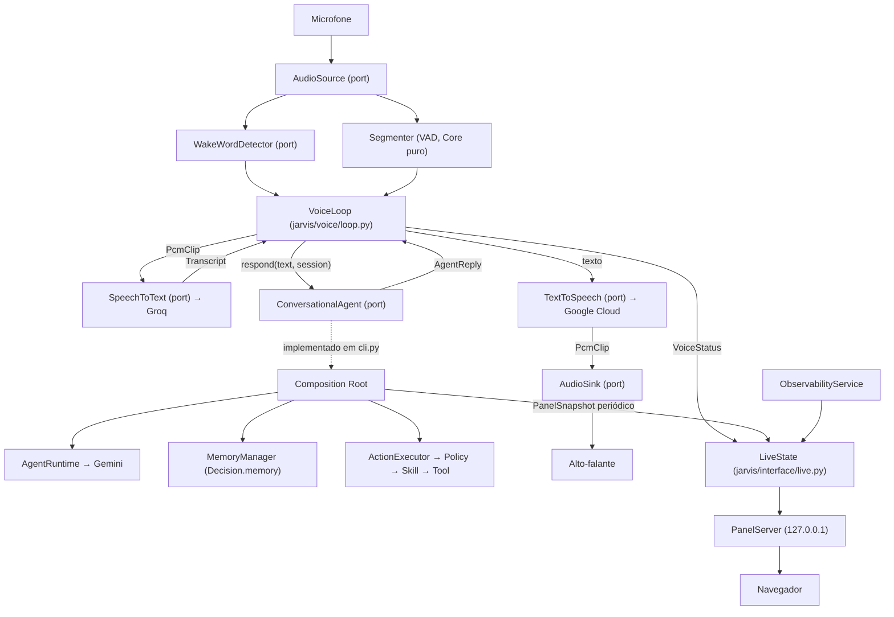

# Plano de implementação — Fase 6: Voz, Wake Word e Interface

> Plano técnico aprovado antes da implementação da Fase 6, na metodologia do
> [`ROADMAP.md`](../ROADMAP.md) (explorar → planejar → revisar → aprovar →
> implementar → testar → commit). Segue o formato dos planos das Fases 1 a 5.
>
> Fonte do objetivo desta fase: [`PHASE_6_EXECUTION_CONTEXT.md`](../PHASE_6_EXECUTION_CONTEXT.md)
> (artefato temporário de planejamento, não documentação permanente). Fonte da
> verdade sobre o que é a subfase: [`ROADMAP.md`](../ROADMAP.md). Fonte da
> verdade sobre o estado atual: o código em `src/`. Fonte da verdade sobre
> fronteiras: [`architecture-contracts.md`](architecture-contracts.md) e os ADRs
> em [`adr/`](adr/).
>
> **Uma única unidade de desenvolvimento.** As etapas E1–E14 da §28 existem para
> ordenar a implementação, não para pedir aprovação entre elas.

---

## 1. Objetivo

Tornar o Jarvis **utilizável**: falar com ele, ser respondido em voz, e ver o
que ele está fazendo por dentro.

```text
Usuário → Microfone → Wake Word → STT → Agent Runtime
        → Context + Memory + LLM → Decision
        → Policy → Skill → Tool Router → MCP
        → TTS → Alto-falante
        → Interface (observabilidade)
```

Ao final da fase, uma pessoa consegue:

- chamar o Jarvis por voz e conversar com ele em turnos encadeados;
- ser respondida em voz, e **interromper** a resposta falando por cima;
- confirmar por voz uma ação que a política barrou;
- abrir `http://127.0.0.1:8765` e ver, ao vivo: linha do tempo de eventos,
  contexto atual campo a campo, memórias recuperadas com score, decisões,
  ações executadas com veredito de política, ferramentas usadas e a conversa;
- executar tudo isso **sem nenhuma IA local** — Gemini raciocina, Groq
  transcreve, Google Cloud sintetiza, e nada além disso roda modelo.

O princípio que a fase materializa:

```text
A voz é uma Interface, não um componente novo de raciocínio.
O painel é um leitor, não uma fonte de verdade.
O silêncio continua sendo uma decisão válida.
```

---

## 2. Estado atual encontrado

Fases 0–5 concluídas. `git log`: `1ca0629 docs: retire phase-0 and phase-4 era
claims from the architecture docs`.

```text
src/jarvis/
├── __init__.py · __main__.py · cli.py (1455 linhas) · config.py · errors.py · audit.py
├── events/     event.py bus.py ports.py publisher.py errors.py + adapters/
├── context/    observation.py model.py freshness.py projection.py aggregator.py
│               consumer.py engine.py snapshot.py ports.py errors.py + adapters/
├── memory/     memory.py embedding.py ranking.py retrieval.py consolidation.py
│               manager.py ports.py errors.py + adapters/
├── agent/      messages.py ports.py decision.py conversation.py input.py
│               importance.py prompt.py runtime.py errors.py + adapters/gemini.py
├── policy/ · skills/ · tools/ · execution/          (Fase 5)
tests/          73 módulos, estrutura plana, doubles em *_doubles.py
docs/           README · architecture · architecture-contracts · phase-1..5-plan
                event-system · context-system · memory-system · agent-runtime
                skills · mcp · security · adr/0001..0019
data/           events.db · context.db · memory.db · actions.db (gerados)
```

Fatos verificados no código que condicionam este plano:

| Fato | Onde | Consequência para a Fase 6 |
|---|---|---|
| `cli.py` é o composition root e o único módulo que lê credenciais | `cli.py:1`, `build_llm_provider` | Todo wiring de voz e painel entra aqui; `JARVIS_GROQ_API_KEY` e `JARVIS_GOOGLE_TTS_API_KEY` são lidos só aqui |
| Todo comando abre e fecha os bancos dentro de um `with` | `cli.py:566`, `1043`, `1249` | O modo residente (`jarvis run`) é a primeira exceção: mantém conexões abertas por minutos/horas. Precisa de decisão explícita sobre thread (§14.4) |
| Os quatro SQLite já usam `PRAGMA journal_mode = WAL` | `*/adapters/sqlite_*.py:38-52` | Um processo residente lendo enquanto outro CLI escreve funciona sem mudança de schema |
| `AgentRuntime.handle(...)` recebe `conversation: Conversation \| None` e devolve `AgentTurn` | `agent/runtime.py:164` | A voz não precisa de nenhuma API nova no agente — o multi-turno já existe, e é exatamente o que `agent chat` usa |
| `Conversation` é imutável, em memória, e o docstring diz "persistir sessão é escopo de Voice Sessions (6.4)" | `agent/conversation.py:13` | Esta fase resolve essa pendência, e a resolve como **estado operacional**, não como evento |
| `_persist_memory_proposal` grava `Decision.memory` com `Provenance(USER)` sem `reference` | `cli.py:152`, `909` | O ADR-0018 registrou que essa escolha precisa ser reavaliada "quando conversas forem persistidas (6.4)". A reavaliação está na §17.4 |
| `ContextField.CONVERSATION` existe e **nunca é preenchido**; o consumer diz que "conversa pertence à fase que trouxer a fonte correspondente" | `context/model.py:41`, `context/consumer.py:17` | Esta é a fase. Dois eventos novos passam a alimentar o campo |
| `GeminiLLMProvider` fala REST por `urllib` com `opener` injetável, e mapeia HTTP → taxonomia do Core | `agent/adapters/gemini.py` | Os adapters de STT e TTS copiam esse desenho linha a linha, inclusive o `opener` |
| Credencial vai em header, nunca em query string | ADR-0011, `gemini.py:11` | Vale igual para Groq (`Authorization: Bearer`) e Google TTS (`x-goog-api-key`) |
| `EventBus` é síncrono e em processo (ADR-0008); consumers filtram por `event_type` | `events/bus.py` | Os dois eventos de voz entram no mesmo mecanismo; nenhum broker novo |
| A trilha de auditoria da Fase 5 já publica 9 tipos de evento no Event Store | ADR-0017, `audit.py` | O painel tem o que mostrar em "decisões", "ações" e "ferramentas" **sem** antecipar a 7.4 |
| A confirmação chega como evento e a retomada reavalia a política do zero | ADR-0014, `cli.py:1325` | Confirmação por voz publica os mesmos dois eventos; nada de novo no fluxo de segurança |
| `pyproject.toml`: só `pydantic` + `pydantic-settings` em runtime; `addopts = -m 'not external'` | `pyproject.toml` | Áudio é a primeira necessidade que a stdlib não cobre → extra opcional (§26) |
| CI roda **só** `ubuntu-latest`, headless | `.github/workflows/ci.yml` | Nenhum teste pode exigir dispositivo de áudio, rede ou a dependência opcional |
| `tests/test_agent_architecture.py` proíbe `groq` entre os SDKs de vendor do agente | `test_agent_architecture.py:78` | Continua valendo: quem fala com a Groq é `jarvis.voice.adapters`, nunca `jarvis.agent` |
| Não existe `jarvis/voice/`, `jarvis/interface/`, nem nada de áudio ou HTTP server | `src/` | Tudo abaixo é novo |

---

## 3. Arquitetura atual relevante

O que a Fase 6 consome do que já existe, e **como**:

- **Agent Runtime** — consumido **por trás de um port próprio da camada de voz**
  (`ConversationalAgent`, §8.3). `jarvis.voice` não importa `jarvis.agent`. Quem
  liga os dois é `cli.py`.
- **Execution** — a voz nunca alcança `ActionExecutor`. Uma confirmação falada
  vira uma chamada ao mesmo port, e o composition root publica o evento e
  retoma (ADR-0014/0016 intactos).
- **Event System** — dois eventos novos, sem conteúdo (§17). O painel lê o
  Event Store para a linha do tempo e para a trilha de auditoria.
- **Context Engine** — o painel lê `CurrentContext`; os eventos de voz passam a
  preencher `ContextField.CONVERSATION`.
- **Memory System** — inalterado. O painel mostra as memórias que o turno
  recuperou (`AgentTurn.used_memory_ids`) e as últimas gravadas.
- **Configuração** — `Settings` ganha um bloco de Fase 6; lida uma vez em
  `cli.py`.
- **Erros** — `JarvisError → DomainError | InfrastructureError → ProviderError`,
  com `retryable` como atributo de classe.
- **Testes arquiteturais por AST** — padrão `tests/test_*_architecture.py`,
  replicado em dois arquivos novos.

---

## 4. Gap entre estado atual e objetivo

| # | Objetivo | Hoje | Gap |
|---|---|---|---|
| 1 | Capturar e reproduzir áudio | inexistente | ports `AudioSource`/`AudioSink` + adapter (§26) |
| 2 | Wake word com interface própria, sem IA local | inexistente | port `WakeWordDetector` + dois adapters (§10) |
| 3 | VAD determinístico para segmentar fala | inexistente | `voice/vad.py`, Core puro (§10.2) |
| 4 | STT trocável, com provider Groq | inexistente | port `SpeechToText` + `GroqSpeechToText` (§11) |
| 5 | TTS trocável, com provider Google Cloud | inexistente | port `TextToSpeech` + `GoogleCloudTextToSpeech` (§12) |
| 6 | Sessão de voz com id, estado e timeout | `Conversation` só em memória | `VoiceSession` + `voice.db` (§13) |
| 7 | Interrupção da fala do agente | inexistente | barge-in no `VoiceLoop` (§13.4) |
| 8 | Conversa completa por voz | `agent chat` lê stdin | `VoiceLoop` + `jarvis voice listen` (§9) |
| 9 | Painel de observabilidade | só saída de terminal | `jarvis/interface/` + `jarvis panel serve` (§14) |
| 10 | Estado ao vivo visível durante a conversa | inexistente | `LiveState` + SSE (§15.3) |
| 11 | Notificação visível ao usuário | inexistente | toast do painel, e **nada além** (§16) |
| 12 | Campo `conversation` do contexto preenchido | sempre ausente | dois eventos + duas traduções (§17.3) |
| 13 | Processo residente | todo comando é one-shot | `jarvis run` (§14.4, ADR-0023) |
| 14 | Provas estruturais das fronteiras novas | — | `test_voice_architecture.py`, `test_interface_architecture.py`, `test_voice_privacy.py` (§23) |

---

## 5. Arquitetura proposta

Dois pacotes novos, e a razão de serem dois é a regra de dependência:

```text
src/jarvis/
├── voice/       Interface + Infrastructure — fala com o usuário; conhece só ports próprios
└── interface/   Interface (leitura) — projeta o estado do sistema; não aciona nada
```



Direções de dependência (todas verificadas por teste em §23):

```text
voice        →  jarvis.errors                        (e nada mais de jarvis)
interface    →  jarvis.errors, e apenas módulos de *domínio* de
                events / context / memory / execution / voice
voice        ─X→ agent, policy, skills, tools, execution, interface, config
interface    ─X→ agent, policy, skills, tools, execution.orchestrator,
                 qualquer *.adapters, config, cli, sqlite3
agent        ─X→ voice, interface           (continua não conhecendo ninguém a jusante)
cli          →  tudo (composition root)
```

A assimetria é deliberada e é o ponto central da fase:

- **`jarvis.voice` não importa `jarvis.agent`.** Contracts §3.9 *permitiria*
  (lista "a interface conversacional do Agent Runtime" entre as dependências
  legítimas), mas um port próprio é mais forte e mais barato: o loop de voz
  passa a ser testável inteiro sem LLM, sem memória e sem banco, e a proibição
  vira uma linha de teste em vez de uma convenção. O preço é um `Protocol` de
  dois métodos — pago à vista.
- **`jarvis.interface` não importa serviço nenhum**, só tipos de domínio. É o
  que torna "a interface nunca acessa SQLite, MCP, Skills ou LLM" uma
  propriedade estrutural em vez de uma promessa.

---

## 6. Componentes a criar

### 6.1 `jarvis/voice/` — Core + adapters

| Módulo | Conteúdo |
|---|---|
| `errors.py` | `VoiceError`, `InvalidVoiceInputError`, `VoiceSessionError` (domínio); `AudioError`, `AudioDeviceError`, `AudioFormatError`, `VoiceRepositoryError` (infra); `SpeechToTextError`/`TextToSpeechError` + as cinco subclasses de cada (§19) |
| `audio.py` | `AudioFormat`, `AudioChunk`, `PcmClip`, `rms()`, `silence()`, `concat()`, `MAX_CLIP_SECONDS`. **Módulo folha, sem imports de `jarvis` além de `errors`** |
| `ports.py` | `AudioSource`, `AudioSink`, `SpeechToText`, `TextToSpeech`, `WakeWordDetector`, `ConversationalAgent`, `VoiceSessionRepository` — sete `Protocol` |
| `vad.py` | `VadSettings`, `SpeechSegment`, `Segmenter` — aritmética determinística sobre PCM, zero modelo, zero I/O |
| `wake.py` | `WakePhrase`, `WakeWordDetection`, `normalize()`, `matches()`, `edit_distance()` |
| `session.py` | `VoiceState`, `VoiceTurn`, `VoiceSession`, `VoiceStatus`, `SessionSettings`, `new_session_id()` |
| `loop.py` | `VoiceLoop`, `VoiceSettings`, `TurnOutcome` — a orquestração inteira |
| `adapters/sounddevice_audio.py` | `MicrophoneSource`, `SpeakerSink`, `list_devices()` — **único** módulo do repositório que importa `sounddevice` |
| `adapters/groq_stt.py` | `GroqSpeechToText` (multipart por `urllib`, `opener` injetável) |
| `adapters/google_tts.py` | `GoogleCloudTextToSpeech` (JSON por `urllib`, `opener` injetável) |
| `adapters/wake_push_to_talk.py` | `PushToTalkWakeWord` + `StdinTrigger` |
| `adapters/wake_transcription.py` | `TranscriptionWakeWord` (VAD + `SpeechToText` + `WakeBudget`) |
| `adapters/wave_io.py` | `encode_wav()`, `decode_wav()` sobre o módulo `wave` da stdlib |
| `adapters/sqlite_sessions.py` | `SqliteVoiceSessionRepository` (`data/voice.db`) |

### 6.2 `jarvis/interface/` — Interface + adapters

| Módulo | Conteúdo |
|---|---|
| `errors.py` | `InterfaceError`, `PanelError`, `PanelAddressInUseError` |
| `viewmodel.py` | `PanelSnapshot` + `TimelineEntry`, `ContextRow`, `MemoryCard`, `DecisionCard`, `ActionCard`, `ToolCard`, `ConversationEntry`, `Toast`, `VoiceStatusView`, `Severity` |
| `service.py` | `ObservabilityService` — recebe *callables* de leitura e devolve `PanelSnapshot` |
| `live.py` | `LiveState` — publicação thread-safe com revisão monotônica e `wait_for(revision, timeout)` |
| `adapters/http_panel.py` | `PanelServer` sobre `ThreadingHTTPServer`; rotas `/`, `/api/state`, `/api/stream`, `/healthz` |
| `adapters/page.py` | `PANEL_HTML` — a página única, HTML+CSS+JS inline, sem CDN e sem build |

### 6.3 Bancos e arquivos gerados

```text
data/voice.db          quinto SQLite: sessões e transcrições (estado operacional, apagável)
```

---

## 7. Componentes a modificar

| Arquivo | Mudança | Por quê |
|---|---|---|
| `src/jarvis/config.py` | bloco `# --- Fase 6` com 24 campos novos (§21) | configuração é lida uma vez, no root |
| `src/jarvis/cli.py` | `build_audio_io`, `build_stt`, `build_tts`, `build_wake_detector`, `build_voice_loop`, `build_observability_service`, `RuntimeConversationalAgent`, e os comandos `voice`, `panel`, `run` | é o composition root; nenhum outro módulo pode conhecer as três zonas |
| `src/jarvis/context/consumer.py` | duas traduções novas: `voice.session_started` → `conversation`, `voice.session_ended` → ausência observada | o campo existe desde a Fase 2 e o comentário do módulo já reservava a fase que traria a fonte |
| `.env.example` | bloco de Fase 6, com comentário por grupo | o padrão do arquivo |
| `pyproject.toml` | `[project.optional-dependencies] voice`; override de mypy para `sounddevice.*` | §26 |
| `README.md` | seção de uso: `jarvis run`, o painel, o extra `voice` | é a porta de entrada |
| `ROADMAP.md` | marcar 6.1–6.6; **acrescentar 6.7 e 6.8** com justificativa; histórico | §34, divergência V-1 |
| `docs/architecture.md` | §7 deixa de ser "conceito, não implementado" | documentação de implementação acompanha o código |
| `docs/architecture-contracts.md` | §3.9 ganha a nota do port `ConversationalAgent`; §3.14 novo (Observability Interface) | é contrato novo, não repetição |
| `docs/README.md` | índice ganha `voice.md` e `interface.md` | o índice é mantido |
| `tests/test_context_consumer.py`, `test_cli.py`, `test_config.py` | ampliados | comportamento novo em módulos existentes |

**Não muda:** `agent/`, `memory/`, `policy/`, `skills/`, `tools/`,
`execution/`, `events/`. Nenhum arquivo desses pacotes é tocado — e os testes
arquiteturais existentes garantem que nenhum deles ganhe uma aresta para voz ou
interface.

---

## 8. Interfaces e contratos

### 8.1 Áudio (`voice/audio.py`)

```python
@dataclass(frozen=True, slots=True, kw_only=True)
class AudioFormat:
    sample_rate: int = 16_000  # Hz — o que Whisper espera
    channels: int = 1  # mono; estéreo não ajuda reconhecimento
    sample_width: int = 2  # bytes por amostra (PCM s16le)

    @property
    def frame_bytes(self) -> int: ...  # channels * sample_width
    @property
    def bytes_per_second(self) -> int: ...
    def duration_of(self, data: bytes) -> float: ...


@dataclass(frozen=True, slots=True, kw_only=True)
class AudioChunk:
    """Um bloco contínuo de PCM, como saiu do dispositivo."""

    data: bytes
    format: AudioFormat
    captured_at: datetime

    @property
    def duration_seconds(self) -> float: ...
    @property
    def rms(self) -> float: ...  # 0.0–1.0, normalizado pela escala do sample_width


@dataclass(frozen=True, slots=True, kw_only=True)
class PcmClip:
    """Um enunciado completo, pronto para transcrever ou reproduzir."""

    data: bytes
    format: AudioFormat

    @property
    def duration_seconds(self) -> float: ...
    def __post_init__(self) -> None: ...  # recusa clip > MAX_CLIP_SECONDS (default 60)


def rms(data: bytes, *, sample_width: int) -> float: ...
def concat(chunks: Sequence[AudioChunk]) -> PcmClip: ...  # recusa formatos divergentes
def silence(seconds: float, *, format: AudioFormat) -> PcmClip: ...
```

`rms` usa `audioop`… **não**: `audioop` foi removido do Python 3.13. A
implementação usa `array("h", data)` da stdlib e uma soma de quadrados — 6
linhas, determinística, e testada com PCM sintético. Registrado aqui porque é o
tipo de detalhe que custa uma hora se for descoberto durante a implementação.

### 8.2 Ports de voz (`voice/ports.py`)

```python
class AudioSource(Protocol):
    """De onde vem o som. Um adapter respeita três regras:
    nunca bloqueia além de `timeout_seconds`; devolve `None` em vez de levantar
    quando não houve áudio no intervalo; traduz erro nativo para `AudioError`."""

    @property
    def format(self) -> AudioFormat: ...
    def start(self) -> None: ...
    def read(self, *, timeout_seconds: float) -> AudioChunk | None: ...
    def stop(self) -> None: ...
    def close(self) -> None: ...


class AudioSink(Protocol):
    """Para onde vai o som. `play` é síncrono e **cancelável**: consulta
    `cancelled()` entre blocos, e retorna assim que ela for verdadeira —
    é o que torna barge-in possível sem thread extra."""

    @property
    def format(self) -> AudioFormat: ...
    def play(self, clip: PcmClip, *, cancelled: Callable[[], bool] = ...) -> PlaybackResult: ...
    def close(self) -> None: ...


@dataclass(frozen=True, slots=True, kw_only=True)
class PlaybackResult:
    played_seconds: float
    interrupted: bool


class SpeechToText(Protocol):
    """Áudio entra, texto sai. Não decide nada, não guarda estado,
    traduz todo erro nativo para `SpeechToTextError` e respeita o timeout."""

    @property
    def model(self) -> str: ...
    def transcribe(
        self, clip: PcmClip, *, language: str | None = None, timeout_seconds: float
    ) -> Transcript: ...


@dataclass(frozen=True, slots=True, kw_only=True)
class Transcript:
    text: str
    language: str | None = None
    duration_seconds: float | None = None

    @property
    def is_empty(self) -> bool: ...  # text.strip() == ""


class TextToSpeech(Protocol):
    @property
    def voice(self) -> str: ...
    def synthesize(self, text: str, *, timeout_seconds: float) -> PcmClip: ...


class WakeWordDetector(Protocol):
    """Modelo **push**: o loop já está lendo do microfone e alimenta o detector.
    Nenhum detector abre dispositivo por conta própria — é o que permite que o
    mesmo stream sirva wake word, captura e barge-in."""

    @property
    def name(self) -> str: ...
    def feed(self, chunk: AudioChunk) -> WakeWordDetection | None: ...
    def reset(self) -> None: ...
    def close(self) -> None: ...


class ConversationalAgent(Protocol):
    """A única porta da camada de voz para o resto do Jarvis.

    O implementador (composition root) faz: montar contexto, chamar o
    `AgentRuntime`, aplicar `Decision.memory` e, se houver `Decision.action` e o
    modo permitir, submeter ao `ActionExecutor`. Nada disso é visível aqui — e é
    por isso que `jarvis.voice` não importa `jarvis.agent` nem
    `jarvis.execution`."""

    def respond(self, text: str, *, session: VoiceSession) -> AgentReply: ...
    def answer_confirmation(
        self, execution_id: str, *, granted: bool, session: VoiceSession
    ) -> AgentReply: ...


@dataclass(frozen=True, slots=True, kw_only=True)
class AgentReply:
    text: str | None  # None = silêncio deliberado
    decision_type: str  # "ignore" | "notify" | ... (dado, não enum importado)
    correlation_id: str
    awaiting_confirmation: str | None = None  # execution_id, quando a política pediu
    detail: str = ""


class VoiceSessionRepository(Protocol):
    def save(self, session: VoiceSession) -> None: ...
    def get(self, session_id: str) -> VoiceSession | None: ...
    def list(self, *, limit: int) -> Sequence[VoiceSession]: ...
    def purge(self, session_id: str) -> bool: ...
    def purge_before(self, cutoff: datetime) -> int: ...
```

Quais **não** são ports, e por quê: `Segmenter`, `VoiceLoop`, `VoiceSession`,
`ObservabilityService`, `LiveState`, `PanelServer`. Cada um tem implementação
única e nenhum substituto real — a mesma assimetria de `EventBus`/`EventStore`
(Fase 1) e `MemoryManager`/`MemoryRepository` (Fase 3). Um `Protocol` para eles
seria a abstração especulativa que contracts §1 proíbe.

### 8.3 VAD (`voice/vad.py`)

```python
@dataclass(frozen=True, slots=True, kw_only=True)
class VadSettings:
    rms_threshold: float = 0.02  # acima disto, considera-se fala
    min_speech_ms: int = 300  # abaixo disto, é ruído e o segmento é descartado
    silence_ms: int = 800  # silêncio contínuo que fecha o segmento
    max_utterance_seconds: float = 20.0  # teto duro; fecha e entrega o que houver
    pre_roll_ms: int = 300  # áudio mantido *antes* do disparo, para não cortar a sílaba inicial


@dataclass(frozen=True, slots=True, kw_only=True)
class SpeechSegment:
    clip: PcmClip
    started_at: datetime
    ended_at: datetime
    reason: SegmentEnd  # SILENCE | MAX_DURATION | FLUSH


class Segmenter:
    """Máquina de estados sobre chunks. Determinística: mesma sequência de
    chunks, mesmos segmentos. Não conhece dispositivo, rede nem relógio de
    parede além do que vem em `AudioChunk.captured_at`."""

    def __init__(self, *, settings: VadSettings = VadSettings()) -> None: ...
    @property
    def is_speaking(self) -> bool: ...
    def feed(self, chunk: AudioChunk) -> SpeechSegment | None: ...
    def flush(self) -> SpeechSegment | None: ...
    def reset(self) -> None: ...
```

Um anel de pré-roll de `pre_roll_ms` guarda os chunks anteriores ao disparo — é
a diferença entre transcrever "arvis, que horas são" e "jarvis, que horas são".

### 8.4 Wake word (`voice/wake.py`)

```python
@dataclass(frozen=True, slots=True, kw_only=True)
class WakePhrase:
    text: str  # normalizado na construção
    max_edit_distance: int = 1


@dataclass(frozen=True, slots=True, kw_only=True)
class WakeWordDetection:
    phrase: str
    detected_at: datetime
    detector: str
    transcript: str = ""  # o que foi ouvido, quando houve transcrição
    remainder: str = ""  # o que veio depois da frase, no mesmo enunciado


def normalize(text: str) -> str:
    """Minúsculas, sem acento (NFKD), sem pontuação, espaços colapsados."""


def edit_distance(a: str, b: str, *, cap: int) -> int:
    """Levenshtein com corte em `cap` — determinística e barata."""


def matches(transcript: str, phrases: Sequence[WakePhrase]) -> tuple[str, str] | None:
    """Devolve `(frase_casada, resto_do_enunciado)` ou `None`.

    Só casa nos **dois primeiros tokens** do enunciado: "jarvis, apague tudo"
    ativa; "o jarvis do filme apaga tudo" não. A restrição é o que evita que
    qualquer menção ao nome vire comando."""
```

### 8.5 Sessão (`voice/session.py`)

```python
class VoiceState(StrEnum):
    IDLE = "idle"  # nada acontecendo; nem o microfone está aberto
    LISTENING = "listening"  # microfone aberto, esperando a wake word
    CAPTURING = "capturing"  # gravando o enunciado do usuário
    TRANSCRIBING = "transcribing"  # enunciado fechado, esperando a Groq
    THINKING = "thinking"  # esperando o agente (contexto + memória + Gemini + ação)
    SPEAKING = "speaking"  # reproduzindo a resposta
    FOLLOW_UP = "follow_up"  # janela curta de escuta sem wake word, após responder


class TurnRole(StrEnum):
    USER = "user"
    ASSISTANT = "assistant"


@dataclass(frozen=True, slots=True, kw_only=True)
class VoiceTurn:
    role: TurnRole
    text: str
    at: datetime
    latency_ms: float | None = None
    decision_type: str = ""
    correlation_id: str = ""


@dataclass(frozen=True, slots=True, kw_only=True)
class VoiceSession:
    session_id: str
    started_at: datetime
    correlation_id: str
    turns: tuple[VoiceTurn, ...] = ()
    ended_at: datetime | None = None
    ended_reason: str = ""

    def append(self, turn: VoiceTurn) -> "VoiceSession": ...  # devolve outra; nada é reescrito
    def end(self, *, at: datetime, reason: str) -> "VoiceSession": ...
    def last(self, count: int) -> Sequence[VoiceTurn]: ...
    @property
    def turn_count(self) -> int: ...
    @property
    def is_open(self) -> bool: ...


@dataclass(frozen=True, slots=True, kw_only=True)
class SessionSettings:
    follow_up_seconds: float = 12.0  # janela de escuta sem wake word depois de responder
    idle_timeout_seconds: float = 45.0  # sem fala nenhuma, a sessão fecha
    max_turns: int = 40  # teto duro; fecha a sessão e abre outra


@dataclass(frozen=True, slots=True, kw_only=True)
class VoiceStatus:
    """O que o painel mostra ao vivo. **Nunca** carrega áudio."""

    state: VoiceState
    session_id: str | None
    at: datetime
    detail: str = ""
    last_transcript: str = ""
    last_reply: str = ""
```

### 8.6 Loop (`voice/loop.py`)

```python
@dataclass(frozen=True, slots=True, kw_only=True)
class VoiceSettings:
    vad: VadSettings = VadSettings()
    session: SessionSettings = SessionSettings()
    phrases: tuple[WakePhrase, ...] = (WakePhrase(text="jarvis"),)
    language: str | None = "pt"
    stt_timeout_seconds: float = 30.0
    tts_timeout_seconds: float = 15.0
    barge_in: bool = True
    barge_in_rms: float = 0.06  # mais alto que o VAD: o alto-falante também faz som
    read_timeout_seconds: float = 0.5
    speak_errors: bool = True  # falar "não consegui te ouvir" em vez de só logar


class VoiceLoop:
    def __init__(
        self,
        *,
        source: AudioSource,
        sink: AudioSink,
        stt: SpeechToText,
        tts: TextToSpeech,
        wake: WakeWordDetector,
        agent: ConversationalAgent,
        sessions: VoiceSessionRepository | None = None,
        settings: VoiceSettings = VoiceSettings(),
        on_status: Callable[[VoiceStatus], None] = lambda status: None,
        on_session: Callable[[VoiceSession, bool], None] = lambda session, started: None,
        clock: Callable[[], datetime] = _utc_now,
        monotonic: Callable[[], float] = time.monotonic,
        new_id: Callable[[], str] = new_session_id,
    ) -> None: ...

    def run(self, *, stop: Callable[[], bool] = lambda: False) -> None:
        """Laço externo: sessão após sessão, até `stop()`."""

    def run_session(self) -> VoiceSession:
        """Uma sessão completa: da wake word ao timeout. É o que os testes usam."""

    def handle_utterance(self, clip: PcmClip, session: VoiceSession) -> TurnOutcome: ...
```

`on_status` e `on_session` são a **única** saída do loop para o mundo de fora
além do áudio: é assim que o painel recebe estado ao vivo e que o composition
root publica os dois eventos, sem que `jarvis.voice` conheça `jarvis.events`.

### 8.7 View models (`interface/viewmodel.py`)

```python
class Severity(StrEnum):
    INFO = "info"
    SUCCESS = "success"
    WARNING = "warning"
    DANGER = "danger"


@dataclass(frozen=True, slots=True, kw_only=True)
class TimelineEntry:
    event_id: str
    event_type: str
    source: str
    occurred_at: datetime
    recorded_at: datetime
    correlation_id: str
    severity: Severity
    summary: str  # derivado do tipo, **nunca** o payload cru (§20.3)


@dataclass(frozen=True, slots=True, kw_only=True)
class ContextRow:
    field: str
    value: str  # "-" nunca observado, "(nenhum)" ausência observada
    source: str
    observed_at: datetime | None
    freshness: str  # fresh | stale
    confidence: float | None


@dataclass(frozen=True, slots=True, kw_only=True)
class MemoryCard:
    memory_id: str
    type: str
    content: str  # truncado em 160 caracteres
    subject: str
    importance: float
    confidence: float
    origin: str
    reference: str
    score: float | None = None  # presente quando veio de um retrieval do turno
    used_in_turn: bool = False


@dataclass(frozen=True, slots=True, kw_only=True)
class DecisionCard:
    decision_type: str
    reason: str
    message: str
    correlation_id: str
    decided_at: datetime
    consulted_llm: bool
    importance: float | None
    memory_count: int


@dataclass(frozen=True, slots=True, kw_only=True)
class ActionCard:
    execution_id: str
    skill: str
    status: str
    actor: str
    verdict: str  # allow | deny | require_confirmation | "-"
    rule_id: str
    reason: str
    duration_ms: float | None
    tools_used: tuple[str, ...]
    correlation_id: str
    at: datetime


@dataclass(frozen=True, slots=True, kw_only=True)
class ToolCard:
    tool_id: str
    backend_id: str
    status: str  # completed | failed
    duration_ms: float | None
    execution_id: str
    at: datetime


@dataclass(frozen=True, slots=True, kw_only=True)
class ConversationEntry:
    role: str
    text: str
    at: datetime
    session_id: str
    latency_ms: float | None = None


@dataclass(frozen=True, slots=True, kw_only=True)
class Toast:
    toast_id: str  # determinístico: dedup no navegador sem estado no servidor
    severity: Severity
    title: str
    body: str
    at: datetime


@dataclass(frozen=True, slots=True, kw_only=True)
class VoiceStatusView:
    state: str
    session_id: str | None
    detail: str
    last_transcript: str
    last_reply: str
    at: datetime | None


@dataclass(frozen=True, slots=True, kw_only=True)
class PanelSnapshot:
    revision: int
    as_of: datetime
    voice: VoiceStatusView
    timeline: tuple[TimelineEntry, ...] = ()
    context: tuple[ContextRow, ...] = ()
    memories: tuple[MemoryCard, ...] = ()
    decisions: tuple[DecisionCard, ...] = ()
    actions: tuple[ActionCard, ...] = ()
    tools: tuple[ToolCard, ...] = ()
    conversation: tuple[ConversationEntry, ...] = ()
    toasts: tuple[Toast, ...] = ()
    degraded: tuple[str, ...] = ()  # o que não pôde ser lido nesta passada
```

### 8.8 Serviço de observabilidade (`interface/service.py`)

```python
class ObservabilityService:
    """Monta o `PanelSnapshot`. Recebe *funções de leitura* já ligadas aos
    stores pelo composition root — o mesmo desenho de
    `AgentRuntime(context_reader=...)`. Não abre banco, não conhece adapter."""

    def __init__(
        self,
        *,
        read_events: Callable[[int], Sequence[RecordedEvent]],
        read_context: Callable[[], CurrentContext],
        read_memories: Callable[[int], Sequence[StoredMemory]],
        read_pending: Callable[[], Sequence[PendingAction]],
        timeline_limit: int = 50,
        memory_limit: int = 10,
        toast_types: frozenset[str] = DEFAULT_TOAST_TYPES,
        clock: Callable[[], datetime] = _utc_now,
    ) -> None: ...

    def snapshot(
        self,
        *,
        revision: int,
        voice: VoiceStatus | None = None,
        session: VoiceSession | None = None,
        last_turn: TurnTrace | None = None,
    ) -> PanelSnapshot: ...
```

Cada leitura é embrulhada em um `try/except JarvisError`: um banco travado
degrada **um painel**, não derruba a sessão de voz. O que falhou aparece em
`PanelSnapshot.degraded` e é mostrado na página — a interface é honesta sobre o
que não conseguiu ler, em vez de mostrar vazio como se fosse ausência.

### 8.9 Estado ao vivo (`interface/live.py`)

```python
class LiveState:
    """Um `PanelSnapshot` por vez, com revisão monotônica.

    Escrito só pela thread principal; lido por N threads do servidor HTTP. Um
    `threading.Condition` faz o long-poll do SSE acordar na próxima revisão em
    vez de girar em `sleep`."""

    def __init__(self) -> None: ...
    def publish(self, snapshot: PanelSnapshot) -> int: ...
    def current(self) -> PanelSnapshot | None: ...
    @property
    def revision(self) -> int: ...
    def wait_for(self, *, after: int, timeout: float) -> PanelSnapshot | None: ...
```

### 8.10 Servidor do painel (`interface/adapters/http_panel.py`)

```python
class PanelServer:
    def __init__(
        self,
        *,
        live: LiveState,
        host: str = "127.0.0.1",
        port: int = 8765,
        stream_timeout: float = 25.0,
    ) -> None: ...
    @property
    def url(self) -> str: ...
    @property
    def port(self) -> int: ...          # resolvido, útil quando port=0 nos testes
    def start(self) -> None: ...        # thread daemon
    def stop(self) -> None: ...
    def __enter__/__exit__ ...
```

| Rota | Método | Resposta |
|---|---|---|
| `/` | GET | `text/html` — `PANEL_HTML`, autocontido |
| `/api/state` | GET | `application/json` — o `PanelSnapshot` corrente |
| `/api/stream` | GET | `text/event-stream` — um `data:` por revisão nova; heartbeat a cada `stream_timeout` |
| `/healthz` | GET | `text/plain` — `ok` + revisão |
| qualquer outra | GET | 404 |
| qualquer rota | POST/PUT/DELETE | **405**, sempre |

Headers em toda resposta: `Cache-Control: no-store`,
`Content-Security-Policy: default-src 'none'; style-src 'unsafe-inline'; script-src 'unsafe-inline'; connect-src 'self'`,
`X-Content-Type-Options: nosniff`. Bind fixo em `127.0.0.1`; um host diferente é
recusado na construção com `PanelError` — abrir o painel para a rede exigiria
autenticação, e autenticação é multiusuário, que o `PHASE_6_EXECUTION_CONTEXT.md`
coloca fora de escopo.

---

## 9. Fluxos de voz

### 9.1 Conversa completa (caminho feliz)

```text
jarvis run
  └─ source.start()                                   state=LISTENING
     loop: chunk = source.read(0.5s)
        ├─ wake.feed(chunk) → None                    (segue ouvindo)
        └─ wake.feed(chunk) → WakeWordDetection       state=CAPTURING
             session = VoiceSession(...)              on_session(session, started=True)
                                                      → cli publica voice.session_started
             segmenter.reset(); [pre-roll já retido]
             loop: segmenter.feed(chunk) → SpeechSegment(reason=SILENCE)
                                                      state=TRANSCRIBING
             transcript = stt.transcribe(segment.clip, language="pt", timeout=30)
             session = session.append(VoiceTurn(USER, transcript.text, ...))
                                                      state=THINKING
             reply = agent.respond(transcript.text, session=session)
                 ↳ (no composition root) contexto → memória → Gemini → Decision
                   → Decision.memory aplicada (ADR-0018)
                   → Decision.action submetida ao ActionExecutor (ADR-0016)
             session = session.append(VoiceTurn(ASSISTANT, reply.text, ...))
                                                      state=SPEAKING
             clip = tts.synthesize(reply.text, timeout=15)
             sink.play(clip, cancelled=barge_in_detected)
                                                      state=FOLLOW_UP (12s)
             ├─ nova fala dentro da janela → CAPTURING (sem wake word)
             └─ silêncio → sessão fecha               on_session(session, started=False)
                                                      → cli publica voice.session_ended
                                                      state=LISTENING
```

Quando a wake word veio junto do comando ("jarvis, que horas são"),
`WakeWordDetection.remainder` já traz o resto e o turno pula a captura: o
enunciado que ativou **é** o enunciado processado. Sem isso, o usuário teria de
falar duas vezes toda vez.

### 9.2 Silêncio — `Decision.ignore`

`AgentReply.text is None` → **nada é sintetizado, nada é falado**. O turno é
registrado na sessão como turno do assistente vazio? Não: nenhum `VoiceTurn` de
assistente é criado. O painel mostra a decisão (`decision_type="ignore"`), e o
estado volta para `FOLLOW_UP`. É o "silêncio é uma decisão válida" cumprido
literalmente — o custo de uma síntese e de 3 segundos de fala não é pago para
dizer nada.

### 9.3 Ação que exige confirmação, falada

```text
usuário: "jarvis, apague o relatório"
  → agent.respond(...) → ActionExecutor → PolicyVerdict=require_confirmation
  → AgentReply(text="Isso apaga relatorio.txt. Confirma?",
               awaiting_confirmation="exec-7c2…")
  → sink.play(...)                            state=FOLLOW_UP, aguardando resposta
usuário: "sim"
  → o loop reconhece a resposta contra AFFIRMATIVE/NEGATIVE (lista fechada,
    normalizada: "sim", "isso", "confirmo", "pode", "não", "cancela", "para")
  → agent.answer_confirmation("exec-7c2…", granted=True, session=...)
       ↳ (no composition root) publica action.confirmation_granted
         → ActionEventConsumer projeta no estado
         → executor.resume(...) **reavalia a política do zero** (ADR-0013/0014)
  → AgentReply com o desfecho → TTS
```

Uma resposta que não casa com nenhuma das duas listas **não** é interpretada
como confirmação: vira um enunciado comum, e a pendência continua aberta até
expirar. Errar para o lado de não executar é o desfecho seguro; a mesma lógica
do ADR-0019.

### 9.4 Interrupção (barge-in)

```text
state=SPEAKING, sink.play() reproduzindo bloco a bloco
  a cada bloco: cancelled() consulta o detector de barge-in
    detector: source.read(0) → chunk.rms > barge_in_rms por ≥ 2 blocos consecutivos
  → cancelled() = True → play() retorna PlaybackResult(interrupted=True)
  → o restante do clip é **descartado** (nunca retomado: a fala perdeu validade)
  → state=CAPTURING, com o pre-roll do barge-in já no buffer
```

Três detalhes que a implementação não pode inventar:

1. Durante `SPEAKING`, o `TranscriptionWakeWord` fica **suspenso** — senão o
   Jarvis transcreve a própria voz e se acorda sozinho.
2. `barge_in_rms` é maior que `vad.rms_threshold` de propósito: sem headset, o
   próprio alto-falante alimenta o microfone. O `README` documenta que barge-in
   confiável pressupõe fone; `JARVIS_VOICE_BARGE_IN=false` desliga.
3. O clip interrompido não é retomado nem repetido. O turno já foi registrado na
   sessão com o texto inteiro — o que o usuário ouviu é uma informação de
   entrega, não de conteúdo.

### 9.5 Falhas

| Falha | Comportamento |
|---|---|
| `SttTimeoutError` / `SttRateLimitError` | fala "Não consegui te ouvir agora." (se `speak_errors`), estado volta a `LISTENING`, sessão continua aberta |
| `Transcript.is_empty` | nenhum turno é criado, nenhuma chamada ao LLM é feita, volta a `FOLLOW_UP` — silêncio transcrito não é uma pergunta |
| `TtsTimeoutError` / `TtsRejectedError` | a resposta é **impressa** no terminal e mostrada no painel; a sessão segue. Ficar mudo sem sinal seria pior que responder por texto |
| `LLMProviderError` (via `ConversationalAgent`) | fala "Tive um problema para pensar nisso." e loga; nunca vaza o erro cru (contracts §13) |
| `AudioDeviceError` no `start()` | o comando falha com código 1 e uma mensagem acionável ("instale o extra: `uv sync --extra voice`" / "nenhum dispositivo de entrada") |
| `AudioError` no meio da sessão | encerra a sessão com `ended_reason="audio_error"`, publica `voice.session_ended`, e o processo continua vivo se o painel estiver rodando |
| `Ctrl-C` | encerra a sessão com `ended_reason="interrupted"`, fecha dispositivos, para o servidor, código 0 |

Nenhuma dessas falhas derruba `jarvis run`: o painel continua servindo, e é
exatamente nesse momento que a observabilidade vale alguma coisa.

---

## 10. Wake word (6.1)

### 10.1 A restrição, e o que ela elimina

`PHASE_6_EXECUTION_CONTEXT.md` proíbe modelos locais, inferência local e
servidores locais de IA. Isso elimina **todas** as soluções usuais de wake word:
Porcupine, openWakeWord, Precise e derivados são inferência local. Um detector
acústico "clássico" (MFCC + DTW sobre amostras gravadas) também está fora: seria
um modelo treinado por enrolamento, exigiria DSP pesado em Python puro e teria
qualidade imprevisível — mais risco do que o problema justifica.

O que sobra, sem quebrar a restrição, são duas estratégias. As duas são
implementadas, porque servem a momentos diferentes de uso.

### 10.2 `PushToTalkWakeWord` (default)

Um `StdinTrigger` roda numa thread lendo `sys.stdin`; qualquer linha (inclusive
vazia — Enter) levanta um `threading.Event`. `feed()` ignora o áudio e devolve
uma `WakeWordDetection` quando o evento está setado, limpando-o em seguida.

Custo zero, latência zero, determinístico, testável, e **nenhum áudio sai do
dispositivo antes de o usuário pedir**. É o default por isso.

### 10.3 `TranscriptionWakeWord` (opt-in)

```text
chunk → Segmenter (VAD determinístico, sem modelo)
      → segmento de 0,3–3,0 s fechado por silêncio
      → WakeBudget: já houve N transcrições neste minuto?  (sim → descarta)
      → stt.transcribe(segmento)
      → wake.matches(transcrito, phrases)  →  WakeWordDetection(remainder=…)
```

Quatro controles, porque "mandar tudo que se ouve para a nuvem" seria
inaceitável:

1. **Gate de energia e duração** — só segmentos entre `min_speech_ms` e
   `wake_max_segment_seconds` (default 3,0 s) viram requisição. Silêncio, tosse
   e ruído nunca saem da máquina.
2. **Orçamento** — `JARVIS_STT_WAKE_BUDGET_PER_MINUTE` (default 12). Estourado,
   os segmentos são descartados e o fato é logado uma vez por minuto. É o que
   impede uma TV ligada de consumir a quota inteira.
3. **Casamento restrito** — só nos dois primeiros tokens, com distância de
   edição ≤ 1 sobre o texto normalizado (§8.4).
4. **Suspensão durante `SPEAKING`** — o detector é pausado enquanto o Jarvis
   fala (§9.4).

O modo é declarado em `JARVIS_WAKE_STRATEGY=push_to_talk|transcription`, e o
`README` diz, sem rodeio, o que o modo `transcription` implica: **trechos de
áudio do ambiente são enviados a um serviço de nuvem enquanto o modo de escuta
estiver ligado.**

### 10.4 Substituibilidade

O port `WakeWordDetector` é a razão de tudo isso ser trocável. Se um dia a
restrição "sem IA local" for revista, um `PorcupineWakeWord` entra como terceiro
adapter, sem tocar em `VoiceLoop`, `VoiceSession` ou no CLI — só no wiring e num
valor de configuração. Isso é registrado no ADR-0021 como o gatilho para
reconsiderar.

---

## 11. STT — Groq (6.2)

### 11.1 Requisição

```text
POST https://api.groq.com/openai/v1/audio/transcriptions
Authorization: Bearer <JARVIS_GROQ_API_KEY>
Content-Type: multipart/form-data; boundary=<32 hex aleatórios>

--boundary
Content-Disposition: form-data; name="file"; filename="utterance.wav"
Content-Type: audio/wav

<WAV RIFF de 16 kHz mono s16le, montado por wave_io.encode_wav>
--boundary
Content-Disposition: form-data; name="model"

whisper-large-v3-turbo
--boundary
Content-Disposition: form-data; name="response_format"

json
--boundary
Content-Disposition: form-data; name="language"      (só se configurado)

pt
--boundary
Content-Disposition: form-data; name="temperature"

0
--boundary--
```

Resposta esperada: `{"text": "que horas são"}`. Parsing tolerante, como no
adapter Gemini: campo ausente ou não-string → `SttInvalidResponseError`; campos
extras são ignorados.

O multipart é montado à mão (≈25 linhas: boundary, `b"\r\n".join(...)`), pelo
mesmo motivo do ADR-0011 — não vale trazer `requests` para formatar um corpo que
cabe numa função. O `opener` injetável permite testar o corpo byte a byte.

### 11.2 Mapa de erro

| Condição | Erro do Core | `retryable` |
|---|---|---|
| `TimeoutError` / `URLError(reason=TimeoutError)` | `SttTimeoutError` | sim |
| HTTP 429 | `SttRateLimitError` (com `retry_after` do header) | sim |
| HTTP 401 / 403 | `SttAuthenticationError` | não |
| HTTP 413 | `SttRejectedError` ("áudio grande demais") | não |
| HTTP 400–499 | `SttRejectedError` | não |
| HTTP 500–599 | `SpeechToTextError` | sim |
| corpo não-JSON, sem `text` | `SttInvalidResponseError` | não |
| `OSError` | `SpeechToTextError` | sim |

Nenhum ramo repete o corpo da resposta no log — pelo mesmo motivo do Gemini: ele
ecoa a transcrição, que é fala do usuário.

### 11.3 Retry

Uma política própria, mínima: `max_attempts=2` com backoff, respeitando
`Retry-After` — igual à `LLMRetryPolicy` em espírito, mas **não** reutilizada:
importar `jarvis.agent.runtime` daria a `jarvis.voice` uma aresta para o agente,
que é exatamente o que a fase evita. São 15 linhas duplicadas contra uma
fronteira preservada; o mesmo cálculo que `skills/skill.py:_NAME_PATTERN` já fez.

---

## 12. TTS — Google Cloud (6.3)

### 12.1 Requisição

```text
POST https://texttospeech.googleapis.com/v1/text:synthesize
x-goog-api-key: <JARVIS_GOOGLE_TTS_API_KEY>
Content-Type: application/json

{
  "input":  {"text": "São nove e vinte."},
  "voice":  {"languageCode": "pt-BR", "name": "pt-BR-Neural2-B"},
  "audioConfig": {
    "audioEncoding": "LINEAR16",
    "sampleRateHertz": 24000,
    "speakingRate": 1.0
  }
}
```

Resposta: `{"audioContent": "<base64>"}`. Com `LINEAR16`, o conteúdo é um **WAV
com header RIFF** — por isso `wave_io.decode_wav()` existe: ele devolve
`PcmClip` com o `AudioFormat` lido do próprio arquivo, e o `SpeakerSink`
reamostra? **Não reamostra.** O sink abre o stream de saída no formato do clip;
misturar taxas seria trabalho de DSP sem necessidade. Entrada (16 kHz) e saída
(24 kHz) são streams independentes.

`LINEAR16` e não MP3 exatamente por isso: MP3 exigiria um decoder, que exigiria
uma dependência, para economizar banda que ninguém está pagando num loopback
local.

Texto acima de `JARVIS_TTS_MAX_CHARS` (default 1200) é **truncado na última
fronteira de frase** e o corte é logado. A API tem limite de 5000 bytes; falar
por três minutos seguidos também não é o comportamento desejado.

### 12.2 Mapa de erro

Mesmo formato do §11.2, com `TtsTimeoutError`, `TtsRateLimitError`,
`TtsAuthenticationError`, `TtsRejectedError`, `TtsInvalidResponseError`. HTTP
400 com `INVALID_ARGUMENT` sobre voz inexistente vira `TtsRejectedError` com a
mensagem "voz `<nome>` não existe para `<idioma>`" — é o erro que uma pessoa
comete ao configurar, e ele merece ser legível.

---

## 13. Sessões e interrupção (6.4, 6.5)

### 13.1 Máquina de estados

```text
        ┌──────────────────────── idle_timeout / erro de áudio ───────────────┐
        ▼                                                                     │
     IDLE ──start()──► LISTENING ──wake──► CAPTURING ──segmento──► TRANSCRIBING
                          ▲                    ▲                        │
                          │                    │ fala nova              ▼
                          │              FOLLOW_UP ◄──fim──── SPEAKING ◄── THINKING
                          │                    │                  │
                          └──── timeout ───────┘        barge-in ──┘
```

Toda transição chama `on_status(VoiceStatus(...))` — é o que dá ao painel um
estado ao vivo sem custo de banco.

### 13.2 Identidade e correlação

`session_id` é gerado como os demais ids do projeto (`new_event_id()` reusado
via `new_session_id()` local, para não importar `jarvis.events`). O
`correlation_id` da sessão é o próprio `session_id`, e é ele que o
`ConversationalAgent` usa como `conversation_id` do `UserMessage` — assim um
`jarvis events list --correlation-id <session_id>` mostra a sessão inteira:
início, ações, vereditos, ferramentas e fim.

### 13.3 Persistência

Uma sessão é salva **ao fechar** e a cada N turnos (`save()` é idempotente por
`session_id`, `INSERT OR REPLACE`). Se o processo morrer, perde-se no máximo os
turnos desde o último save — e turnos de conversa não são fato auditável, são
conveniência.

```sql
PRAGMA journal_mode = WAL;
PRAGMA user_version = 1;

CREATE TABLE IF NOT EXISTS voice_sessions (
    session_id     TEXT PRIMARY KEY,
    started_at     TEXT NOT NULL,          -- ISO-8601 UTC
    ended_at       TEXT,
    ended_reason   TEXT NOT NULL DEFAULT '',
    correlation_id TEXT NOT NULL,
    turn_count     INTEGER NOT NULL DEFAULT 0
);

CREATE TABLE IF NOT EXISTS voice_turns (
    session_id     TEXT NOT NULL REFERENCES voice_sessions(session_id) ON DELETE CASCADE,
    ordinal        INTEGER NOT NULL,
    role           TEXT NOT NULL CHECK (role IN ('user', 'assistant')),
    text           TEXT NOT NULL,
    at             TEXT NOT NULL,
    latency_ms     REAL,
    decision_type  TEXT NOT NULL DEFAULT '',
    correlation_id TEXT NOT NULL DEFAULT '',
    PRIMARY KEY (session_id, ordinal)
);

CREATE INDEX IF NOT EXISTS idx_voice_sessions_started
    ON voice_sessions (started_at DESC);
```

**Nunca entra aqui:** áudio (nem PCM, nem WAV, nem caminho de arquivo),
credencial, payload de evento. Só texto de conversa e metadado de turno.

Retenção: `JARVIS_VOICE_RETENTION_DAYS` (default 7). `jarvis run` e
`jarvis voice listen` chamam `purge_before(now - retention)` na inicialização, e
`jarvis voice sessions purge --all` apaga tudo. Zero desliga o expurgo
automático, e a configuração diz isso explicitamente. Ver ADR-0025.

### 13.4 Interrupção

Implementada como descrito em §9.4. O que a torna simples é a assinatura de
`AudioSink.play(clip, cancelled=...)`: nenhuma thread nova, nenhum lock, nenhuma
fila — o loop de reprodução do adapter consulta uma função entre blocos de
~50 ms. `PlaybackResult.interrupted` volta para o `VoiceLoop`, que decide o que
fazer (sempre: descartar e capturar).

---

## 14. Arquitetura da interface

### 14.1 Camadas

```text
Navegador (HTML+JS inline)
        │  GET /api/state · GET /api/stream (SSE)
        ▼
PanelServer            (interface/adapters/http_panel.py)  ← Infrastructure
        │  lê
        ▼
LiveState              (interface/live.py)                 ← Interface
        ▲  publish()
        │
ObservabilityService   (interface/service.py)              ← Interface
        │  callables injetados
        ▼
Core: EventStore · ContextEngine · MemoryRepository · ActionRepository
        ▼
Adapters SQLite                                            ← Infrastructure
```

O caminho `Interface → View Models → Application → Core → Adapters` que o
`PHASE_6_EXECUTION_CONTEXT.md` pede é exatamente esse, lido de baixo para cima.

### 14.2 A interface não tem estado

`PanelSnapshot` é reconstruído a cada refresh a partir das fontes de verdade
(Event Store, Context Engine, Memory System) mais o estado ao vivo da sessão. O
navegador não guarda nada além do último `revision` recebido, para deduplicar
toast. Recarregar a página não perde nada; matar o processo e subir de novo
mostra o mesmo painel, menos a sessão em curso.

### 14.3 Cadência de atualização

Duas trilhas, e a distinção é o que mantém o painel vivo mesmo quando o Jarvis
está esperando a nuvem:

| Trilha | Gatilho | Custo | O que atualiza |
|---|---|---|---|
| **Status** | toda transição de estado do `VoiceLoop` | nenhum I/O | `voice`, `conversation` (turno corrente) |
| **Snapshot** | a cada `JARVIS_PANEL_REFRESH_SECONDS` (2,0) e ao fim de cada turno | 4 leituras SQLite | tudo |

Quando só o status muda, o `LiveState` publica um snapshot derivado do anterior
com `voice` substituído — barato, e o SSE dispara na hora.

### 14.4 Modelo de processo e threads (ADR-0023)

```text
jarvis run
├─ thread principal   VoiceLoop + refresh de snapshot     ← única que toca SQLite
├─ thread daemon      ThreadingHTTPServer (N handlers)    ← só lê LiveState
├─ thread daemon      callback do sounddevice → queue     ← só produz AudioChunk
└─ thread daemon      StdinTrigger (só no modo push-to-talk)
```

A regra que resolve o `check_same_thread` do sqlite3 de uma vez: **nenhuma
thread além da principal abre ou usa conexão de banco.** Ela cai de graça da
regra arquitetural que já existia ("a interface não acessa SQLite"), o que é um
bom sinal sobre a regra.

`jarvis panel serve` é o mesmo desenho sem o loop de voz: a thread principal só
dorme e refaz o snapshot. `jarvis voice listen` é o mesmo sem o servidor.

---

## 15. View models e fluxos do painel

### 15.1 Os seis blocos exigidos

| Bloco do `PHASE_6_EXECUTION_CONTEXT.md` | View model | Fonte |
|---|---|---|
| 1. Timeline de eventos | `TimelineEntry` | `EventStore.read_latest(limit)` |
| 2. Contexto atual | `ContextRow` | `ContextEngine.current()` + `iter_fields` |
| 3. Memórias relevantes | `MemoryCard` | memórias do último turno (`used_memory_ids` + score) e as últimas gravadas |
| 4. Decisões | `DecisionCard` | turno de voz corrente + eventos `policy.evaluated` |
| 5. Ferramentas | `ToolCard` | eventos `tool.execution_completed` / `_failed` |
| 6. Conversa | `ConversationEntry` | `VoiceSession.turns` |

E um sétimo, que o pedido implica sem nomear: **ações** (`ActionCard`), a partir
de `action.requested` / `action.completed` / `action.failed` correlacionados por
`execution_id`, mais as pendências de `ActionRepository`.

### 15.2 Contrato de `/api/state`

```json
{
  "revision": 42,
  "as_of": "2026-08-14T12:34:56.789+00:00",
  "voice": {
    "state": "speaking", "session_id": "…", "detail": "",
    "last_transcript": "que horas são", "last_reply": "São nove e vinte.",
    "at": "2026-08-14T12:34:56.700+00:00"
  },
  "timeline": [
    {"event_id": "…", "event_type": "action.completed", "source": "jarvis-execution",
     "occurred_at": "…", "recorded_at": "…", "correlation_id": "…",
     "severity": "success", "summary": "file.write concluída"}
  ],
  "context":      [{"field": "utc_offset", "value": "-03:00", "source": "system-time",
                    "observed_at": "…", "freshness": "fresh", "confidence": 1.0}],
  "memories":     [{"memory_id": "…", "type": "preference", "content": "…",
                    "subject": "notificacoes", "importance": 0.7, "confidence": 0.86,
                    "origin": "user", "reference": "", "score": 0.71, "used_in_turn": true}],
  "decisions":    [{"decision_type": "act_and_notify", "reason": "…", "message": "…",
                    "correlation_id": "…", "decided_at": "…", "consulted_llm": true,
                    "importance": null, "memory_count": 3}],
  "actions":      [{"execution_id": "…", "skill": "file.write", "status": "completed",
                    "actor": "user", "verdict": "allow", "rule_id": "granted_capability",
                    "reason": "", "duration_ms": 12.4, "tools_used": ["local.fs.write"],
                    "correlation_id": "…", "at": "…"}],
  "tools":        [{"tool_id": "local.fs.write", "backend_id": "local",
                    "status": "completed", "duration_ms": 4.1, "execution_id": "…", "at": "…"}],
  "conversation": [{"role": "user", "text": "que horas são", "at": "…",
                    "session_id": "…", "latency_ms": null}],
  "toasts":       [{"toast_id": "…", "severity": "warning",
                    "title": "Confirmação necessária", "body": "file.delete aguarda confirmação",
                    "at": "…"}],
  "degraded":     []
}
```

`datetime` sempre em ISO-8601 com offset; `float` nunca é `NaN`; ausência é
`null`, nunca string vazia disfarçada. A serialização é uma função pura
(`viewmodel.to_json_object(snapshot)`) — testável sem servidor.

### 15.3 SSE

```text
GET /api/stream
retry: 3000

data: {"revision": 42, …}

: heartbeat            ← a cada stream_timeout, para o proxy/navegador não fechar

data: {"revision": 43, …}
```

O handler chama `live.wait_for(after=<último enviado>, timeout=stream_timeout)`.
Sem revisão nova, manda o heartbeat. Se o cliente sumir, a escrita levanta
`BrokenPipeError`, capturado e tratado como fim de conexão — não como erro.

A página tem fallback: se `EventSource` falhar duas vezes, passa a fazer polling
de `/api/state` a cada 3 s. É o tipo de degradação que um painel local deve ter
para não virar suporte técnico.

### 15.4 A página

Uma grade responsiva de seis cartões, tema escuro, `<details>` para payload de
evento, e um cabeçalho com o estado da voz em destaque (a informação mais
importante da tela). Sem framework, sem CDN, sem build: HTML, CSS e ~120 linhas
de JS, tudo inline em `PANEL_HTML`, servido pela mesma CSP restritiva do §8.10.
Nenhum recurso externo é carregado — o painel funciona offline, que é a única
forma honesta de um painel local funcionar.

---

## 16. Notificações e modo silencioso

**O que é implementado:** `Toast`, derivado de eventos que já existem, mostrado
no canto do painel, com dedupe por `toast_id` determinístico. Tipos que viram
toast (`DEFAULT_TOAST_TYPES`, lista fechada):

| Evento | Severidade | Por quê |
|---|---|---|
| `action.confirmation_requested` | `warning` | alguém precisa responder |
| `action.failed` | `danger` | algo tentou e não conseguiu |
| `policy.evaluated` com `deny` | `danger` | uma ação foi barrada |
| `action.completed` | `success` | o mundo mudou |

**O que não é implementado, e a razão:** nenhum port `Notification`, nenhum
pacote `jarvis/notifications/`, nenhum canal de desktop, nenhuma prioridade,
nenhum modo silencioso configurável. Tudo isso é a subfase **7.3 (Notification
Manager)** do `ROADMAP.md`, e implementá-la aqui adiantaria fase (CLAUDE.md §10).
O toast do painel não é um Notification System: é a **renderização** de fatos que
o Event Store já guarda, do mesmo jeito que a linha do tempo é.

**Modo silencioso** continua sendo o que sempre foi: `Decision.ignore` e
`Decision.remember` não produzem fala nem toast. A fase não acrescenta nem
remove nada dessa propriedade — só a torna visível, porque agora dá para ver
uma decisão `ignore` acontecendo no painel. Um agente que decide calar não é um
agente parado, e o painel é o que prova isso.

---

## 17. Eventos e contexto

### 17.1 Dois eventos, e só dois

| Evento | `payload` | Quando |
|---|---|---|
| `voice.session_started` | `{"session_id": …}` | ao abrir a sessão |
| `voice.session_ended` | `{"session_id": …, "turn_count": n, "duration_ms": …, "reason": …}` | ao fechar |

`source = "jarvis-voice"`, `event_id` determinístico a partir de
`(session_id, marco)` — reemitir é no-op, como manda o contrato §5.
`correlation_id = session_id`.

**Nenhum transcrito, nenhum texto de resposta, nenhum áudio** entra em evento. É
o mesmo raciocínio do ADR-0014 sobre parâmetros de ação: um evento é para
sempre, e conversa é dado pessoal com validade curta. Quem quiser saber o que
foi dito consulta `voice.db`, que é apagável.

Quem publica é o **composition root**, no callback `on_session` — `jarvis.voice`
não importa `jarvis.events`.

### 17.2 O que não vira evento

Turno, transcrição, resposta, wake word detectada, barge-in, falha de STT/TTS.
Todos existem em log estruturado e no painel. Criar evento para eles seria
exatamente o "não criar evento porque parece legal" que a Fase 5 já recusou, e
inflaria o `events.db` com ruído sem consumidor.

### 17.3 Contexto

`context/consumer.py` ganha duas traduções:

```python
def _voice_session_started(event: Event) -> ContextUpdate:
    session_id = require_label(event.payload.get("session_id"), field_name="payload.session_id")
    return ContextUpdate(conversation=_observed(event, session_id))


def _voice_session_ended(event: Event) -> ContextUpdate:
    ended: str | None = None  # ausência observada, não campo nunca visto
    return ContextUpdate(conversation=_observed(event, ended))
```

Isso exige que `ConversationContext.active_id` aceite `str | None` — a mesma
mudança que `ActivityContext.current` já sofreu na Fase 2, pelo mesmo motivo, e
com o mesmo comentário explicando a diferença entre "nunca observado" e
"observado como ausente". `CONTEXT_EVENT_TYPES` passa de três para cinco tipos.

Consequência bonita e gratuita: o agente passa a **saber, no prompt, que está
numa conversa por voz e qual é ela** — sem nenhuma mudança em `jarvis.agent`.

### 17.4 Memória: o gatilho do ADR-0018, discharged

O ADR-0018 registrou: *"a Fase 7.4 torna a decisão um artefato consultável.
Quando isso existir, `reference` no caminho do usuário passa a ter para onde
apontar — e a escolha precisa ser reavaliada."* A 6.4 cria o primeiro artefato
durável do caminho do usuário (`voice.db`), então a reavaliação é devida agora.

**Decisão: continua sem `reference`.** Uma referência por sessão faria
`find_duplicate` — que exige a **mesma** `reference` para deduplicar — tratar
cada sessão como um universo novo: a mesma preferência dita em três dias
diferentes viraria três memórias em vez de uma reforçada três vezes. Trocar
consolidação por rastreabilidade seria um mau negócio num sistema cujo valor é
lembrar. E há um segundo motivo: `voice.db` é apagável por retenção, então a
referência apontaria para o nada depois de sete dias — um ponteiro que expira é
pior que nenhum.

A proveniência do caminho de voz é, portanto, idêntica à de `agent ask`:
`Provenance(origin=MemoryOrigin.USER)`, sem `reference`. Registrado aqui e em
`docs/voice.md`; **não** gera ADR novo, porque não é mudança de decisão — é a
reavaliação que o ADR-0018 pediu, concluindo por manter.

---

## 18. Persistência

| Store | Arquivo | Categoria (contracts §12) | Apagável |
|---|---|---|---|
| Eventos | `data/events.db` | fato histórico | não |
| Contexto | `data/context.db` | projeção | sim (reconstruível) |
| Memória | `data/memory.db` | conhecimento | por `forget`/`purge` |
| Ações | `data/actions.db` | estado operacional | sim |
| **Voz** | **`data/voice.db`** | **estado operacional** | **sim, por retenção** |

Quinto banco, mesmo padrão dos quatro anteriores: um componente, um schema, um
`PRAGMA user_version`, sem ferramenta de migração (não há histórico a migrar).
`SqliteVoiceSessionRepository.open(path)` com o mesmo contrato de context manager
dos demais.

O painel **não** persiste nada. `LiveState` é memória de processo, e é assim que
deve ser: um painel que sobrevivesse ao processo estaria mostrando o passado
como se fosse o presente.

---

## 19. Erros

```text
JarvisError
├── DomainError
│   ├── VoiceError
│   │   ├── InvalidVoiceInputError      texto vazio, formato divergente, clip longo demais
│   │   └── VoiceSessionError           sessão fechada recebendo turno, ordinal duplicado
│   └── InterfaceError
│       └── PanelError                  host não-local, porta inválida
└── InfrastructureError
    ├── AudioError                      (retryable = True)
    │   ├── AudioDeviceError            dispositivo ausente, extra não instalado (retryable = False)
    │   └── AudioFormatError            formato não suportado pelo dispositivo (retryable = False)
    ├── VoiceRepositoryError            falha em voice.db
    ├── PanelAddressInUseError          porta ocupada (retryable = False)
    └── ProviderError
        ├── SpeechToTextError
        │   ├── SttTimeoutError · SttRateLimitError (retry_after)
        │   └── SttAuthenticationError · SttRejectedError · SttInvalidResponseError  (permanentes)
        └── TextToSpeechError
            ├── TtsTimeoutError · TtsRateLimitError
            └── TtsAuthenticationError · TtsRejectedError · TtsInvalidResponseError  (permanentes)
```

`cli.py` acrescenta: `VoiceError`, `InvalidVoiceInputError`, `VoiceSessionError`,
`InterfaceError`, `PanelError` ao bloco de código 2 (entrada inválida); `AudioError`,
`SpeechToTextError`, `TextToSpeechError`, `VoiceRepositoryError`,
`PanelAddressInUseError` ao bloco de código 1 (infraestrutura). A ordem importa:
os erros de domínio vêm antes, como já acontece com `ToolInvalidInputError`.

Regra transversal, herdada de contracts §13: **nenhum erro mostrado ao usuário
(falado ou impresso) carrega detalhe interno.** A frase falada é uma de quatro
constantes; o detalhe vai para o log estruturado com `correlation_id`.

---

## 20. Segurança e privacidade

### 20.1 As credenciais

Três agora (`JARVIS_GEMINI_API_KEY`, `JARVIS_GROQ_API_KEY`,
`JARVIS_GOOGLE_TTS_API_KEY`), todas `SecretStr`, todas lidas **só** em `cli.py`,
todas em header — nunca em query string, nunca em log, nunca em evento, nunca em
memória. `test_voice_privacy.py` varre a AST atrás de `get_secret_value` fora do
composition root, do mesmo jeito que os testes de privacidade das fases 2–5 já
fazem.

### 20.2 O que sai do dispositivo

Honestidade explícita, porque a fase aumenta a superfície:

| Dado | Vai para | Quando |
|---|---|---|
| Áudio do enunciado (PCM/WAV) | Groq | a cada enunciado capturado |
| Trechos curtos do ambiente | Groq | **só** com `JARVIS_WAKE_STRATEGY=transcription` |
| Transcrição + contexto + memórias | Google (Gemini) | a cada turno que consulta o modelo |
| Texto da resposta | Google (Cloud TTS) | a cada resposta falada |

O `README` e `docs/voice.md` dizem isso em português claro, e o
`ADR-0021`/`ADR-0022` registram a contrapartida — a mesma que o ADR-0011 já
havia aceitado para o prompt.

### 20.3 O painel

- Bind fixo em `127.0.0.1`; qualquer outro host é `PanelError` na construção.
- **Sem rota de escrita.** Nenhum POST, nenhuma confirmação, nenhum comando.
  Um painel que executa é uma superfície de ataque local; um painel que lê não é.
- Payload de evento **não** vai cru para a linha do tempo: `TimelineEntry.summary`
  é derivado do `event_type` e de campos conhecidos e seguros (`execution_id`,
  `skill`, `status`). O payload completo fica atrás de um `<details>` e só para
  os tipos de evento do próprio Jarvis — nunca para eventos de fonte externa,
  que podem carregar conteúdo de e-mail ou arquivo.
- CSP sem `connect-src` externo: a página não consegue exfiltrar o que mostra,
  nem que alguém injete conteúdo num `summary`.
- Escape de HTML em toda inserção no DOM (`textContent`, nunca `innerHTML`).

### 20.4 Prompt injection

Inalterado, e vale a pena dizer por quê: a voz não cria caminho novo até
execução. Um áudio hostil vira texto, que vira `UserMessage`, que vira
`Decision`, que passa pelo Policy Engine igual a qualquer outra. A cadeia de
autorização da Fase 5 é a mesma, byte a byte — e é exatamente por isso que a
camada de voz não pode importar `jarvis.execution`.

---

## 21. Configuração

`Settings` ganha o bloco abaixo (prefixo `JARVIS_`), replicado em
`.env.example` com os comentários:

```python
# --- Fase 6: voz -----------------------------------------------------------
stt_provider: Literal["groq"] = "groq"
groq_api_key: SecretStr | None = None
stt_model: str = "whisper-large-v3-turbo"
stt_language: str = "pt"  # "" = deixa o provider detectar
stt_timeout_seconds: float = 30.0
stt_max_attempts: int = 2
stt_wake_budget_per_minute: int = 12

tts_provider: Literal["google"] = "google"
google_tts_api_key: SecretStr | None = None
tts_voice: str = "pt-BR-Neural2-B"
tts_language: str = "pt-BR"
tts_speaking_rate: float = 1.0
tts_sample_rate: int = 24_000
tts_timeout_seconds: float = 15.0
tts_max_chars: int = 1200

wake_strategy: Literal["push_to_talk", "transcription"] = "push_to_talk"
wake_phrases: str = "jarvis"  # lista separada por vírgula
wake_max_edit_distance: int = 1

voice_input_device: str = ""  # índice ou nome; vazio = padrão do SO
voice_output_device: str = ""
voice_sample_rate: int = 16_000
voice_barge_in: bool = True
voice_barge_in_rms: float = 0.06
voice_retention_days: int = 7  # 0 desliga o expurgo automático

vad_rms_threshold: float = 0.02
vad_min_speech_ms: int = 300
vad_silence_ms: int = 800
vad_max_utterance_seconds: float = 20.0

voice_follow_up_seconds: float = 12.0
voice_idle_timeout_seconds: float = 45.0
voice_max_turns: int = 40
voice_execute_actions: bool = False  # o `--execute` da voz, e ele é opt-in

# --- Fase 6: painel --------------------------------------------------------
panel_host: str = "127.0.0.1"
panel_port: int = 8765
panel_refresh_seconds: float = 2.0
panel_timeline_limit: int = 50
panel_memory_limit: int = 10
panel_open_browser: bool = False
```

Uma escolha que merece registro: **`voice_execute_actions` é `False` por
default.** `jarvis agent ask` exige `--execute` para submeter uma ação; a voz
não pode ser mais permissiva que o terminal só porque é mais conveniente.
`jarvis run --execute` (ou a variável) liga. Quando ligado, uma ação de risco
continua caindo em `require_confirmation` e sendo confirmada por voz (§9.3) — a
política é a mesma.

`data_dir` ganha `voice.db` em `_info`, junto dos outros quatro.

---

## 22. Estratégia de testes

Invariante da suíte padrão, herdado das cinco fases anteriores e mantido:
**`uv run pytest` passa sem rede, sem credencial, sem dispositivo de áudio e sem
a dependência opcional instalada.**

### 22.1 Doubles novos

`tests/voice_doubles.py`:

| Double | O que faz |
|---|---|
| `FakeAudioSource` | devolve uma sequência programada de `AudioChunk` (tom/silêncio gerados por `tone()`/`quiet()`), depois `None` |
| `RecordingAudioSink` | guarda o que foi tocado; `cancel_after(n)` simula barge-in |
| `ScriptedSpeechToText` | mapeia clip → transcrição por ordem de chamada; `fail_with(erro)` |
| `ScriptedTextToSpeech` | devolve um `PcmClip` sintético; conta chamadas |
| `ScriptedWakeWord` | dispara no n-ésimo chunk |
| `ScriptedAgent` | implementa `ConversationalAgent` com respostas programadas, inclusive `awaiting_confirmation` |
| `InMemoryVoiceSessions` | implementa `VoiceSessionRepository` |
| `tone()` / `quiet()` | geram PCM s16le determinístico (senoide e zeros) |

`tests/interface_doubles.py`: `FakeReaders` (as quatro funções de leitura com
dados fixos), `failing_reader()` (para o caminho `degraded`).

### 22.2 Por módulo

| Arquivo de teste | Cobre |
|---|---|
| `test_voice_audio.py` | `AudioFormat`, `rms` (senoide conhecida → valor conhecido), `concat` recusando formatos divergentes, `PcmClip` recusando duração acima do teto |
| `test_voice_vad.py` | fala curta descartada; segmento fechado por silêncio; fechado por duração máxima; pre-roll presente no clip; `flush()` parcial; idempotência de `reset()` |
| `test_voice_wake.py` | normalização (acento, maiúscula, pontuação); casamento exato; distância 1 aceita; distância 2 recusada; `remainder` extraído; nome no meio da frase **não** ativa |
| `test_voice_session.py` | imutabilidade de `append`; `end()` fecha; `turn_count`; `last(n)`; `max_turns` |
| `test_voice_loop.py` | wake → captura → stt → agente → tts, ponta a ponta com doubles; `AgentReply.text is None` não sintetiza; follow-up dispensa wake word; timeout fecha a sessão; barge-in cancela e recaptura; falha de STT não fecha a sessão; falha de TTS imprime; confirmação por voz chama `answer_confirmation`; "talvez" **não** confirma |
| `test_voice_groq_stt.py` | corpo multipart (boundary, campos, WAV válido); header `Authorization`; parsing de `{"text": …}`; os oito ramos de erro do §11.2; `Retry-After` respeitado; **credencial ausente do log** |
| `test_voice_google_tts.py` | corpo JSON exato; header `x-goog-api-key`; base64 → WAV → `PcmClip` com formato lido do header; truncamento em fronteira de frase; ramos de erro; credencial nunca na URL |
| `test_voice_wake_adapters.py` | `PushToTalkWakeWord` com trigger falso; `TranscriptionWakeWord` respeitando gate de duração e `WakeBudget`; suspensão durante fala |
| `test_voice_sessions_sqlite.py` | round-trip de sessão com turnos; ordem por `ordinal`; `INSERT OR REPLACE` idempotente; `purge_before` por data; `purge` em cascata; `user_version` |
| `test_voice_wave_io.py` | `encode_wav`/`decode_wav` round-trip; WAV de 24 kHz decodificado com o formato certo; arquivo truncado → `AudioFormatError` |
| `test_interface_viewmodel.py` | `to_json_object` de cada view model; `datetime` em ISO com offset; `None` vira `null`; truncamento de conteúdo de memória |
| `test_interface_service.py` | os seis blocos montados; `degraded` preenchido quando um reader levanta; toast só para os tipos da lista fechada; `toast_id` determinístico; nenhum payload cru em `summary` |
| `test_interface_live.py` | `publish` incrementa revisão; `wait_for` acorda na revisão nova; `wait_for` devolve `None` no timeout; concorrência com 8 threads leitoras |
| `test_interface_panel.py` | servidor em porta 0; `GET /` devolve HTML com CSP; `/api/state` devolve o JSON do snapshot; `/api/stream` emite um `data:` e um heartbeat; POST → 405; rota desconhecida → 404; host não-local → `PanelError` |
| `test_voice_architecture.py` · `test_interface_architecture.py` · `test_voice_privacy.py` | §23 |
| `test_cli.py` (ampliado) | `jarvis voice devices` sem o extra → mensagem acionável e código 1; `jarvis voice say --out` grava WAV; `jarvis voice transcribe` lê WAV; `jarvis panel serve --once`; `jarvis run` monta e desliga; `jarvis voice sessions list/purge` |
| `test_context_consumer.py` (ampliado) | `voice.session_started` preenche `conversation`; `voice.session_ended` marca ausência observada; payload sem `session_id` → `InvalidContextError` |
| `test_config.py` (ampliado) | defaults do bloco de Fase 6; `SecretStr` não vaza em `repr` |

### 22.3 Smoke externo (`-m external`, fora da suíte padrão)

`test_voice_smoke_external.py`: transcreve um WAV de 1 s gerado na hora e
sintetiza uma frase curta, contra as APIs reais. Exige as duas credenciais.
Reusa o marker `external` que já existe — **nenhum marker novo** é declarado.

Hardware de áudio **não** é testado automaticamente em lugar nenhum. A
verificação é manual e está na §36 (`jarvis voice devices`, `jarvis voice say`).

---

## 23. Testes arquiteturais

### 23.1 `test_voice_architecture.py`

```python
ALLOWED_JARVIS_IMPORTS = {"jarvis.errors", "jarvis.voice"}

FORBIDDEN_IN_CORE = {
    "sqlite3",
    "pathlib",
    "urllib",
    "http",
    "socket",
    "ssl",
    "subprocess",
    "wave",
    "base64",
    "jarvis.voice.adapters",
    "jarvis.cli",
    "jarvis.config",
}

FORBIDDEN_EVERYWHERE = {  # Core **e** adapters
    "jarvis.agent",
    "jarvis.policy",
    "jarvis.skills",
    "jarvis.tools",
    "jarvis.execution",
    "jarvis.interface",
    "jarvis.memory",
    "jarvis.context",
    "jarvis.events",
}

FORBIDDEN_VENDOR_SDKS = {
    "groq",
    "openai",
    "google.cloud",
    "google.generativeai",
    "google.genai",
    "httpx",
    "requests",
    "numpy",
}

THIRD_PARTY_ALLOWED_IN = {"sounddevice_audio.py": {"sounddevice"}}
```

Testes: o Core não toca I/O; **nenhum** módulo de `jarvis.voice` alcança agente,
execução ou qualquer outro componente; nenhum SDK de vendor; `sounddevice`
aparece em exatamente um arquivo; só `cli.py` importa `jarvis.voice.adapters`;
nenhum componente antigo importa `jarvis.voice` (mão única).

### 23.2 `test_interface_architecture.py`

```python
ALLOWED_JARVIS_IMPORTS = {
    "jarvis.errors",
    "jarvis.interface",
    "jarvis.events.event",  # RecordedEvent
    "jarvis.context.model",
    "jarvis.context.observation",
    "jarvis.memory.memory",
    "jarvis.memory.retrieval",
    "jarvis.execution.model",  # PendingAction, ExecutionStatus
    "jarvis.voice.session",  # VoiceSession, VoiceStatus
}

FORBIDDEN_EVERYWHERE = {
    "jarvis.agent",
    "jarvis.policy",
    "jarvis.skills",
    "jarvis.tools",
    "jarvis.execution.orchestrator",
    "jarvis.execution.adapters",
    "jarvis.cli",
    "jarvis.config",
    "sqlite3",
}
```

Mais: `urllib`/`http`/`socket` só em `adapters/http_panel.py`; nenhuma rota de
escrita (varredura AST atrás de `do_POST`/`do_PUT`/`do_DELETE` que não sejam o
handler único de 405); `jarvis.interface` não é importado por nenhum componente
de Core.

### 23.3 `test_voice_privacy.py`

Cinco afirmações, cada uma como teste:

1. Nenhum módulo de `jarvis.voice` ou `jarvis.interface` chama
   `get_secret_value` (só `cli.py` pode).
2. Nenhum `logger.*` de `jarvis.voice` recebe `transcript`, `text` de turno,
   `data` de clip ou variável de credencial — varredura AST dos `extra=`.
3. `voice_session_event(...)` (o construtor dos dois eventos, em `cli.py`) produz
   payload cujas chaves são exatamente o conjunto permitido — teste de valor,
   não de AST.
4. O schema de `voice.db` não tem coluna de áudio: a lista de colunas é
   comparada com um conjunto fechado.
5. `TimelineEntry.summary` de um evento com payload sensível não contém nenhum
   valor do payload — teste de valor com um evento de fonte externa fabricado.

---

## 24. Documentação

| Documento | Ação |
|---|---|
| `docs/voice.md` | **novo** — documentação de implementação: ports, os dois detectores de wake word, STT/TTS, sessão e retenção, interrupção, comandos, limitações conhecidas, o que sai do dispositivo |
| `docs/interface.md` | **novo** — o painel: arquitetura, view models, contrato de `/api/state`, cadência, modelo de threads, por que é somente leitura |
| `docs/architecture.md` | §7 deixa de ser "conceito, não implementado"; §2 ganha voz e painel no diagrama e na tabela de componentes |
| `docs/architecture-contracts.md` | §3.9 ganha a nota do port `ConversationalAgent` e a proibição de importar `jarvis.agent`; **§3.14 novo** (Observability Interface: responsabilidade, o que pode e não pode conhecer, somente leitura); §15 lista os ADRs 0020–0025 |
| `docs/README.md` | índice ganha `voice.md` e `interface.md` |
| `docs/agent-runtime.md` | nota curta: o agente ganhou um segundo acionador (voz) sem mudar uma linha |
| `docs/security.md` | seção sobre as duas credenciais novas e sobre o painel somente leitura |
| `docs/adr/README.md` | índice com 0020–0025 |
| `README.md` | seção "Falando com o Jarvis": `uv sync --extra voice`, `jarvis run`, o painel, e o aviso sobre áudio na nuvem |
| `ROADMAP.md` | 6.1–6.6 marcadas; **6.7 e 6.8 acrescentadas** com justificativa (§34); tabela de histórico; M6 marcado |
| `CLAUDE.md` | §2 (estrutura do projeto) ganha `voice/` e `interface/`; a frase "não há Voice" sai; a frase sobre Notification System permanece |
| `PHASE_6_EXECUTION_CONTEXT.md` | **removido no commit final** — é artefato temporário de planejamento, como o próprio documento declara |

---

## 25. ADRs novos

| ADR | Decisão | Alternativa real descartada |
|---|---|---|
| **0020** — Áudio como ports, com `sounddevice` em extra opcional | `AudioSource`/`AudioSink` no Core; um adapter; a dependência fora do grupo default | (a) `ffmpeg` por `subprocess`: zero dependência Python, mas exige binário externo e um conjunto de flags **por sistema operacional** (`dshow`/`avfoundation`/`alsa`) dentro do nosso código — mais acoplamento de plataforma, não menos; (b) `ctypes` sobre `winmm`: prende o projeto ao Windows e quebra o CI Linux; (c) dependência obrigatória: quebraria `uv sync --locked` + `pytest` em ambiente headless |
| **0021** — Wake word sem IA local | gate determinístico (VAD) + verificação por transcrição em nuvem, com push-to-talk como default | (a) Porcupine/openWakeWord: inferência local, proibida pela especificação da fase; (b) MFCC+DTW artesanal: DSP pesado em Python puro, qualidade imprevisível, e ainda assim um modelo por enrolamento; (c) só push-to-talk: cumpriria a subfase pela metade — não seria wake word |
| **0022** — STT e TTS em nuvem por REST da stdlib, com ports separados | `SpeechToText` e `TextToSpeech` como ports distintos; adapters Groq e Google por `urllib` com `opener` injetável | (a) SDKs oficiais (`groq`, `google-cloud-texttospeech`): trariam `httpx`/`grpc`/`google-auth` para dois POSTs, e enfraqueceriam o teste que afirma "nenhum SDK de vendor"; (b) um port único `SpeechProvider` cobrindo os dois: junta dois ciclos de troca independentes, o mesmo erro que o ADR-0002 recusou para LLM/embedding; (c) MP3 no TTS: exigiria decoder |
| **0023** — `jarvis run`: processo residente único para voz e painel | um processo, thread principal com voz + SQLite, servidor HTTP em thread daemon, `LiveState` entre os dois | (a) dois processos (voz e painel) conversando por arquivo ou socket: IPC, serialização e uma segunda fonte de estado, para um agente pessoal; (b) `asyncio`: reverteria o ADR-0008 e obrigaria a reescrever bus, consumers e CLI; (c) painel lendo o banco na própria thread: quebraria "a interface não acessa SQLite" e o `check_same_thread` |
| **0024** — Painel como leitor de snapshot sobre HTTP local | `http.server` da stdlib, `127.0.0.1`, somente leitura, página autocontida, SSE com fallback para polling | (a) TUI com `curses`: exige `windows-curses` e este projeto é desenvolvido no Windows; (b) framework web (Flask/FastAPI) + front-end: dependências e build para um painel de seis cartões; (c) painel com rotas de escrita (confirmar ação): criaria um segundo caminho até a execução, sem o cuidado que o CLI tem |
| **0025** — Transcrição como estado operacional, nunca como evento | `voice.db` apagável com retenção; nos eventos, só identidade e contagem | (a) transcrições no Event Store: dado pessoal imutável para sempre, exatamente o que o ADR-0014 recusou para parâmetros de ação; (b) não persistir nada: `jarvis voice sessions` não teria o que mostrar e a subfase 6.4 ficaria sem "estado"; (c) transcrições como Memory: confundiria conversa com conhecimento e poluiria o retrieval |

Cada ADR segue o template de `docs/adr/README.md` (Contexto / Decisão /
Alternativas consideradas / Consequências) e declara explicitamente o que **não**
resolve e qual é o gatilho para ser superado.

---

## 26. Dependências

Uma dependência nova, e ela é **opcional**:

```toml
[project.optional-dependencies]
voice = ["sounddevice>=0.5"]
```

Justificativa contra a regra "nenhuma dependência nova sem necessidade concreta"
(CLAUDE.md §3): capturar e reproduzir áudio é a primeira necessidade desta fase
que a biblioteca padrão do Python **não** atende de forma alguma — não é
conveniência sobre `urllib`, como seria `requests`. A árvore transitiva é
`cffi` + `pycparser` mais o PortAudio embutido na wheel; nada de compilação e
nada de rede em tempo de import.

Consequências operacionais, todas verificadas na §36:

- `uv sync --locked` (sem `--extra voice`) **não** instala nada novo: CI, lint,
  mypy e a suíte padrão ficam idênticos ao que são hoje.
- `uv sync --extra voice` habilita `jarvis voice` e `jarvis run` com áudio.
- `sounddevice` é importado **dentro** de `build_audio_io()`, tarde, e o
  `ImportError` vira `AudioDeviceError("áudio indisponível: instale com
  `uv sync --extra voice`")`. Ninguém descobre a falta da dependência por
  traceback.
- mypy: `[[tool.mypy.overrides]] module = ["sounddevice.*"]` com
  `ignore_missing_imports = true`, para que `uv run mypy` passe **com e sem** o
  extra instalado.

Zero dependência nova para o painel, para STT e para TTS: `http.server`, `json`,
`base64`, `wave` e `urllib` cobrem tudo.

---

## 27. Estratégia de commits

Um commit por subfase do roadmap, no imperativo, com o prefixo já em uso:

| # | Commit | Subfase |
|---|---|---|
| 1 | `feat: add audio ports and deterministic segmentation` | base de 6.1 |
| 2 | `feat: implement wake word interface` | 6.1 |
| 3 | `feat: implement speech-to-text pipeline` | 6.2 |
| 4 | `feat: implement text-to-speech pipeline` | 6.3 |
| 5 | `feat: implement voice sessions` | 6.4 |
| 6 | `feat: implement voice interruption` | 6.5 |
| 7 | `feat: complete conversational voice interface` | 6.6 |
| 8 | `feat: implement observability panel` | 6.7 |
| 9 | `feat: serve voice and panel from one process` | 6.8 |
| 10 | `docs: document the voice and interface layers` | documentação + ADRs |
| 11 | `chore: complete voice milestone` | `ROADMAP.md` + remoção do `PHASE_6_EXECUTION_CONTEXT.md` |

Nenhum commit é criado sem aprovação explícita do usuário na sessão corrente
(CLAUDE.md §9). Os cinco portões passam antes de cada um.

---

## 28. Ordem de execução

| Etapa | Entrega | Depende de |
|---|---|---|
| E1 | `voice/errors.py`, `voice/audio.py` + testes | — |
| E2 | `voice/ports.py` (os sete Protocols) | E1 |
| E3 | `voice/vad.py` + testes de segmentação | E1 |
| E4 | `voice/wake.py` + testes de casamento | E1 |
| E5 | `adapters/wave_io.py`, `adapters/sounddevice_audio.py` + `pyproject` | E2 |
| E6 | `adapters/groq_stt.py` + testes com `opener` | E2 |
| E7 | `adapters/google_tts.py` + testes com `opener` | E2, E5 |
| E8 | `adapters/wake_push_to_talk.py`, `adapters/wake_transcription.py` | E3, E4, E6 |
| E9 | `voice/session.py`, `adapters/sqlite_sessions.py` + testes | E1 |
| E10 | `voice/loop.py` + `tests/voice_doubles.py` + teste de ponta a ponta | E2–E9 |
| E11 | `interface/` inteiro (viewmodel, service, live, http_panel, page) + testes | E9 (usa `VoiceSession`) |
| E12 | `config.py`, `.env.example`, `context/consumer.py` + testes ampliados | — |
| E13 | `cli.py`: `RuntimeConversationalAgent`, os builders, `voice`/`panel`/`run` | E10, E11, E12 |
| E14 | testes arquiteturais e de privacidade; documentação; ADRs; `ROADMAP.md` | tudo |

E1–E9 são independentes entre si em grande parte e podem ser feitos em qualquer
ordem compatível com a coluna de dependências. E13 é o único ponto onde as
peças se encontram — e é assim de propósito.

---

## 29. Definition of Done

A fase está concluída quando **todos** os itens abaixo são verdadeiros:

**Portões automáticos**

1. `uv sync --locked` instala sem o extra e a suíte roda: `uv run pytest` verde,
   sem rede, sem credencial, sem dispositivo de áudio.
2. `uv run ruff format --check .`, `uv run ruff check .` e `uv run mypy` passam
   — **com e sem** `--extra voice` instalado.
3. Os três testes arquiteturais novos passam, e os cinco antigos continuam
   passando sem alteração.

**Comportamento (verificação manual, §36)**

4. `jarvis voice devices` lista dispositivos; sem o extra, falha com mensagem
   acionável e código 1.
5. `jarvis voice say "teste"` fala; `--out arquivo.wav` grava um WAV válido.
6. `jarvis voice transcribe arquivo.wav` devolve o texto.
7. `jarvis voice listen` faz uma conversa de pelo menos três turnos, com
   follow-up sem wake word.
8. A resposta do agente é interrompível falando por cima (com fone).
9. Uma ação de risco proposta por voz cai em `require_confirmation`, é
   confirmada por voz, e o evento correspondente aparece em
   `jarvis events list --correlation-id <session_id>`.
10. Uma `Decision.ignore` **não** produz fala.
11. `jarvis panel serve` sobe em `http://127.0.0.1:8765` e mostra os seis
    blocos com dados reais.
12. `jarvis run` mostra o estado da voz mudando ao vivo no painel enquanto a
    conversa acontece.
13. `POST` em qualquer rota do painel devolve 405.
14. `jarvis context show` mostra `conversation` preenchido durante a sessão e
    `(nenhum)` depois dela.
15. `jarvis voice sessions list` mostra a sessão; `purge` a remove;
    `voice.db` não contém áudio.
16. Matar o microfone no meio da sessão não derruba o painel.

**Processo**

17. Documentação atualizada (§24), seis ADRs criados, `ROADMAP.md` com 6.1–6.8
    marcadas e histórico preenchido, `PHASE_6_EXECUTION_CONTEXT.md` removido.
18. Nenhum problema crítico conhecido em aberto.

---

## 30. Fora de escopo

Explicitamente **não** implementado nesta fase:

- Notification System, canais de desktop, prioridade, modo silencioso
  configurável — subfase **7.3**.
- Trigger Engine, interruption policy, avaliação proativa de eventos — **7.1/7.2**.
- Decision logging consultável — **7.4**. O painel mostra decisões do turno
  corrente e a trilha de auditoria da Fase 5; histórico de decisão é lá.
- Aplicativo Android/iOS, sincronização entre dispositivos, interface web
  pública, multiusuário, login, permissões por usuário.
- Integração com a Bambu Lab: **não existe** e nada é implementado. O ponto de
  extensão já existe e é `mcp.json` — um MCP server da impressora aparece na
  linha do tempo e nas ferramentas sem uma linha de código novo.
- Streaming de STT ou TTS (transcrição/síntese incremental). O turno é
  enunciado-a-enunciado. Gatilho para reconsiderar: latência percebida acima de
  ~2,5 s por turno de forma consistente.
- Diarização, identificação de locutor, múltiplos idiomas simultâneos.
- Escolha de dispositivo pela interface, ou qualquer configuração pelo painel —
  o painel é somente leitura.
- Reamostragem de áudio, cancelamento de eco acústico, supressão de ruído.
- Wake word acústica offline — proibida pela restrição "nenhuma IA local"
  (ADR-0021).

---

## 31. Riscos

| # | Risco | Probabilidade | Impacto | Mitigação |
|---|---|---|---|---|
| R1 | Eco: o microfone capta o alto-falante e o barge-in dispara sozinho | alta sem fone | conversa fica inutilizável | `barge_in_rms` mais alto que o VAD; `JARVIS_VOICE_BARGE_IN=false`; `README` diz que fone é o cenário suportado |
| R2 | Wake word por transcrição gasta quota e envia áudio do ambiente | média | custo e privacidade | push-to-talk é o **default**; gate de duração; `WakeBudget` por minuto; aviso explícito na documentação |
| R3 | Latência do turno (STT + Gemini + TTS) desconfortável | média | experiência ruim | medida e exposta no painel por etapa; `whisper-large-v3-turbo` e `gemini-flash` são as opções rápidas; streaming registrado como gatilho futuro |
| R4 | `sounddevice` indisponível ou sem dispositivo no ambiente do usuário | média | voz não sobe | extra opcional + import tardio + `AudioDeviceError` acionável; todo o resto do Jarvis continua funcionando |
| R5 | VAD mal calibrado corta a fala no meio ou nunca fecha | média | frustração | quatro parâmetros expostos em `Settings`; `pre_roll` para a sílaba inicial; teto duro de duração; testes de fronteira com PCM sintético |
| R6 | ASR erra o nome "Jarvis" em português | média | não ativa | distância de edição ≤1 + `JARVIS_WAKE_PHRASES` aceita lista de variantes ("jarvis, jarves, jarvez") |
| R7 | Conta do Google TTS exige OAuth em vez de API key | baixa | TTS não sobe | o adapter isola a autenticação num ponto; trocar por service account é mudança local, e o erro 401/403 já diz o que houve |
| R8 | Processo residente segura conexões SQLite e conflita com um CLI paralelo | baixa | `database is locked` | WAL já ativo nos quatro bancos; leituras curtas; falha de leitura degrada **um** painel (`degraded`), não a sessão |
| R9 | O painel vira porta de entrada indesejada na máquina | baixa | segurança | bind fixo em `127.0.0.1` verificado em construção e em teste; nenhuma rota de escrita; CSP sem destino externo |
| R10 | Transcrições acumulam dado pessoal em disco | média | privacidade | retenção default de 7 dias, expurgo na inicialização, `sessions purge`, e `data/` já está no `.gitignore` |
| R11 | Deriva do formato de resposta das APIs de STT/TTS | baixa | quebra em produção | parsing tolerante (campo extra não quebra); smoke `-m external` para detectar cedo |
| R12 | O escopo (voz + painel numa fase) atrasa a entrega | média | cronograma | E1–E9 entregam valor isolado; se o painel precisar escorregar, 6.1–6.6 fecham a fase do roadmap sozinhas e 6.7/6.8 viram a primeira entrega da fase seguinte |

---

## 32. Estratégia de migração futura

O que esta fase deixa **preparado** e como cada troca acontece:

| Troca futura | Custo | O que **não** muda |
|---|---|---|
| Outro provider de STT (Deepgram, OpenAI, Whisper self-hosted) | um adapter + um valor de `JARVIS_STT_PROVIDER` | `VoiceLoop`, wake word, sessão, painel, CLI |
| Outro provider de TTS (ElevenLabs, Azure, Piper) | um adapter + um valor | idem |
| Wake word acústica offline (se a restrição for revista) | um terceiro adapter de `WakeWordDetector` | tudo o mais — o port já existe por isso |
| Outro backend de áudio (`ffmpeg`, `PyAudio`, WASAPI direto) | um adapter de `AudioSource`/`AudioSink` | o loop nunca soube qual era |
| Streaming de STT | `SpeechToText` ganha um método `stream()` **opcional**; adapters que não o implementam continuam válidos | o caminho enunciado-a-enunciado continua sendo o default |
| Painel em TUI, ou em app nativo | um segundo adapter que lê o mesmo `LiveState` e o mesmo `PanelSnapshot` | `ObservabilityService`, view models, o modelo de dados |
| Notification System (7.3) | passa a consumir os mesmos eventos que hoje viram toast; o toast do painel vira um canal entre outros | nada da camada de voz |
| Decision logging (7.4) | `DecisionCard` passa a vir de uma trilha consultável em vez do turno em memória | o view model já tem a forma certa |
| Voz num processo separado do agente (daemon remoto) | aí sim aparece uma fronteira de confiança real, e o ADR-0013 precisará ser superado | registrado no ADR-0023 como gatilho |
| Separação física `domain/`/`application/`/`infrastructure/` | continua **proibida** até uma subfase do roadmap determinar o contrário | — |

O critério de todas as linhas acima é o mesmo: **a troca é um adapter novo mais
uma linha de configuração**, nunca uma reescrita. Quando não for, o ADR
correspondente diz explicitamente qual é o gatilho para superá-lo.

---

## 33. Decisões tomadas autonomamente

Registradas porque foram escolhas reais, não leituras óbvias da documentação:

1. **`jarvis.voice` não importa `jarvis.agent`.** Contracts §3.9 permitiria; um
   port próprio (`ConversationalAgent`) é mais forte e torna o loop testável sem
   LLM. Custo: um `Protocol` de dois métodos e uma classe de adaptação em
   `cli.py`.
2. **Push-to-talk é o default de wake word**, não a transcrição. Custo zero,
   privacidade máxima, e a subfase 6.1 continua entregue (o port e dois
   adapters).
3. **`voice_execute_actions=False` por default.** A voz não pode ser mais
   permissiva que `agent ask`, que exige `--execute`.
4. **O painel é somente leitura.** Confirmar ação continua no CLI e na voz. Uma
   rota de escrita seria um segundo caminho até a execução.
5. **`LINEAR16` no TTS**, não MP3 — evita um decoder e, com ele, uma dependência.
6. **Dois eventos de voz, sem conteúdo.** Nem zero (o painel e o contexto
   precisam de um marco), nem um por turno (ruído sem consumidor).
7. **Quinto banco SQLite** em vez de uma tabela em `actions.db` — um componente,
   um schema, o padrão das quatro fases anteriores.
8. **Retenção default de 7 dias** para transcrições. Um default de "para sempre"
   criaria um passivo de dado pessoal por omissão.
9. **Marker de teste reusado (`external`)**, nenhum novo. Áudio real não é
   testado automaticamente em lugar nenhum.
10. **Política de retry do STT duplicada** em vez de importada de
    `jarvis.agent.runtime` — 15 linhas contra uma fronteira preservada, o mesmo
    cálculo que `skills/skill.py` já fez com `_NAME_PATTERN`.
11. **`ConversationContext.active_id` passa a aceitar `str | None`**, para
    distinguir "nunca observado" de "observado como ausente" — simetria com
    `ActivityContext.current`, que já fez essa mudança pelo mesmo motivo.
12. **Proveniência de memória do caminho de voz continua sem `reference`** — a
    reavaliação que o ADR-0018 pediu, concluindo por manter (§17.4).

---

## 34. Desvios em relação à especificação da fase

Registrados, não resolvidos em silêncio (CLAUDE.md §0.1).

**V-1 — Divergência real entre `ROADMAP.md` e `PHASE_6_EXECUTION_CONTEXT.md`:
a interface.**

O `ROADMAP.md` define a Fase 6 como **"VOICE"**, com seis subfases (6.1 wake
word, 6.2 STT, 6.3 TTS, 6.4 sessões, 6.5 interrupção, 6.6 integração). **Não há
subfase de interface.** O documento de contexto da fase acrescenta um painel de
observabilidade e o declara obrigatório ("Isso é obrigatório").

Os dois são conciliáveis: o roadmap não proíbe o painel, apenas não o lista. A
resolução segue o precedente já usado três vezes no próprio roadmap (2.2, 3.2,
5.7/5.8) — **anotar o roadmap em vez de escolher em silêncio**:

- 6.1–6.6 são implementadas exatamente como o roadmap as define;
- **duas subfases novas são acrescentadas ao `ROADMAP.md`**: `6.7 — Observability
  Panel` e `6.8 — Voice + Panel Integration`, com a justificativa de que o painel
  é uma *Interface* no sentido de Ports & Adapters (um ponto de entrada que lê o
  Core), não uma capacidade nova de Core, e portanto não antecipa a Fase 7;
- o marco **M6** ganha a linha `[ ] Painel`.

Esta divergência foi sinalizada ao usuário na sessão de planejamento. Se a
decisão dele for manter a Fase 6 estritamente como voz, E11 e E13 (painel) saem
deste plano e viram a abertura da fase seguinte — o resto do plano não muda.

**V-2 — Notificações são toasts do painel, e nada além.**

O documento de contexto pede "um mecanismo de notificações (toast, banner,
janela flutuante)". O `ROADMAP.md` coloca o **Notification Manager na subfase
7.3**, e `architecture-contracts.md §3.10` já define o componente. Implementá-lo
aqui adiantaria fase (CLAUDE.md §10). O que a fase entrega é a **renderização**
de eventos que já existem, dentro do painel — sem port `Notification`, sem
pacote novo, sem canal de desktop, sem prioridade. Quando a 7.3 existir, ela
publica nos mesmos eventos e o toast do painel vira um canal entre outros, sem
tocar neste desenho.

**V-3 — "Decisões" no painel vêm do turno corrente e da trilha de auditoria.**

O documento pede um bloco de decisões ("evento ignorado, notificação enviada,
skill executada, execução negada"). Decisões **consultáveis historicamente** são
a subfase 7.4, que não existe. O painel mostra a decisão do turno em curso (que
o `VoiceLoop` tem em mãos) e os vereditos de política da trilha de auditoria da
Fase 5 (`policy.evaluated`, `action.completed`, `action.failed`) — que são
duráveis e consultáveis desde o ADR-0017. É a resposta honesta com o que existe;
o `DecisionCard` já tem a forma que a 7.4 vai preencher.

**V-4 — Uma dependência nova, contra o hábito de zero.**

As Fases 4 e 5 fecharam com zero dependência nova (ADR-0011, ADR-0015). Esta
fase adiciona `sounddevice`, **em extra opcional**. A diferença de mérito é
concreta: `requests` teria substituído `urllib`, que já resolve o problema;
não existe nada na biblioteca padrão que abra um microfone. O invariante que de
fato importa — `uv sync --locked` + `uv run pytest` sem rede, sem credencial e
sem hardware — permanece intacto (§26).

**V-5 — Bambu Lab: nada é implementado.**

O documento de contexto condiciona ("se a integração existir até esta fase"). Ela
não existe, e o próprio documento manda não implementar. O ponto de extensão já
existe desde a Fase 5 e é `mcp.json`: um MCP server da impressora aparece na
linha do tempo, nas ferramentas e nas ações do painel sem uma linha de código
nova. Nenhuma Skill `printer.*`, nenhum campo de contexto, nenhum tipo de evento
é criado especulativamente.

---

## 35. Estrutura esperada do repositório ao final

```text
src/jarvis/
├── __init__.py · __main__.py · cli.py · config.py · errors.py · audit.py
├── events/ · context/ · memory/ · agent/ · policy/ · skills/ · tools/ · execution/
│                                              (só context/consumer.py é tocado)
├── voice/
│   ├── __init__.py · errors.py · audio.py · ports.py
│   ├── vad.py · wake.py · session.py · loop.py
│   └── adapters/
│       ├── __init__.py · sounddevice_audio.py · wave_io.py
│       ├── groq_stt.py · google_tts.py
│       ├── wake_push_to_talk.py · wake_transcription.py
│       └── sqlite_sessions.py
└── interface/
    ├── __init__.py · errors.py · viewmodel.py · service.py · live.py
    └── adapters/__init__.py · http_panel.py · page.py

tests/                                          (estrutura plana mantida)
├── voice_doubles.py · interface_doubles.py
├── test_voice_audio.py · test_voice_vad.py · test_voice_wake.py
├── test_voice_session.py · test_voice_loop.py
├── test_voice_groq_stt.py · test_voice_google_tts.py
├── test_voice_wake_adapters.py · test_voice_wave_io.py
├── test_voice_sessions_sqlite.py · test_voice_smoke_external.py
├── test_interface_viewmodel.py · test_interface_service.py
├── test_interface_live.py · test_interface_panel.py
├── test_voice_architecture.py · test_interface_architecture.py
├── test_voice_privacy.py
└── …                                           (73 módulos existentes; 3 ampliados)

docs/
├── phase-6-plan.md                             (este documento)
├── voice.md · interface.md                     (novos)
├── architecture.md · architecture-contracts.md · README.md · agent-runtime.md
│                                               · security.md   (atualizados)
└── adr/0020…0025 + README.md atualizado

data/            (gerado, não versionado)
└── events.db · context.db · memory.db · actions.db · voice.db · workspace/
```

`PHASE_6_EXECUTION_CONTEXT.md` **não** aparece nessa árvore: é artefato
temporário de planejamento e sai no commit final da fase.

---

## 36. Comandos de validação esperados

Portões de qualidade — os mesmos do CI, sem adição:

```bash
uv sync --locked                 # sem o extra: nada novo é instalado
uv run ruff format --check .
uv run ruff check .
uv run mypy
uv run pytest                    # sem rede, sem credencial, sem áudio

uv sync --extra voice            # com o extra
uv run mypy && uv run pytest     # tem de passar igual
```

Verificação manual de que o sistema continua executável:

```bash
uv run jarvis --version
uv run jarvis info                        # imprime também voice.db e a configuração do painel

# áudio, isolado
uv run jarvis voice devices
uv run jarvis voice say "Olá, eu sou o Jarvis." --out data/teste.wav
uv run jarvis voice say "Olá de novo."                    # direto no alto-falante
uv run jarvis voice transcribe data/teste.wav             # ida e volta pelos dois providers

# conversa
uv run jarvis voice listen                                # push-to-talk: Enter e fale
JARVIS_WAKE_STRATEGY=transcription uv run jarvis voice listen
JARVIS_VOICE_EXECUTE_ACTIONS=true uv run jarvis voice listen   # ação real, com confirmação falada

# painel
uv run jarvis panel serve                                 # http://127.0.0.1:8765
curl -s http://127.0.0.1:8765/api/state | head -c 400
curl -s -X POST http://127.0.0.1:8765/api/state -o /dev/null -w '%{http_code}\n'   # 405

# tudo junto — o modo de uso normal
uv run jarvis run

# o que a conversa deixou para trás
uv run jarvis voice sessions list
uv run jarvis context show                                # conversation preenchido durante a sessão
uv run jarvis events list --correlation-id <session_id>   # a sessão inteira, ponta a ponta
uv run jarvis voice sessions purge <session_id>

# smoke real dos dois providers novos (exige credenciais)
uv run pytest -m external
```

Critério: todos os comandos acima funcionam numa instalação limpa, e os portões
passam antes de cada commit.
