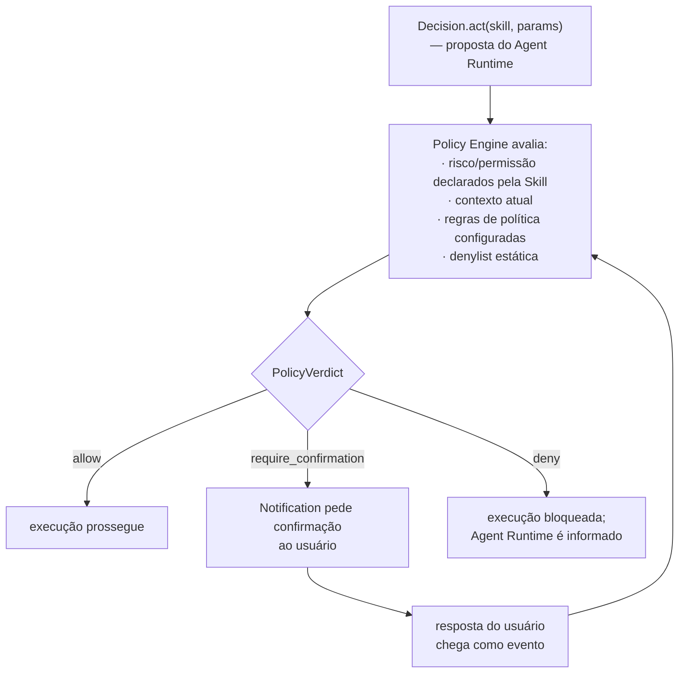

# Segurança e Policy Engine

> Documentação conceitual do Policy Engine e das fronteiras de segurança já
> definidas, previstos para a **Fase 5** do [roadmap](../ROADMAP.md)
> (Policy Engine) e transversais a todo o sistema (secrets, princípio de
> menor privilégio). Criada na subfase **0.5** como explicação de contratos
> já aprovados na 0.3 — **não implementa** nenhum mecanismo concreto de
> `PolicyApproval` nem escolhe tecnologia de permissão. O contrato
> normativo completo está em
> [`architecture-contracts.md §10`](architecture-contracts.md#10-policy-e-safety-boundary)
> e em [ADR-0003](adr/0003-policy-engine-safety-authority.md); este
> documento explica o *porquê* e o *como se relaciona*, sem repetir a
> tabela de fluxo.

## A propriedade central

**O LLM não é a autoridade final de segurança.** O Agent Runtime pode
propor uma `Decision.act`, mas apenas o Policy Engine — código/configuração
determinística, sem chamada de LLM envolvida na própria decisão — decide
se a ação realmente acontece. Esse é o mecanismo que separa "o modelo
quis" de "o Jarvis fez" — ver a motivação completa em
[agent-runtime.md](agent-runtime.md#o-llm-propõe-código-determinístico-autoriza-e-executa)
e [ADR-0003](adr/0003-policy-engine-safety-authority.md).

## Fluxo de decisão

## Níveis de risco e `PolicyVerdict`

Toda proposta `Decision.act(skill, params)` recebe um `PolicyVerdict`:

- **`allow`** — a execução prossegue imediatamente.
- **`deny`** — a execução é bloqueada; o Agent Runtime é informado do
  bloqueio (não silenciosamente ignorado).
- **`require_confirmation`** — o Notification System pede confirmação
  explícita ao usuário; a resposta chega de volta ao sistema como um
  evento, e é o Policy Engine, não a Skill nem o Agent Runtime, quem
  decide o desfecho a partir dessa resposta.

O mecanismo exato de espera por confirmação (evento assíncrono vs. chamada
bloqueante) é uma decisão de implementação das Fases 5/7, não fixada neste
documento.

## Skills declaram risco; isso não concede autorização

Uma Skill autodeclara `risk` (nível de risco) e `confirmation_requirement`
(sob qual condição ela acredita que deveria pedir confirmação) — ver
[skills.md](skills.md). Essas declarações são **insumo** para a decisão do
Policy Engine, nunca a decisão em si:

| | Obrigatório | Permitido | Proibido |
|---|---|---|---|
| **Skill** | declarar `risk`/`confirmation_requirement` honestamente | usar essas declarações como input para o Policy Engine | tratar a própria declaração como autorização e executar sem passar pelo Policy Engine |
| **Policy Engine** | ser a única autoridade que decide `allow`/`deny`/`require_confirmation` | ignorar ou sobrepor a autodeclaração da Skill quando a política exigir (ex. denylist mais restritiva) | delegar essa decisão de volta à Skill ou ao LLM |

Uma denylist estática vale **independentemente** do risco autodeclarado —
é o "cinto e suspensório" do sistema: mesmo que uma Skill se declare de
baixo risco, uma regra de política pode negá-la de qualquer forma.

## `PolicyApproval`

`PolicyApproval` é o conceito de domínio que representa uma autorização
emitida pelo Policy Engine para uma execução específica (Skill +
parâmetros). Uma Skill não deveria conseguir executar sua parte de risco
sem um `PolicyApproval` correspondente — isso torna estruturalmente mais
difícil pular a checagem de política, em vez de depender apenas de
disciplina de código.

**Este documento não define o mecanismo concreto** (token opaco, JWT,
assinatura criptográfica, objeto em memória) — essa é uma decisão de
implementação da Fase 5, deliberadamente em aberto até lá.

## Auditabilidade

Todo `PolicyVerdict` e toda execução real de Tool são registrados via um
port `AuditLog`, com `correlation_id`, timestamp, ator, decisão e
resultado — consultável posteriormente. O audit log é uma categoria
separada dos logs de debug comuns, com retenção mais rígida, e é atrelado
especificamente a vereditos do Policy Engine e execuções do Tool Router —
não a toda linha de log (ver
[`architecture-contracts.md §14`](architecture-contracts.md#14-observability-contract)
e [architecture.md §8](architecture.md#8-observabilidade-cross-cutting)).

## Secrets

Secrets (`JARVIS_*_API_KEY` e equivalentes) usam o mesmo mecanismo de
leitura que configuração de sistema (env/`.env`), com uma regra adicional
que não admite exceção: **nunca aparecem em log, evento, payload de
memória ou audit log em texto claro** — nem mesmo redigidos parcialmente
de forma reversível. Ver
[ADR-0006](adr/0006-configuration-vs-preferences-vs-state.md) para a
distinção completa entre configuração, secrets, preferências e estado, e
[CLAUDE.md §11](../CLAUDE.md) para as regras operacionais correspondentes.

## Risco de prompt injection

O Agent Runtime monta prompts a partir de conteúdo que pode vir de fontes
não confiáveis — o corpo de um email, por exemplo, pode conter texto
projetado para manipular o LLM a propor uma ação maliciosa (`Decision.act`
com parâmetros perigosos). A arquitetura não tenta resolver isso
"limpando" o conteúdo antes do LLM — ela assume que o LLM **pode** ser
manipulado, e por isso a defesa real está em outro lugar: nenhuma
`Decision.act` proposta, manipulada ou não, executa sem passar pelo Policy
Engine. Prompt injection é, portanto, tratado como um risco inerente à
camada de raciocínio, mitigado pela separação de poderes entre Agent
Runtime e Policy Engine — não por um filtro de conteúdo que este documento
não define nem promete.

## Princípio de menor privilégio

Cada componente só recebe as dependências que sua responsabilidade exige
— refletido diretamente nas colunas "Proibido conhecer" de cada componente
em [`architecture-contracts.md §3`](architecture-contracts.md#3-limites-dos-componentes).
Uma Skill não busca Context/Memory por conta própria (recebe como
parâmetro); o Tool Router não conhece regras de negócio de Skills; o MCP
Client não conhece Policy. Isso limita o raio de dano de qualquer
componente comprometido ou com bug ao escopo do que ele legitimamente
precisa conhecer.

## Isolamento entre LLM e execução

Resumo da propriedade central, já detalhada acima e em
[agent-runtime.md](agent-runtime.md): o `LLMProvider` é um port consultado
pelo Agent Runtime para **raciocinar**, nunca para **executar** — não há
caminho de código em que uma resposta de LLM aciona uma Tool diretamente,
sem passar pela `Decision` estruturada, pelo Policy Engine e pelo
`PolicyApproval`.

## O que não está decidido nesta subfase

- Mecanismo concreto de `PolicyApproval` (§4).
- Fluxo exato de confirmação assíncrona (síncrono/bloqueante vs. evento
  posterior).
- Catálogo de regras de política (denylist inicial, escopos de permissão
  por Skill) — escopo da Fase 5.

## Documentos relacionados

- Contrato normativo completo: [architecture-contracts.md §10](architecture-contracts.md#10-policy-e-safety-boundary)
- Policy Engine como autoridade: [ADR-0003](adr/0003-policy-engine-safety-authority.md)
- Configuração vs. secrets vs. preferências: [ADR-0006](adr/0006-configuration-vs-preferences-vs-state.md)
- Skill Contract (declaração de risco): [skills.md](skills.md)
- Regras de segurança para sessões futuras: [CLAUDE.md §11](../CLAUDE.md)
- Visão geral: [architecture.md](architecture.md)
