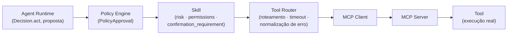

# Skills

> Documentação conceitual do Skill Framework, previsto para a **Fase 5** do
> [roadmap](../ROADMAP.md). Criada na subfase **0.5** como explicação de um
> contrato já aprovado na 0.3 — **não implementa** nenhuma Skill real. O
> contrato normativo completo está em
> [`architecture-contracts.md §8`](architecture-contracts.md#8-skill-contract)
> e em [ADR-0005](adr/0005-skill-tool-mcp-distinction.md); este documento
> explica o *porquê* e o *como se relaciona*, sem repetir a tabela de
> campos. Para MCP e Tool Router especificamente, ver [mcp.md](mcp.md).

## Skill ≠ Tool: por que a distinção existe

É tentador tratar "Skill" como só um sinônimo de "função que chama uma
tool" — mas isso colapsaria justamente o lugar onde risco, permissão e
política de confirmação deveriam viver (ver
[ADR-0003](adr/0003-policy-engine-safety-authority.md)) dentro de uma
simples chamada de função, sem espaço semântico para essas propriedades.
Por isso o Jarvis define quatro conceitos distintos, cada um com uma
responsabilidade própria (ver [ADR-0005](adr/0005-skill-tool-mcp-distinction.md)):

| Conceito | O que é | Onde mora risco/permissão? |
|---|---|---|
| **Tool** | capacidade atômica, stateless, schema fixo de entrada/saída (ex. `send_email(to, subject, body)`). Corresponde ~1:1 a uma tool MCP. | não aqui |
| **MCP Server** | processo externo que expõe uma ou mais Tools via protocolo MCP — detalhe de implementação de onde a Tool mora | não aqui |
| **MCP Tool** | representação de wire-level de uma Tool, como descoberta via protocolo MCP | não aqui |
| **Skill** | capacidade de nível mais alto que o agente decide invocar; pode compor múltiplas Tools | **aqui** |

**`risk` e `confirmation_requirement` são atributos de Skill, nunca de
Tool ou de MCP Server.** Tools são "o que pode ser feito tecnicamente";
Skills são "o que o agente está autorizado/deveria decidir fazer, e sob
qual condição". Uma Skill pode envolver tecnicamente só uma Tool e ainda
assim ser o lugar certo para essas semânticas — Skill não é sinônimo de
função.

## A cadeia Agent → Skill → Tool Router → MCP

Se o contrato normativo determinar outra relação no futuro, ele prevalece
sobre este diagrama — mas hoje esta é a cadeia definida em
[`architecture-contracts.md §9`](architecture-contracts.md#9-tool--mcp-boundary).
Uma Skill pode representar um workflow que compõe várias Tools (inclusive
de MCP Servers diferentes) sob uma única política de risco/confirmação
coerente — ela não é limitada a uma chamada 1:1.

## O contrato de Skill

Campos: `name`/`skill_id`, `input schema`, `output schema`, `capabilities`
(tags declarativas, ex. `email:send`), `permissions` (escopos necessários),
`risk`, `confirmation_requirement`, `execution_context` (dados recebidos
**explicitamente como parâmetro** — a Skill nunca busca Context/Memory por
conta própria), `errors` (taxonomia própria — ver
[`architecture-contracts.md §13`](architecture-contracts.md#13-error-contract)).

Entrada obrigatória: parâmetros já validados contra o `input schema` da
Skill, entregues **somente após** aprovação do Policy Engine. Saída
obrigatória: `SkillResult` (sucesso) ou `SkillError` (falha).

## `risk` e `confirmation_requirement` não concedem autorização

Esta é uma regra explícita, sem exceção, herdada de
[ADR-0003](adr/0003-policy-engine-safety-authority.md) e detalhada em
[security.md](security.md): uma Skill **declara** seu risco e sob qual
condição acredita que deveria exigir confirmação — mas essa autodeclaração
nunca autoriza a própria Skill a executar. A decisão efetiva de `allow` /
`deny` / `require_confirmation` pertence exclusivamente ao Policy Engine,
que pode inclusive divergir da autodeclaração (ex. aplicar uma denylist
estática mais restritiva do que o risco que a Skill afirma ter). Uma Skill
nunca executa sua parte de risco sem um `PolicyApproval` correspondente.

## O que uma Skill pode e não pode conhecer

Permitido: Tool Router port, seu próprio schema de entrada/saída, seus
próprios metadados de risco. Proibido: internals do Agent Runtime, LLM,
internals de Memory/Context (os dados necessários chegam como parâmetro
explícito — a Skill não os busca sozinha), internals do Policy Engine. Ver
a tabela completa em
[`architecture-contracts.md §3.6`](architecture-contracts.md#36-skills).

## Documentos relacionados

- Contrato normativo completo: [architecture-contracts.md §8](architecture-contracts.md#8-skill-contract)
- Distinção Skill/Tool/MCP: [ADR-0005](adr/0005-skill-tool-mcp-distinction.md)
- Autoridade de autorização: [ADR-0003](adr/0003-policy-engine-safety-authority.md) e [security.md](security.md)
- Protocolo MCP e Tool Router: [mcp.md](mcp.md)
- Regras para criação de Skills em sessões futuras: [CLAUDE.md §7](../CLAUDE.md)
- Visão geral: [architecture.md](architecture.md)
